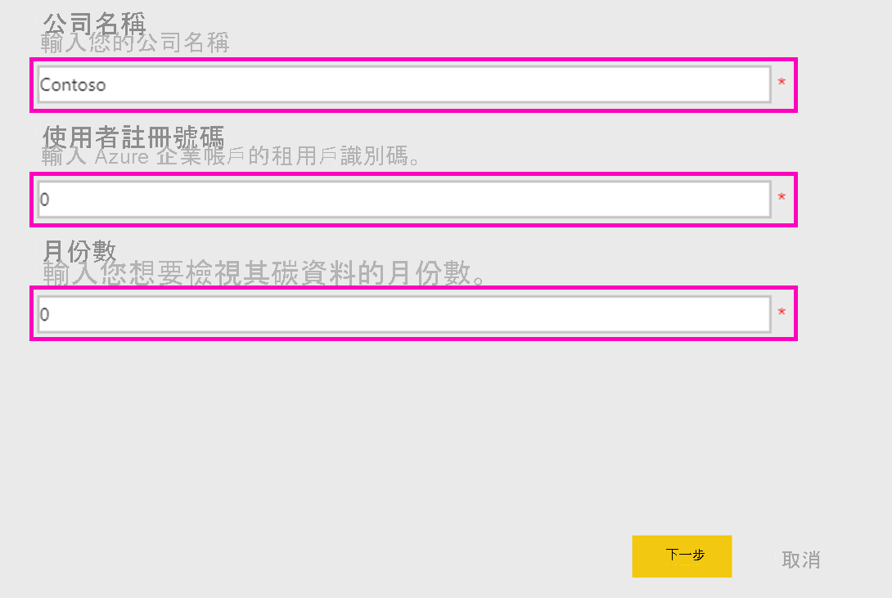
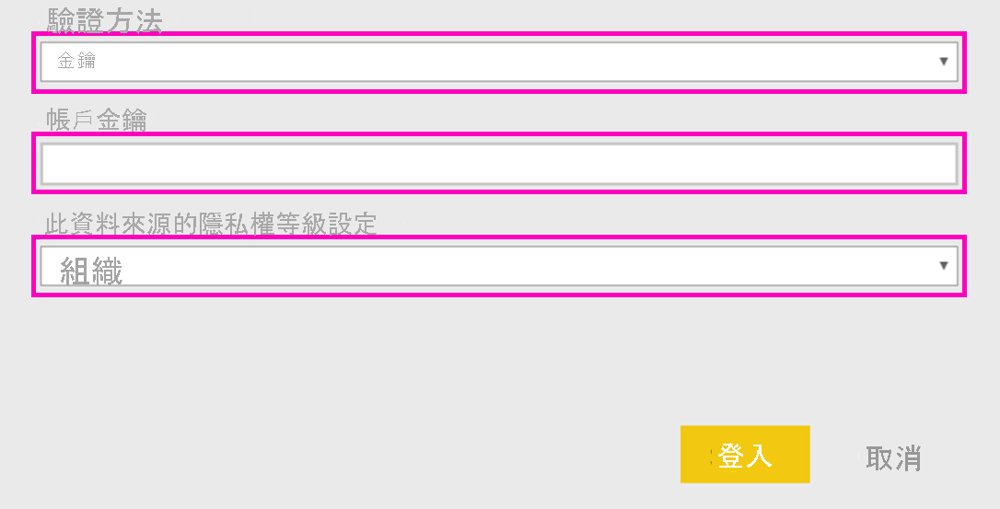

# 連線 Microsoft Sustainability Calculator
取得 IT 基礎結構的碳排放量見解，以作出更永續性的運算決策

Microsoft Sustainability Calculator 會針對與 Azure 服務相關聯的碳排放量資料提供新見解。 現在，組織內部負責報告和推動永續性的人員能夠將每個 Azure 訂用帳戶的碳衝擊量化，還可以透過在 Azure 與內部部署資料中心執行這些工作負載來查看預估的減碳量。 此資料可用於範圍 3 排放量的溫室天然氣報告。 您需要有租用戶識別碼和存取金鑰才能存取 Microsoft Sustainability Calculator，通常可透過貴組織的 Azure 管理員來取得。

若要使用此應用程式，您將需要 Azure 企業版入口網站的資訊。 貴企業的系統管理員或許能夠協助您取得此資訊。 請先檢閱這些指示並取得必要資訊，然後再安裝應用程式。 

此連接器版本只支援來自 [https://ea.azure.com](https://ea.azure.com/) 的企業註冊。 中國目前不支援註冊。

## 如何連接
[!INCLUDE [powerbi-service-apps-get-more-apps](../includes/powerbi-service-apps-get-more-apps.md)]

1. 選取 [Microsoft Sustainability Calculator] \> [立即取得]。
1. 在 [要安裝此 Power BI 應用程式嗎?] 中，選取 [安裝]。
1. 在 [應用程式] 窗格中，選取 [Microsoft Sustainability Calculator] 磚。
1. 在 [開始使用您的新應用程式] 中，選取 [連線]。

    

1. 輸入**公司名稱、使用者註冊號碼**和**月份數 \> [登入]** 。 請參閱以下關於[尋找這些參數](#finding-parameters)的詳細資料。

    

1. 針對 [驗證方法] 選取 [金鑰]，並針對 [隱私權等級] 選取 [組織]。
1. 針對 [金鑰] 輸入您的**存取金鑰 \> [登入]** 。

    

1. 匯入程序會自動開始。 完成時，新的儀表板、報表與模型會出現在 [瀏覽窗格] 中。 選取報表以檢視匯入的資料。

## 尋找參數

若要尋找您的公司**註冊識別碼**和**存取金鑰**，請與您的 Azure 管理員合作以取得所需資訊。 您的管理員將

1. 登入 [Azure 企業版入口網站](https://ea.azure.com)，然後按一下左側功能區上的 [管理]，並取得**註冊號碼**，如下所示
2. 從 [Azure 企業版入口網站](https://ea.azure.com)中，按一下 [報表]，然後按一下 API 存取金鑰 (如下所示)，以取得主要註冊帳戶金鑰

## 使用應用程式

若要在任何時間點更新參數，請瀏覽至 [資料集] 設定、存取與應用程式工作區相關聯的內容，然後更新租用戶識別碼、公司名稱或資料月份數。 套用您的參數之後，按一下 [重新整理]，以使用套用的新參數重新載入資料。