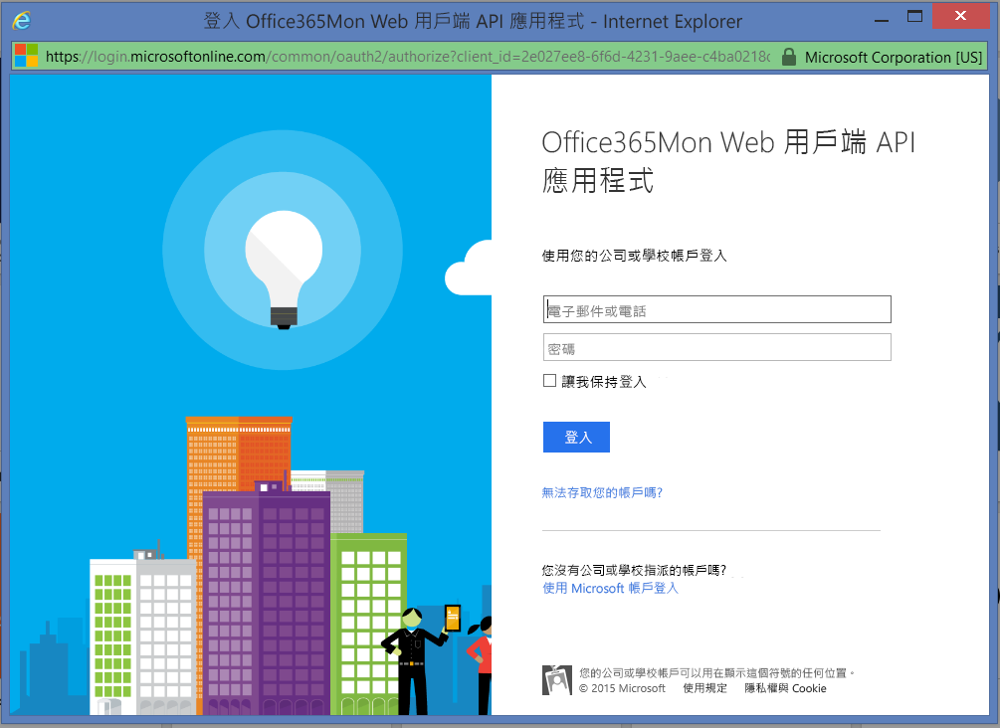

# 使用 Power BI 連接到 Office365Mon
使用 Power BI 與 Office365Mon 範本應用程式，輕鬆分析您 Office 365 的中斷問題與健康狀態效能資料。 Power BI 會擷取您的資料 (包括中斷與健康狀況探查)，然後根據該資料建置現成的儀表板與報表。

連線到 Power BI 適用的 [Office365Mon 範本應用程式](https://msit.powerbi.com/groups/me/getapps/services/office365mon.office365mon_powerbi_v3)。

>[!NOTE]
>Office365Mon 系統管理帳戶是連接及載入 Power BI 範本應用程式的必備項目。

## 如何連接
1. 在導覽窗格的底部，選取 [取得資料]  。
   
   
2. 在 [服務]  方塊中，選取 [取得]  。
   
    
3. 選取 [Office365Mon]  \> [取得]  。
   
   
4. 針對 [驗證方法]，選取 [oAuth2]  \> [登入]  。
   
   出現提示時，輸入 Office365Mon 管理認證，並遵循驗證程序。
   
   
   
   
5. Power BI 匯入資料之後，您會在導覽窗格中看到新的儀表板、報表和資料集。 新的項目會以黃色星號 \* 標示，選取 Office365Mon 項目。
   
   

**接下來呢？**

* 請嘗試在儀表板頂端的[問與答方塊中提問](../consumer/end-user-q-and-a.md)
* [變更儀表板中的圖格](../create-reports/service-dashboard-edit-tile.md)。
* [選取圖格](../consumer/end-user-tiles.md)，開啟基礎報表。
* 雖然資料集排程為每天重新整理，但是您可以變更重新整理排程，或使用 [立即重新整理]  視需要嘗試重新整理

## 疑難排解
如果您使用 Office365Mon 訂用帳戶認證登入之後收到 **「登入失敗」** 的錯誤，則您使用的帳戶沒有權限可從您的帳戶擷取 Office365Mon 訂用帳戶資料。 請確認它是系統管理員帳戶，然後重試一次。

## 後續步驟
[Power BI 是什麼？](../fundamentals/power-bi-overview.md)

[取得 Power BI 的資料](service-get-data.md)
