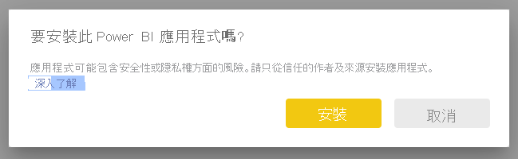
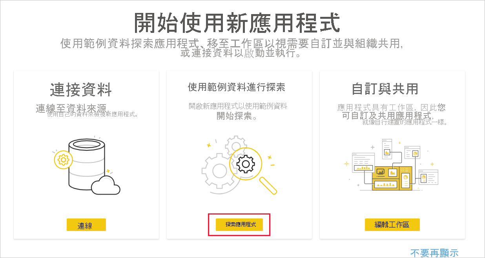
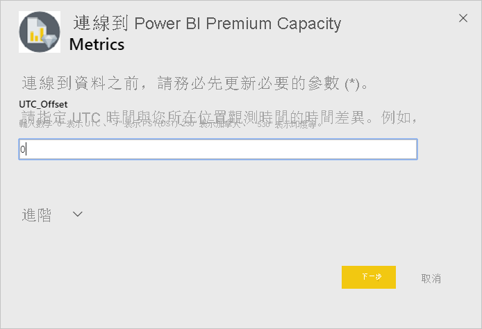
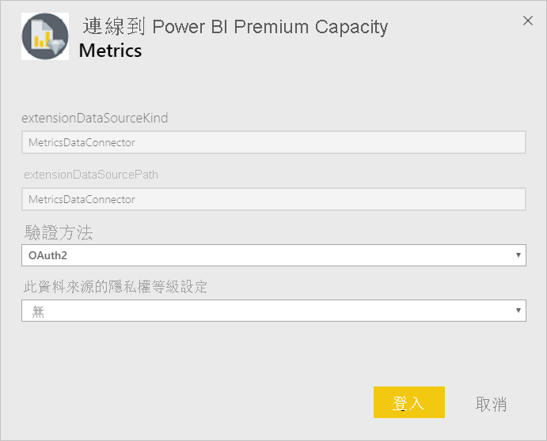
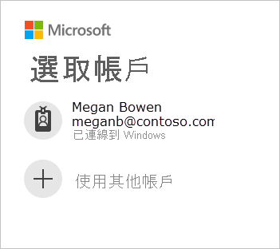
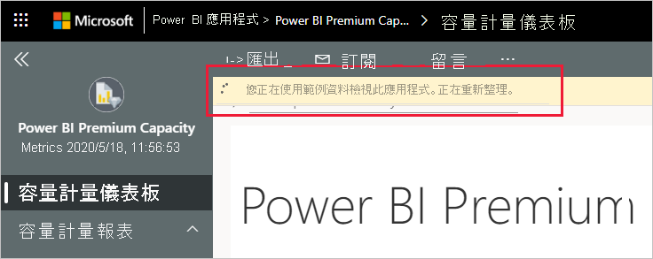
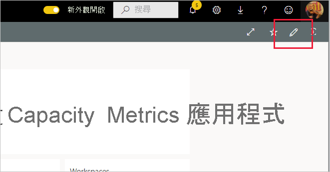

# 連線到 Power BI Premium 容量計量
監視您的容量對於明智地決定如何最有效地利用 Premium 容量資源至關重要。 Power BI Premium 容量計量應用程式提供您容量執行方式的最深入資訊。

本文描述如何安裝應用程式及連線至資料來源。 若需報表內容及如何使用報表的資訊，請參閱[使用應用程式監視 Premium 容量](../service-admin-premium-monitor-capacity.md)，以及 [Premium 容量計量應用程式部落格文章](https://powerbi.microsoft.com/blog/premium-capacity-metrics-app-new-health-center-with-kpis-to-explore-relevant-metrics-and-steps-to-mitigate-issues/)。

在安裝應用程式及連線到資料來源後，您即可視需要自訂報表。 您接著可將其散發給組織中的同事。

> [!NOTE]
> 安裝範本應用程式需要[權限](./service-template-apps-install-distribute.md#prerequisites)。 如果您發現沒有足夠的權限，請連絡租用戶系統管理員。

## 安裝應用程式

1. 按一下下列連結以取得應用程式：[Power BI Premium 容量計量範本應用程式](https://app.powerbi.com/groups/me/getapps/services/pbi_pcmm.capacity-metrics-dxt)

1. 在應用程式的 [AppSource][ **頁面上選取 [立即取得]** ](https://app.powerbi.com/groups/me/getapps/services/pbi_pcmm.capacity-metrics-dxt)。

    

1. 選取 [安裝]。 

    

    > [!NOTE]
    > 若先前已安裝過應用程式，則系統會詢問是要[覆寫該安裝](./service-template-apps-install-distribute.md#update-a-template-app)，還是安裝到新的工作區。

    應用程式安裝完成後，會顯示在 [應用程式] 頁面上。

   ![[應用程式] 頁面上的 Power BI Premium 容量計量應用程式](media/service-connect-to-pbi-premium-capacity-metrics/service-pbi-premium-capacity-metrics-app-apps-page-icon.png)

## 連接至資料來源

1. 選取 [應用程式] 頁面上的圖示以開啟應用程式。

1. 在啟動顯示畫面上，選取 [探索]。

   

   應用程式隨即開啟，其中顯示範例資料。

1. 在頁面頂端的橫幅中，選取 [連線至資料] 連結。

   ![Power BI Premium 容量計量應用程式 [Connect Your Data] \(連線資料\) 連結](media/service-connect-to-pbi-premium-capacity-metrics/service-pbi-premium-capacity-metrics-app-connect-data.png)

1. 在出現的對話方塊中設定 UTC 位移，即國際標準時間和您位置時間的小時差異。 然後按 [下一步]。
  
   
   **注意：半小時的格式應該是小數 (例如，5.5、2.5 等)。**

1. 在下一個出現的對話方塊中，您不需要執行任何動作。 請直接選取 [Login] \(登入\)。

   

1. 在 Microsoft 登入畫面上登入 Power BI。

   

   登入後，報表會連線至資料來源，並使用最新的資料填入。 在這段期間，活動監視器會開啟。

   

   報表資料會每天自動重新整理一次，除非您在登入流程期間停用此功能。 您也可以視需要[設定自己的重新整理排程](./refresh-scheduled-refresh.md)，以將報表資料保持在最新狀態。

## 自訂和共用

若要開始自訂應用程式，請按一下右上角的鉛筆圖示。

 

如需詳細資訊，請參閱[自訂和共用應用程式](./service-template-apps-install-distribute.md#customize-and-share-the-app)。

## 後續步驟
* [使用應用程式監視 Premium 容量](../admin/service-admin-premium-monitor-capacity.md)
* [Premium 容量計量應用程式部落格文章](https://powerbi.microsoft.com/blog/premium-capacity-metrics-app-new-health-center-with-kpis-to-explore-relevant-metrics-and-steps-to-mitigate-issues/)
* [什麼是 Power BI 範本應用程式？](./service-template-apps-overview.md)
* [在組織中安裝並散發範本應用程式](./service-template-apps-install-distribute.md)
* 有問題嗎？ [嘗試在 Power BI 社群提問](https://community.powerbi.com/)
