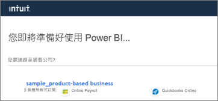

# 使用 Power BI 連接到 QuickBooks Online
當您從 Power BI 連接到您的 QuickBooks Online 資料時，您會立即取得 Power BI 儀表板和 Power BI 報表，其針對您企業的現金流量、獲利率、客戶和其他項目提供深入資訊。 您可以使用原有的儀表板和報表，或是加以自訂，反白顯示您特別有興趣的資訊。 資料會自動每天重新整理一次。

連線到適用於 Power BI 的 [QuickBooks Online 範本應用程式](https://dxt.powerbi.com/getdata/services/quickbooks-online)。

>[!NOTE]
>您必須是 QuickBooks Online 帳戶上的系統管理員，且以您的系統管理員帳戶認證登入，才能夠將 QuickBooks Online 資料匯入 Power BI。 您無法以 QuickBooks Desktop 軟體使用此連接器。 

## 如何連接

[!INCLUDE [powerbi-service-apps-get-more-apps](../includes/powerbi-service-apps-get-more-apps.md)]

3. 選取 [QuickBooks Online]，然後選取 [取得]。
   
   

4. 在 [要安裝此 Power BI 應用程式嗎?] 中，選取 [安裝]。

    

4. 在 [應用程式] 窗格中，選取 [QuickBooks] 磚。

   ![選取 [QuickBooks] 磚](media/service-connect-to-quickbooks-online/power-bi-quickbooks-tile.png)

6. 在 [開始使用您的新應用程式] 中，選取 [連線]。

    

4. 針對 [驗證方法] 選取 [oAuth2]  ，然後選取 [登入] 。 
5. 出現提示時，請輸入您的 QuickBooks Online 認證，並遵循 QuickBooks Online 驗證程序。 如果您已經在瀏覽器中登入 QuickBooks Online，可能就不會出現輸入認證的提示。
   >[!NOTE]
   >您需要 QuickBooks Online 帳戶的系統管理員認證。
6. 請在下一個畫面中，選取您要連接至 Power BI 的公司。
   
   

7. 在下一個畫面中選取 [授權]  開始匯入程序。 視公司資料的大小而定，此程序可能需要幾分鐘的時間。 
   
   
   
8. 當 Power BI 匯入資料之後，您會看到 QuickBooks 應用程式的內容清單：新的儀表板、報表和資料集。
9. 選取 QuickBooks 儀表板以開始探索程序。 Power BI 已自動建立此儀表板來顯示您匯入的資料。

    

**接下來呢？**

* 請嘗試在儀表板頂端的[問與答方塊中提問](../consumer/end-user-q-and-a.md)
* [變更儀表板中的圖格](../create-reports/service-dashboard-edit-tile.md)。
* [選取圖格](../consumer/end-user-tiles.md)，開啟基礎報表。
* 雖然資料集排程為每天重新整理，但是您可以變更重新整理排程，或使用 [立即重新整理] 視需要嘗試重新整理

## 疑難排解
**「糟糕!** 發生錯誤了。」

如果您在選取 [授權] 之後收到此訊息：

「糟糕！ 發生錯誤了。 請關閉此視窗，然後再試一次。

應用程式已由此公司的另一位使用者訂閱。 連絡 [管理員電子郵件] 來變更此訂用帳戶。」

...此錯誤表示您公司的另一位管理員已經使用 Power BI 連線到您的公司資料。 請向該管理員要求與您共用儀表板。 目前，只有一位管理員使用者可以連接至 Power BI 的特定 QuickBooks Online 公司資料集。 當 Power BI 建立儀表板之後，管理員可在同一個 Power BI 租用戶上與多位同事共用該儀表板。

**「這個應用程式並未設定為允許來自於您的國家/地區的連線」**

目前 Power BI 僅支援美國的 QuickBooks Online 版本。 

## 後續步驟
[Power BI 是什麼？](../fundamentals/power-bi-overview.md)

[Power BI 服務中的設計工具基本概念](../fundamentals/service-basic-concepts.md)
