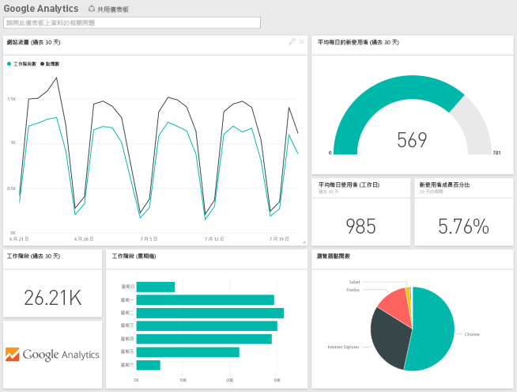

# 使用 Power BI 連接到所用服務
您可以使用 Power BI 連接到執行業務所用的多個服務，例如 Salesforce、Microsoft Dynamics 和 Google Analytics。 Power BI 首先會使用您的認證來連接至服務。 它會建立 Power BI「工作區」  ，內含儀表板和一組 Power BI 報表，可自動顯示資料並提供業務相關的視覺見解。

>[!IMPORTANT]
>服務內容套件將由[範本應用程式](./service-template-apps-overview.md)取代。 截至 2019 年 9 月 25 日，已有一些內容套件即將退場。 所有您已經安裝，但即將退場的內容套件，將會繼續保留在您的帳戶中，但不會再提供任何文件或支援，也無法重新安裝。

登入 Power BI 以檢視[可連接的所有服務](https://app.powerbi.com/getdata/services)。 

安裝應用程式之後，即可在應用程式及 Power BI 服務 ([https://app.powerbi.com](https://app.powerbi.com)) 的工作區中檢視儀表板與報表。 您也可以在 Power BI 行動裝置應用程式中加以檢視。 在工作區中，您可以修改儀表板和報表來符合組織的需求，然後以「應用程式」  的形式散發給同事。 

## 開始使用
[!INCLUDE [powerbi-service-apps-get-more-apps](../includes/powerbi-service-apps-get-more-apps.md)]

## 編輯儀表板和報表
匯入完成時，新的應用程式會出現在 [應用程式] 頁面上。

1. 在導覽窗格中選取 [應用程式]  > 選取應用程式。
   
     ![[應用程式] 頁面](media/service-connect-to-services/power-bi-service-apps-open-app.png)
2. 您可以在問與答方塊中鍵入問題，或按一下圖格開啟基礎報表。 
   
    
   
    變更儀表板和報表來符合組織的需求。 然後[散發應用程式給您的同事](../collaborate-share/service-create-distribute-apps.md)

## 包含的內容
連接至服務之後，您會看到新建立的應用程式，以及內含儀表板、報表和資料集的工作區。 服務的資料著重於特定案例，而且可能不包含該服務中的所有資訊。 資料已排定自動每天重新整理一次。 您可以選取資料集來控制排程。

您也可以[在 Power BI Desktop 中連接到許多服務](desktop-data-sources.md) (例如 Google Analytics)，並建立自訂的儀表板和報表。  

如需連接到特定服務的詳細資料，請參閱個別說明頁面。

## 疑難排解
**空的磚**  
雖然 Power BI 先連接到服務，您可能會在儀表板上看到空的磚集合。 如果您 2 小時後仍然看到空的儀表板，可能是連線失敗。 如果您未看到具有問題修正資訊的錯誤訊息，請提出支援票證。

* 在右上角選取問號圖示 ( **?** ) > [取得說明]  。
  
    ![[取得說明] 圖示](media/service-connect-to-services/power-bi-service-get-help.png)

**遺漏資訊**  
儀表板和報表包含著重於特定案例的服務內容。 如果您要在應用程式中尋找特定計量但看不到它，請在 [Power BI 支援](https://support.powerbi.com/forums/265200-power-bi)頁面上新增想法。

## 建議服務
您有想要向 Power BI 應用程式推薦的服務嗎？ 請移至 [Power BI 支援](https://support.powerbi.com/forums/265200-power-bi)頁面上告訴我們。

如果您有興趣建立範本應用程式並自行散發，請參閱 [Create a template app in Power BI](service-template-apps-create.md) (在 Power BI 中建立範本應用程式)。 Power BI 合作夥伴只要撰寫少量程式碼或不需撰寫程式碼，即可建置 Power BI 應用程式，並將應用程式部署至 Power BI 客戶。 

## 後續步驟
* [散發應用程式給您的同事](../collaborate-share/service-create-distribute-apps.md)
* [在 Power BI 中建立新的工作區](../collaborate-share/service-create-the-new-workspaces.md)
* 有任何問題嗎？ [嘗試在 Power BI 社群提問](https://community.powerbi.com/)