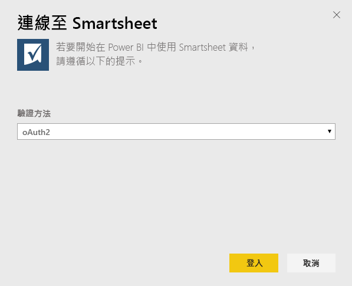
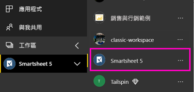
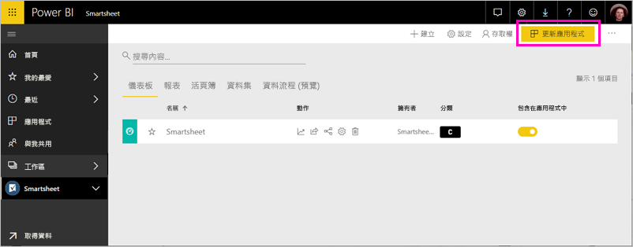

# 使用 Power BI 連接到 Smartsheet
此文章將逐步引導您使用 Power BI 範本應用程式，從 Smartsheet 帳戶提取資料。 Smartsheet 提供一個簡單的平台，供共同作業與檔案共用使用。 適用於 Power BI 的 Smartsheet 範本應用程式會提供儀表板、報表與資料集，以顯示 Smartsheet 帳戶的概觀。 您也可以使用 [Power BI Desktop](desktop-connect-to-data.md) 直接連線到您帳戶中的個別工作表。 

安裝範本應用程式之後，您可以變更儀表板和報表。 然後您可以將它當作應用程式散發給組織中的同事。

連線到適用於 Power BI 的 [Smartsheet 範本應用程式](https://app.powerbi.com/groups/me/getapps/services/pbi-contentpacks.pbiapps-smartsheet)。

>[!NOTE]
>建議使用 Smartsheet 管理帳戶來連線及載入 Power BI 範本應用程式，因為其具有額外的存取權。

## 如何連接

[!INCLUDE [powerbi-service-apps-get-more-apps](../includes/powerbi-service-apps-get-more-apps.md)]

3. 選取 [Smartsheet] \> [立即取得]。
4. 在 [要安裝此 Power BI 應用程式嗎?] 中，選取 [安裝]。
4. 在 [應用程式] 窗格中，選取 [Smartsheet] 磚。

    

6. 在 [開始使用您的新應用程式] 中，選取 [連線]。

    

4. 針對 [驗證方法]，選取 [oAuth2] **\> [登入]** 。
   
   出現提示時，輸入 Smartsheet 認證，並遵循驗證程序。
   
   
   
   

5. 當 Power BI 匯入資料之後，Smartsheet 儀表板就會開啟。
   
   

## 修改和散發應用程式

您已安裝 Smartsheet 範本應用程式。 這表示您也建立了 Smartsheet 工作區。 在工作區中，您可以變更報表和儀表板，然後將它當作「應用程式」散發給組織中的同事。 

1. 若要檢視新 Smartsheet 工作區的所有內容，請在瀏覽窗格中選取 [工作區] > [Smartsheet]。 

    

    此檢視是工作區的內容清單。 在右上角，您會看到 [更新應用程式]。 當您準備好要將應用程式散發給同事時，這會是您的起點。 

    

2. 選取 [報表] 和 [資料集] 以查看工作區中的其他項目。

    深入了解如何[散發應用程式](../collaborate-share/service-create-distribute-apps.md)給您的同事。

## 包含的內容
適用於 Power BI 的 Smartsheet 範本應用程式內含您的 Smartsheet 帳戶概觀，例如，您擁有的工作區、報表和工作表數目及其修改時間等。管理使用者也會看到有關其系統中使用者的一些資訊，例如最佳工作表建立者。  

若要直接連接到您帳戶中的個別工作表，您可以在 [Power BI Desktop](desktop-connect-to-data.md) 中使用 Smartsheet 連接器。  

## 後續步驟

* [在 Power BI 中建立新的工作區](../collaborate-share/service-create-the-new-workspaces.md)
* [在 Power BI 中安裝和使用應用程式](../consumer/end-user-apps.md)
* [連線到 Power BI 應用程式以使用外部服務](service-connect-to-services.md)
* 有問題嗎？ [嘗試在 Power BI 社群提問](https://community.powerbi.com/)