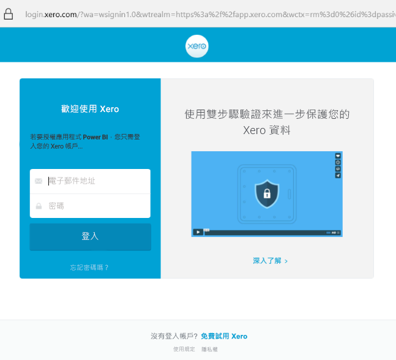

# 使用 Power BI 連接到 Xero
Xero 是簡單易用的線上會計軟體，專為小型企業所設計。 根據您的 Xero 財務功能，使用此 Power BI 範本應用程式來建立具吸引力的視覺效果。 您的預設儀表板包括許多小型企業計量，例如，現金狀況、收入與支出、利潤損失趨勢、應收帳款天數及投資報酬率。

連線至適用於 Power BI 的 [Xero 範本應用程式](https://app.powerbi.com/getdata/services/xero)或深入了解 [Xero 和 Power BI](https://help.xero.com/Power-BI) \(英文\) 整合。

## 如何連接

[!INCLUDE [powerbi-service-apps-get-more-apps](../includes/powerbi-service-apps-get-more-apps.md)]

3. 選取 [Xero] \> [立即取得]。
4. 在 [要安裝此 Power BI 應用程式嗎?] 中，選取 [安裝]。

    

4. 在 [應用程式] 窗格中，選取 [Xero] 磚。

   ![選取 [Xero] 磚](media/service-connect-to-xero/power-bi-start-xero.png)

6. 在 [開始使用您的新應用程式] 中，選取 [連線]。

    

4. 為與您的 Xero 帳戶相關聯的組織輸入暱稱。 任何暱稱都可以，其主要是為了協助具有多個 Xero 組織的使用者不致混淆。 如需詳細資訊，請參閱此文章稍後的[尋找參數](#FindingParams)。

    

5. 針對 [驗證方法] 選取 [OAuth]。 出現提示時，登入您的 Xero 帳戶，然後選取要連線的組織。 登入完成後，選取 [登入] 以啟動載入程序。
   
    
   
    
6. 一經核准，匯入程序會自動開始。 完成時，新的儀表板、報表與模型即會出現在瀏覽窗格中。 選取儀表板以檢視匯入的資料。
   
     

**接下來呢？**

* 請嘗試在儀表板頂端的[問與答方塊中提問](../consumer/end-user-q-and-a.md)
* [變更儀表板中的圖格](../create-reports/service-dashboard-edit-tile.md)。
* [選取圖格](../consumer/end-user-tiles.md)，開啟基礎報表。
* 雖然資料集排程為每天重新整理，但是您可以變更重新整理排程，或使用 [立即重新整理] 視需要嘗試重新整理

## 包含的內容
範本應用程式儀表板包含涵蓋各種不同領域的磚和計量，使用對應的報表來深入了解：  

| 區域 | 儀表板磚 | 報表 |
| --- | --- | --- |
| 現金 |每日現金流量  現金收入  現金支出  帳戶別的期末餘額  今日期末餘額 |銀行帳戶 |
| 客戶 |開立發票的銷售  客戶別的開立發票銷售  開立發票的銷售成長趨勢  到期發票  未清應收帳款  逾期應收帳款 |客戶  庫存 |
| 供應商 |使用票據之購買  依供應商別的使用票據之購買  使用票據之購買成長趨勢   到期票據  未清應付帳款  逾期應付帳款 |供應商  庫存 |
| 庫存 |產品別的每月銷售額 |庫存 |
| 損益 |每月損益  本會計年度淨利  本月份淨利  最高額支出帳戶 |損益 |
| 資產負債表 |總資產  總負債  權益 |資產負債表 |
| 醫療 |流動比率  毛利率   總資產報酬率  總負債對股東權益比率 |健康情況  詞彙和技術提示 |

資料集也包含下列資料表，以自訂您的報表與儀表板︰  

* 地址  
* 警示  
* 銀行對帳單每日餘額  
* 銀行對帳單  
* 連絡人  
* 費用報銷  
* 發票單項  
* 發票  
* 項目  
* 月末  
* 組織  
* 試算表  
* Xero 帳戶

## 系統需求
需要下列角色，才能存取 Xero 範本應用程式：「標準 + 報表」或「建議程式」。

## 尋找參數
為組織提供名稱，以便在 Power BI 中進行追蹤。 特定名稱可讓您連線到多個不同的組織。 您無法多次連線到相同組織，因為其將影響排定的重新整理。   

## 疑難排解
* Xero 使用者必須擁有下列角色，才能存取適用於 Power BI 的 Xero 範本應用程式：「標準 + 報表」或「建議程式」。 範本應用程式依賴以使用者為基礎的權限，透過 Power BI 來存取報告資料。
* 在載入期間，儀表板上的磚會處於一般載入狀態。 等到完整載入完成之後，這些磚才會繼續進行。 如果您收到通知，您的載入已完成但磚仍在載入，請嘗試使用儀表板右上角的 ... 重新整理儀表板磚。
* 如果您的範本應用程式無法重新整理，請檢查您是否在 Power BI 中多次連線到相同組織。 Xero 只允許對一個組織建立單一作用中連線，如果您多次連線到相同組織，可能就會看到指出您認證無效的錯誤。  
* 對於連線適用於 Power BI 之 Xero 範本應用程式的問題 (例如，錯誤訊息或載入速度緩慢)，請先清除快取 / Cookie 並重新啟動瀏覽器，然後重新連線至 Power BI。  

對於其他問題，若問題仍然存在，請在 https://support.powerbi.com 建立票證。

## 後續步驟
[開始使用 Power BI](../fundamentals/service-get-started.md)

[取得 Power BI 中的資料](service-get-data.md)
