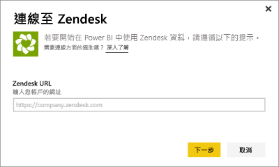
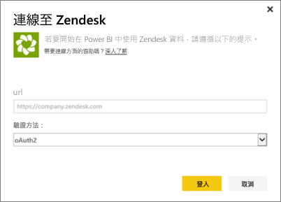
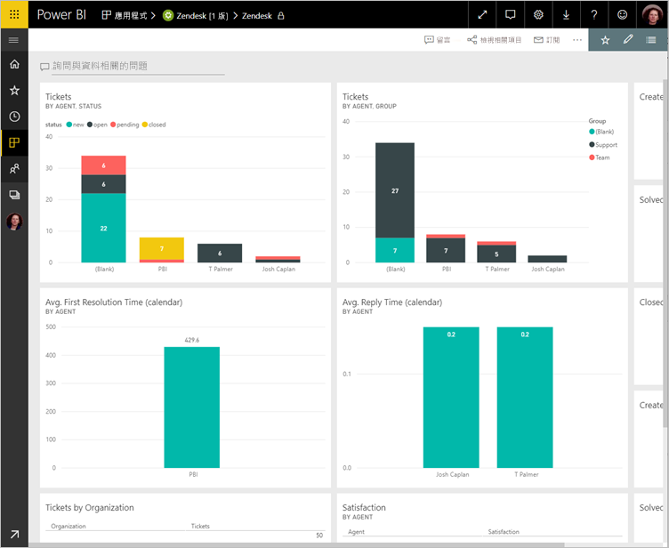
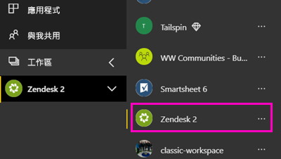
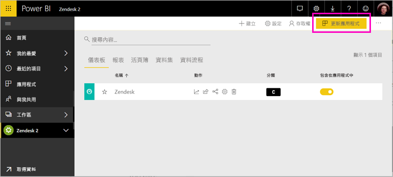

# 使用 Power BI 連接到 Zendesk

此文章將逐步引導您使用 Power BI 範本應用程式，從 Zendesk 帳戶提取資料。 Zendesk 應用程式包含 Power BI 儀表板和一組 Power BI 報表，可提供您有關票證數量及代理程式效能的見解。 資料會自動每天重新整理一次。 

當您安裝範本應用程式之後，就能自訂儀表板和報表，以強調顯示您最關心的資訊。 然後您可以將它當作應用程式散發給組織中的同事。

連線到 [Zendesk 範本應用程式](https://app.powerbi.com/getdata/services/zendesk)或深入了解 Power BI 與 [Zendesk 整合](https://powerbi.microsoft.com/integrations/zendesk)。

安裝範本應用程式之後，您可以變更儀表板和報表。 然後您可以將它當作應用程式散發給組織中的同事。

>[!NOTE]
>您需要具備 Zendesk 管理帳戶才能連線。 下方有[需求](#system-requirements)的詳細資訊。

>[!WARNING]
>在 2019 年 10 月 15 日之前，Zendesk 支援搜尋 API，允許透過分頁處理大型查詢收到總計 200000 個結果。 為了讓搜尋使用與其預期範圍相符，Zendesk 現在將傳回的結果數目上限限制為總共 1000 個結果，每頁最多 100 個結果。 不過，目前的 Power BI Zendesk 連接器仍然可建立超出這些新限制的 API 呼叫，因而導致可能產生誤導的結果。

## 如何連接

[!INCLUDE [powerbi-service-apps-get-more-apps](../includes/powerbi-service-apps-get-more-apps.md)]

3. 選取 [Zendesk] \> [立即取得]。
4. 在 [要安裝此 Power BI 應用程式嗎?] 中，選取 [安裝]。
4. 在 [應用程式] 窗格中，選取 [Zendesk] 磚。

    

6. 在 [開始使用您的新應用程式] 中，選取 [連線]。

    

4. 提供與您帳戶相關聯的 URL。 URL 的格式為 **https://company.zendesk.com** 。 請參閱以下關於[尋找這些參數](#finding-parameters)的詳細資料。
   
   

5. 出現提示時，請輸入您的 Zendesk 認證。  選取 [oAuth 2]  做為驗證機制，然後按一下 [登入] 。 請遵循 Zendesk 驗證流程。 (如果您已經在瀏覽器中登入 Zendesk，可能就不會出現輸入認證的提示)。
   
   > [!NOTE]
   > 此範本應用程式需要您連線到 Zendesk 管理帳戶。 
   > 
   
   
6. 按一下 [允許]  以允許 Power BI 存取您的 Zendesk 資料。
   
   ![按一下 [允許]](media/service-connect-to-zendesk/zendesk2.jpg)
7. 按一下 [連接]  開始匯入程序。 
8. 當 Power BI 匯入資料之後，您會看到 Zendesk 應用程式的內容清單：新的儀表板、報表和資料集。
9. 選取儀表板以開始探索程序。

    
   
## 修改和散發應用程式

您已安裝 Zendesk 範本應用程式。 這表示您也建立了 Zendesk 工作區。 在工作區中，您可以變更報表和儀表板，然後將它當作「應用程式」散發給組織中的同事。 

1. 若要檢視新 Zendesk 工作區的所有內容，請在瀏覽窗格中選取 [工作區] > [Zendesk]。 

    

    此檢視是工作區的內容清單。 在右上角，您會看到 [更新應用程式]。 當您準備好要將應用程式散發給同事時，這會是您的起點。 

    

2. 選取 [報表] 和 [資料集] 以查看工作區中的其他項目。

    深入了解如何[散發應用程式](../collaborate-share/service-create-distribute-apps.md)給您的同事。

## 系統需求
需要有 Zendesk 管理帳戶，才能存取 Zendesk 範本應用程式。 如果您是有興趣檢視 Zendesk 資料的代理商或終端使用者，請在 [Power BI Desktop](desktop-connect-to-data.md) 中新增建議並檢閱 Zendesk 連接器。

## 尋找參數
Zendesk URL 與您用來登入 Zendesk 帳戶的 URL 相同。 如果不確定 Zendesk URL，可以使用 Zendesk [登入說明](https://www.zendesk.com/login/)。

## 疑難排解
如果您在連線時發生問題，請檢查 Zendesk URL，並確認使用的是 Zendesk 管理帳戶。

## 後續步驟

* [在 Power BI 中建立新的工作區](../collaborate-share/service-create-the-new-workspaces.md)
* [在 Power BI 中安裝和使用應用程式](../consumer/end-user-apps.md)
* [連線到 Power BI 應用程式以使用外部服務](service-connect-to-services.md)
* 有問題嗎？ [嘗試在 Power BI 社群提問](https://community.powerbi.com/)
