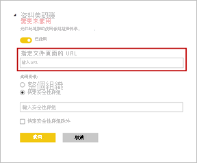

# 認證資料集 - Power BI

組織可以「認證」作為重要資訊權威來源的資料集。 當報表設計人員開始建立報表並尋找可靠資料時，這些資料集會特別強調顯示。 認證過程的選擇性相當高，且只有最有價值的資料集才能通過認證。 Power BI 系統管理員擁有新的設定，能夠嚴格地控制誰可以認證資料集。 系統管理員可確保從認證過程取得真正可靠且具權威的資料集，以供整個組織使用。

身為資料集擁有者，您可要求認證經過宣傳的資料集。 在 [認證] 租用戶設定中定義的一組所選使用者可決定認證的資料集。 在探索資料集期間，在工具提示中會顯示認證資料集的人員名稱。 將滑鼠停留在 [已認證] 標籤上，即會看到名稱。 如需詳細資料，請參閱[設定資料集與資料流程認證](../admin/service-admin-setup-certification.md)。

Power BI 提供兩種方式「背書」資料集。 除了憑證以外，另一種方式是「升階」。 身為資料集的擁有者或工作區成員，當資料集可供廣泛使用時，您即可將其升階。 請參閱[宣傳您的資料集](service-datasets-promote.md)以了解詳細資料。 

## 認證資料集

Power BI 系統管理員可在 [背書] 設定頁面上提供 [深入了解] 的連結。  它們可以連結至您認證流程的相關文件。 若他們沒有為 [深入了解] 連結提供目的地，則該連結依預設會指向本文。

獲得指名成為可以認證資料集的人員，顯然是一個重大責任。 若資料集建立者針對認證資料集事宜進行連絡時，您即可開始審查程序。 當您感到滿意並認為資料集應獲得認證時，以下是您最後需要進行的步驟。

1. 資料集擁有者需要提供您資料集所在工作區的成員權限。
1. 若系統管理員已指名您作為可認證資料集的人員，您即可使用資料集 [設定] 中 [背書] 區段內的 [已認證] 選項。 選取 [已認證]。
1. 選取 [ **套用**]。

深入了解系統管理員如何[控制跨工作區的資料集使用方式](service-datasets-admin-across-workspaces.md)。

## 後續步驟

* [設定資料集與資料流程認證](../admin/service-admin-setup-certification.md)
* [跨工作區使用資料集](service-datasets-across-workspaces.md)
* 有問題嗎？ [嘗試在 Power BI 社群提問](https://community.powerbi.com/)
