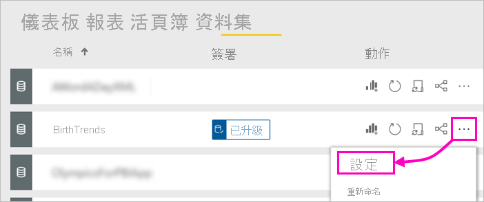

# 升級資料集 - Power BI

您的 Power BI 報表建立者現在可以存取許多不同資料集，因此企業需要引導他們使用可靠且高品質的資料集。 Power BI 提供兩種方式「認可」資料集：

- **升級**：身為資料集的擁有者，當您的資料集可供廣泛使用時，您可以升級它們。 任何具有寫入權限的工作區成員都可以將資料集升階。 針對可以將資料集升階的對象並沒有任何限制。 升級支援組織內共同散佈的資料集。 本文與升級您的資料集相關。
- **認證**：您可以要求認證已升級的資料集。 在 [資料集認證] 租用戶管理員設定中定義的一組所選使用者可決定認證的資料集。 如需詳細資料，請參閱[認證資料集](service-datasets-certify.md)。

## 升級資料集

當您準備要升級資料集時，它需要位在 Power BI 服務的新工作區體驗工作區中。

1. 請移至工作區的資料集清單。
 
1. 選取 [更多選項] (...)，然後選取 [設定]。

    

1. 展開 [簽署] > 選取 [已升級]。

    ![選取 [已升級] 和 [套用]](media/service-datasets-certify-promote/power-bi-dataset-promoted-endorsement.png)

1. 選取 [ **套用**]。

## 要求認證資料集

租用戶管理員已找出您組織中可認證資料集的人員。 您可以要求他們認證您的資料集。

1. 將您資料集所在工作區的成員權限授與認證人。

1. 在 [設定] 的 [簽署] 區段中，[認證] 呈現灰色。

1. 選取 [深入了解] 連結。

    您的 Power BI 租用戶管理員可以設定 [深入了解] 連結前往指定的位置，顯示您租用戶認證程序的詳細資料。   如果他們尚未自訂 [深入了解] 連結，根據預設，它會指向[資料集認證](service-datasets-certify.md)一文。

## 後續步驟

* 閱讀[跨工作區使用資料集](service-datasets-across-workspaces.md)
* 有問題嗎？ [嘗試在 Power BI 社群提問](https://community.powerbi.com/)
