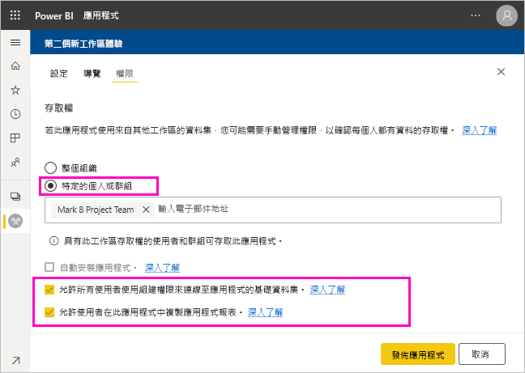
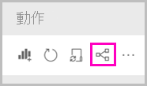

# 共用資料集 (預覽)

身為 Power BI Desktop 中的「資料模型」建立者，您會建立可在 Power BI 服務中發佈的「資料集」。 其他報表建立者可以使用您的資料集作為其自有報表的基礎。 在此文章中，您將了解如何共用您的資料集。 若要了解如何授與及移除您資料集的存取權，請參閱[建置權限](service-datasets-build-permissions.md)。

## 共用資料集的步驟

1. 開始方式為使用 Power BI Desktop 中的資料模型建立 .pbix 檔案。 如果您打算將此資料集提供給其他人建立報表，您可能甚至無法在 .pbix 檔案中設計報表。

    最佳做法是將 .pbix 檔案儲存至 Microsoft 365 群組。

1. 將 .pbix 檔案發佈到 Power BI 服務中的[新體驗工作區](../collaborate-share/service-create-the-new-workspaces.md)。
    
    此工作區的其他成員，已經可以根據此資料集在其他工作區中建立報表。

1. 您也可以從此工作區[發佈應用程式](../collaborate-share/service-create-distribute-apps.md)。 當您這麼做時，您可以在 [權限] 頁面上指定誰具有權限來進行哪些項目。

    > [!NOTE]
    > 如果您選取 [整個組織]，組織中將沒有任何人具有建置權限。 此為已知的問題。 因此，請在 [特定的個人或群組] 中指定電子郵件地址。  如果您希望整個組織都具有建置權限，請指定整個組織的電子郵件別名。

    

1. 選取 [發佈應用程式]，或 [更新應用程式] (如果已發佈)。

## 追蹤您的資料集使用方式

當您在工作區中擁有共用資料集時，您可能需要知道其他工作區中的哪些報表以該資料集為基礎。

1. 在資料集清單檢視中，選取 [檢視相關項目]。

    

1. [相關內容] 對話方塊會顯示所有相關項目。 在此清單中，您會看到此工作區與 [其他工作區] 中的相關項目。
 
    ![[相關內容] 對話方塊](media/service-datasets-build-permissions/power-bi-dataset-related-workspaces.png)

## 後續步驟

- [跨工作區使用資料集 (預覽)](service-datasets-across-workspaces.md)
- 有問題嗎？ [嘗試在 Power BI 社群提問](https://community.powerbi.com/)
