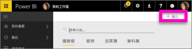
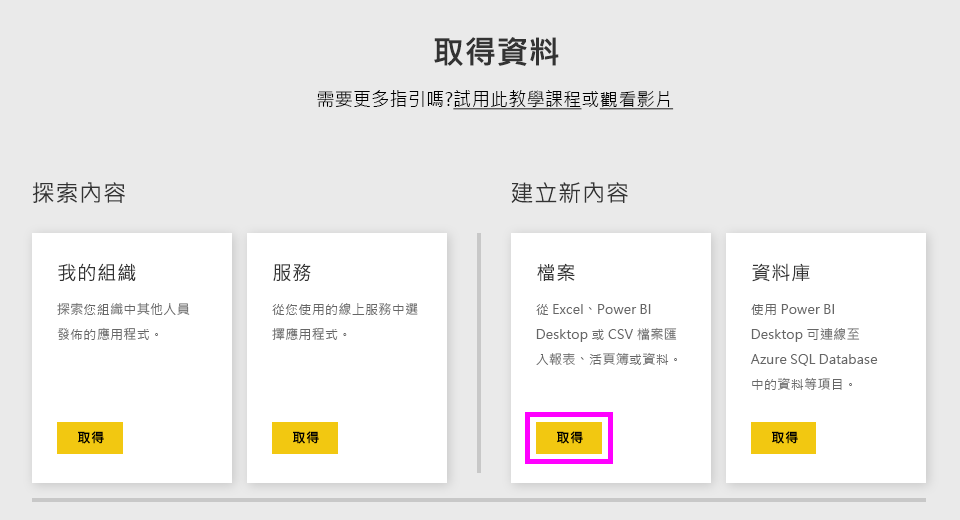
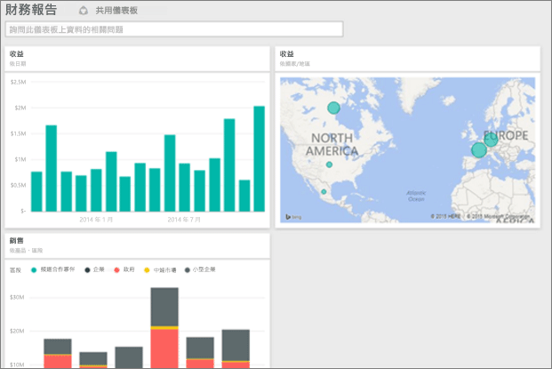

# 從 Excel 活頁簿轉變為 Power BI 服務中出色的報表
您的經理在下班時想要看到您最近的銷售數字以及之前行銷活動效果的報表。 但最新資料在各種協力廠商系統及您膝上型電腦的檔案上。 在過去，需要好幾個小時的時間才能建立視覺效果並將報表格式化，所以您覺得有點焦慮。

但別擔心。 有了 Power BI 之後，您可以很快地製作令人讚嘆的報表。

在此範例中，我們將從本機系統上傳 Excel 檔案、建立新的報表，並與同事分享，全部可從 Power BI 中進行。

## 準備資料
以一個簡單的 Excel 檔做為範例。 

1. 將 Excel 檔載入 Power BI 之前，必須先將資料整理放在二維資料表中。 在二維資料表中，每個資料行包含相同的資料類型；例如，文字、日期、數字或貨幣。 您的資料表應該要有標題列，但不應該是任何顯示總計的資料行或資料列。

   

2. 接下來，將資料格式化為資料表。 在 Excel 中，於 [首頁]  索引標籤的 [樣式]  群組中，選取 [格式化為表格]  。 

3. 選取要套用至您工作表的表格樣式。 

   現在 Excel 即已備妥可載入 Power BI 中。

   

## 將 Excel 檔案上傳至 Power BI 服務
Power BI 服務可連接至許多資料來源，包括您電腦上的 Excel 檔案。 

 > [!NOTE] 
 > 若要遵循本教學課程的其餘部分，請使用[財務範例活頁簿](../create-reports/sample-financial-download.md)。

1. 若要開始使用，請登入 Power BI 服務。 若尚未註冊，[可以免費註冊](https://powerbi.com)。

2. 您想要建立新的儀表板。 開啟 [我的工作區]  ，然後選取**建立**圖示。

   

3. 選取 [儀表板]  ，並輸入名稱，然後選取 [建立]  。 

   隨即顯示不含資料的新儀表板。

   ![[建立] 下拉式清單](media/service-from-excel-to-stunning-report/power-bi-create-dash.png)

4. 在導覽窗格的底部，選取 [取得資料]  。 

5. 在 [取得資料] 頁面上，在 [建立新內容] 下方的 [檔案] 方塊中選取 [取得]。

   

6. 在 [檔案]  頁面上，選取 [本機檔案]  。 巡覽至您電腦上的 Excel 活頁簿檔案並選取 [開啟]  將其載入 Power BI 服務中。 

   ![[取得資料] > [檔案] 視窗](media/service-from-excel-to-stunning-report/pbi_local_file.png)

7. 從 [本機檔案]  頁面，選取 [匯入]  。

## 建立報表
Power BI 服務匯入您的 Excel 檔案之後，您就可以開始製作報表。 

1. 出現 [您的資料集已經就緒]  訊息時，請選取 [檢視資料集]  。  

   Power BI 會以編輯檢視開啟，並顯示報表畫布。 右側為 [視覺效果]  、[篩選]  和 [欄位]  窗格。 請注意，您的 Excel 活頁簿資料表資料會出現在 [欄位]  窗格中。 Power BI 會在資料表名稱下，列出資料行標題做為個別的欄位。

   ![Excel 資料在 [欄位] 窗格中的樣貌](media/service-from-excel-to-stunning-report/pbi_report_fields.png)

2. 現在即可開始建立視覺效果。 假設您經理想要查看一段時間的收益。 在 [欄位]  窗格中，將 [收益]  拖曳至報表畫布。 

   Power BI 預設會顯示橫條圖。 

3. 將 [日期]  拖曳至報表畫布。 

   Power BI 會更新橫條圖以依據日期來顯示收益。

   

   > [!TIP]
   > 如果您的圖表看起來與預期不同，請檢查彙總。 例如，在 [值]  區以右鍵按一下您剛新增的欄位，並確認資料以您想要的方式彙總。 在本例中，我們使用 [加總]  。
   > 

您的經理想要知道利潤最高的國家/地區。 用地圖視覺效果來讓他們的印象深刻吧。 

1. 選取報表畫布中的空白區域。 

2. 從 [欄位]  窗格，將 [國家/地區]  與 [收益]  欄位拖曳至您的報表畫布。

   Power BI 會建立地圖視覺與泡泡，代表每個地點相對的收益。

   

想要以圖形依產品及市場區段顯示銷售額嗎? 簡單。 

1. 在 [欄位]  窗格中，選取 [銷售]  、[產品]  及 [市場區隔]  欄位。 
   
   Power BI 會立即建立橫條圖。 

2. 選擇 [視覺效果]  功能表中的任一圖示來變更圖表的類型。 例如，將其變更為 [堆疊直條圖]  。 

3. 若要排序圖表，請選取 [更多選項]  (...) > [排序依據]  。

   

將所有視覺效果釘選到儀表板。 現在可以與同事共用。

   

## 共用儀表板
假設您想要與經理共用儀表板。 您可以與具有 Power BI 帳戶的任何同事，共用您的儀表板與基礎報表。 他們可以與您的報表互動，但無法儲存變更。

1. 若要共用您的報表，請在儀表板頂端選取 [共用]  。

   

   Power BI 會隨即顯示 [共用儀表板]  頁面。 

2. 在 [輸入電子郵件地址]  方塊中輸入收件者的電子郵件地址，並在其下方塊中新增訊息。 

3. 若要允許收件者能與其他人共用您的儀表板，請選取 [允許收件者共用您的儀表板]  。 選取 [共用]  。

   ![[共用儀表板] 視窗](media/service-from-excel-to-stunning-report/power-bi-share-dash-new.png)

## 後續步驟

* [開始使用 Power BI 服務](../fundamentals/service-get-started.md)
* [開始使用 Power BI Desktop](../fundamentals/desktop-getting-started.md)
* [Power BI 服務中的設計工具基本概念](../fundamentals/service-basic-concepts.md)

有其他問題嗎？ [試試 Power BI 社群](https://community.powerbi.com/)。
