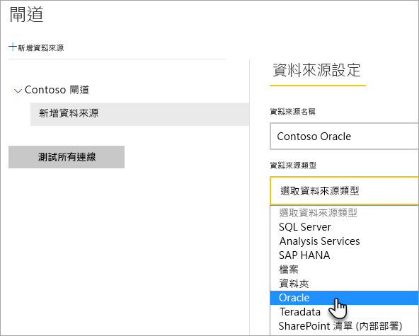
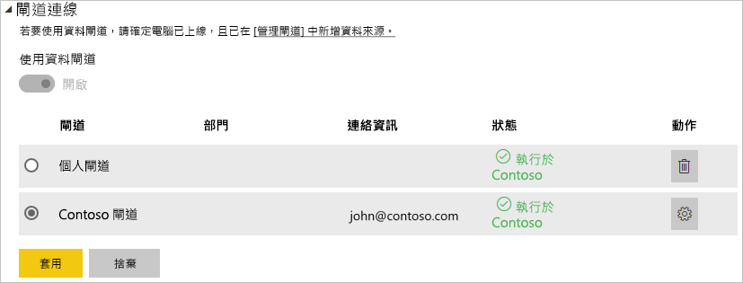

# 管理您的資料來源 - Oracle

[!INCLUDE [gateway-rewrite](../includes/gateway-rewrite.md)]

在您[安裝內部部署資料閘道](/data-integration/gateway/service-gateway-install)後，您需要[新增資料來源](service-gateway-data-sources.md#add-a-data-source)，其可與閘道搭配使用。 本文會探討如何針對已排程重新整理或 DirectQuery 使用閘道和 Oracle 資料來源。

## 連接到 Oracle 資料庫
若要使用內部部署的資料閘道連接到 Oracle 資料庫，則執行閘道的電腦上必須安裝正確的 Oracle 用戶端軟體。 您所使用的 Oracle 用戶端軟體取決於 Oracle 伺服器版本，但一律符合 64 位元閘道。

支援的 Oracle 版本： 
- Oracle Server 9 與更新版本
- Oracle 資料存取用戶端 (ODAC) 軟體 11.2 與更新版本

## 安裝 Oracle 用戶端
- [下載及安裝 64 位元 Oracle 用戶端](https://www.oracle.com/database/technologies/odac-downloads.html)。

> [!NOTE]
> 選擇與 Oracle Server 相容的 Oracle 資料存取用戶端 (ODAC) 版本。 例如，ODAC 12.x 不一定都支援 Oracle Server 第 9 版。
> 選擇 Oracle 用戶端的 Windows Installer。
> 在設定 Oracle 用戶端期間，請務必在安裝精靈期間選取對應的核取方塊，以啟用「在全機器層級設定適用於 ASP.NET 的 ODP.NET 和/或 Oracle 提供者」。 有些 Oracle 用戶端精靈版本根據預設會選取核取方塊，其他則否。 請務必確認已選取核取方塊，讓 Power BI 能夠連線到 Oracle 資料庫。
 
在安裝用戶端及正確設定 ODAC 之後，建議使用 PowerBI Desktop 或其他測試用戶端，以驗證閘道上的安裝與設定為正確。

## 加入資料來源

如需如何新增資料來源的詳細資訊，請參閱[新增資料來源](service-gateway-data-sources.md#add-a-data-source)。 在 [資料來源類型]  下選取 [Oracle]  。

在您選取 Oracle 資料來源類型後，請填入資料來源的資訊，其中包括 [伺服器]  和 [資料庫]  。 

在 [驗證方法]  下，您可以選擇 [Windows]  或 [基本]  。 若您計劃使用在 Oracle 而非 Windows 驗證中所建立的帳戶，請選擇 [基本]  。 然後輸入要用於這個資料來源的認證。

> [!NOTE]
> 資料來源的所有查詢都會使用這些認證來執行。 若要深入了解認證的儲存方式，請參閱[在雲端中儲存加密認證](service-gateway-data-sources.md#store-encrypted-credentials-in-the-cloud)。

填入所有資訊之後，選取 [新增]  。 您現在可以使用此資料來源，針對內部部署的 Oracle 伺服器，用於已排程的重新整理或 DirectQuery。 如果成功，您會看到「連線成功」  。

### 進階設定

您可以選擇性地設定您資料來源的隱私權等級。 此設定可以控制合併資料的方式。 只能用於已排程的重新整理。 隱私權層級設定不適用於 DirectQuery。 若要深入了解您資料來源的隱私權等級，請參閱[隱私權等級 (Power Query)](https://support.office.com/article/Privacy-levels-Power-Query-CC3EDE4D-359E-4B28-BC72-9BEE7900B540)。

## 使用資料來源

建立資料來源之後，您便可以搭配 DirectQuery 連線，或是透過已排程的重新整理來使用它。

> [!WARNING]
> Power BI Desktop 和內部部署資料閘道內資料來源的伺服器和資料庫名稱必須相符。

您的資料集和閘道內的資料來源是根據您的伺服器名稱和資料庫名稱以建立連結。 這些名稱必須相符。 例如，若您在 Power BI Desktop 中為伺服器名稱提供 IP 位址，則必須在閘道設定中針對資料來源使用 IP 位址。 此名稱也必須符合 tnsnames.ora 檔案中定義的別名。 如需 tnsnames.ora 檔案的詳細資訊，請參閱[安裝 Oracle 用戶端](#install-the-oracle-client)。

這項需求適用於 DirectQuery 和已排程的重新整理。

### 使用 DirectQuery 連線來使用資料來源

請確定在 Power BI Desktop 和針對閘道所設定資料來源之間具有相符的伺服器和資料庫名稱。 您也必須確定資料來源的 [使用者]  索引標籤已列出使用者，才能發佈 DirectQuery 資料集。 當您第一次匯入資料時，Power BI Desktop 內會出現 DirectQuery 的選取項目。 如需如何使用 DirectQuery 的詳細資訊，請參閱[在 Power BI Desktop 中使用 DirectQuery](desktop-use-directquery.md)。

發佈之後，您的報表會從 Power BI Desktop 或**取得資料**開始工作。 建立閘道內的資料來源之後，可能需要幾分鐘的時間才能使用連線。

### 使用已排程的重新整理使用資料來源

若您已列在閘道內所設定資料來源的 [使用者]  索引標籤中，且伺服器名稱和資料庫名稱相符，您將會看到可以與已排程重新整理搭配使用的閘道選項。

## 疑難排解

當命名語法不正確或未正確設定時，可能會遇到來自 Oracle 的任一種錯誤：

* ORA-12154:TNS：無法解析指定的連接識別碼。
* ORA-12514:TNS：接聽程式目前不了解連接描述元中要求的服務。
* ORA-12541:TNS：沒有任何接聽程式。
* ORA-12170:TNS：發生連接逾時。
* ORA-12504:TNS 接聽程式在 CONNECT_DATA 中未得到 SERVICE_NAME。

若未安裝或未正確設定 Oracle 用戶端，便可能會發生這些錯誤。 若已安裝，請驗證 tnsnames.ora 檔案已正確設定，且您使用的是適當的 net_service_name。 您也必須確定使用 Power BI Desktop 的電腦與執行閘道的電腦所使用的 net_service_name 相同。 如需詳細資訊，請參閱[安裝 Oracle 用戶端](#install-the-oracle-client)。

您也可能遇到 Oracle Server 版本與 Oracle 資料存取用戶端版本之間的相容性問題。 一般而言，因為某些組合不相容，所以您會希望這些版本能夠相符。 例如，ODAC 12.x 不支援 Oracle Server 第 9 版。

若要診斷資料來源伺服器與閘道電腦之間的連線問題，建議在閘道電腦上安裝用戶端 (例如 PowerBI Desktop 或 Oracle ODBC 測試)。 您可使用用戶端來檢查資料來源伺服器的連線。

如何與閘道相關的其他疑難排解資訊，請參閱[為內部部署資料閘道進行疑難排解](/data-integration/gateway/service-gateway-tshoot)。

## 後續步驟

* [針對閘道進行疑難排解 - Power BI](service-gateway-onprem-tshoot.md)
* [Power BI Premium](../admin/service-premium-what-is.md)

有其他問題嗎？ 請嘗試詢問 [Power BI 社群](https://community.powerbi.com/)。
