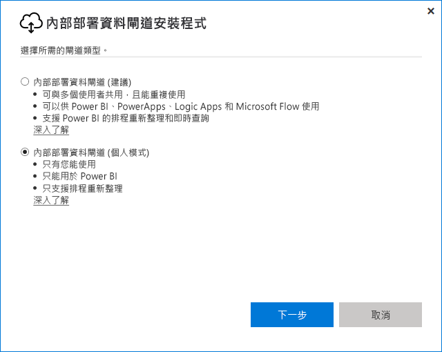
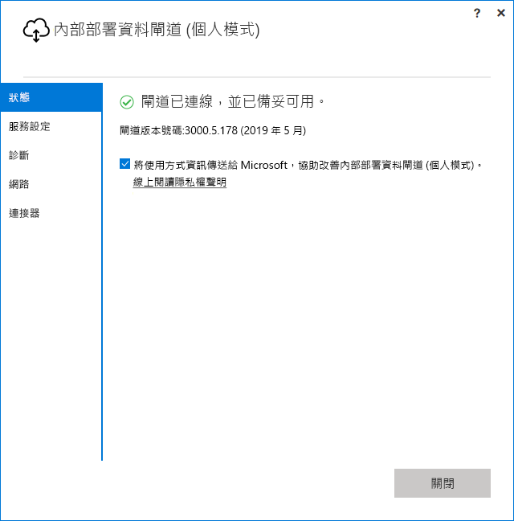

# <a name="use-personal-gateways-in-power-bi"></a>在 Power BI 中使用個人閘道

[!INCLUDE [gateway-rewrite](../includes/gateway-rewrite.md)]

內部部署資料閘道 (個人模式) 是僅適用於 Power BI 的內部部署資料閘道版本。 您可以使用個人閘道在您自己的電腦上安裝閘道，並存取內部部署資料。

> [!NOTE]
> 每一個 Power BI 使用者都只能有一個正在執行的個人模式閘道。 如果為相同的使用者安裝另一個個人模式閘道 (即使在不同的電腦上)，最新的安裝都會取代先前的既有安裝。

## <a name="on-premises-data-gateway-vs-on-premises-data-gateway-personal-mode"></a>內部部署資料閘道與內部部署資料閘道 (個人模式) 的比較

下表描述內部部署資料閘道與內部部署資料閘道 (個人模式) 之間的差異。

|   |內部部署的資料閘道 | 內部部署資料閘道 (個人模式) |
| ---- | ---- | ---- |
|支援雲端服務 |Power BI、PowerApps、Azure Logic Apps、Power Automate、Azure Analysis Services、資料流程 |Power BI |
|執行 |如具有閘道存取權的使用者所設定 |如同您用於 Windows 驗證，且如同您為其他驗證類型所設定 |
|只能以電腦系統管理員身分安裝 |是 |否 |
|集中式閘道和資料來源管理 |是 |否 |
|匯入資料並排程重新整理 |是 |是 |
|DirectQuery 支援 |是 |否 |
|Analysis Services 的 LiveConnect 支援 |是 |否 |

## <a name="install-the-on-premises-data-gateway-personal-mode"></a>安裝內部部署資料閘道 (個人模式)

安裝內部部署資料閘道 (個人模式)：

1. [下載內部部署資料閘道](https://go.microsoft.com/fwlink/?LinkId=820925&clcid=0x409)。

2. 在安裝程式中，選取內部部署資料閘道 (個人模式)，然後選取 [下一步]  。

   

閘道檔案會安裝在 _"%localappdata%\Microsoft\On-premises data gateway (personal mode)_ 中。 在安裝成功完成並且您順利登入後，您會看下列畫面。



## <a name="use-fast-combine-with-the-personal-gateway"></a>搭配個人閘道使用快速合併

個人閘道上的 [快速合併] 可協助您在執行查詢時忽略指定的隱私權等級。 啟用 [快速合併] 以使用內部部署資料閘道 (個人模式)：

1. 使用檔案總管，開啟下列檔案：

   `%localappdata%\Microsoft\On-premises data gateway (personal mode)\Microsoft.PowerBI.DataMovement.Pipeline.GatewayCore.dll.config`

2. 在檔案底端，新增下列文字：

    ```xml
    <setting name="EnableFastCombine" serializeAs="String">
       <value>true</value>
    </setting>
    ```

3. 在其完成後，設定會在約一分鐘內生效。 若要檢查它是否正常運作，請嘗試 Power BI 服務中的隨選重新整理，確認快速合併正常運作。

## <a name="frequently-asked-questions-faq"></a>常見問題集 (FAQ)

**問：** 我可以並存執行內部部署資料閘道 (個人模式) 與內部部署資料閘道 (先前稱為企業版閘道) 嗎？
  
**答：** 是，這兩個閘道可以同時執行。

**問：** 我能以服務形式執行內部部署資料閘道 (個人模式) 嗎？
  
**答：** 不會。 內部部署資料閘道 (個人模式) 只能以應用程式形式執行。 如果您需要以服務形式或系統管理員模式執行閘道，請考慮使用[內部部署資料閘道](/data-integration/gateway/service-gateway-onprem) (先前稱為「企業閘道」)。

**問：** 內部部署資料閘道 (個人模式) 的更新頻率為何？
  
**答：** 我們想要每月更新個人閘道。

**問：** 為什麼要求我更新認證？
  
**答：** 許多情況都可以觸發認證的要求。 最常見的情況是您已在與 Power BI - 個人閘道不同電腦上重新安裝內部部署資料閘道 (個人模式)。 這也可能會在資料來源中造成問題，而且 Power BI 無法執行測試連接，或發生逾時或系統錯誤。 若要更新 Power BI 服務中的認證，請選取齒輪圖示，然後選取 [設定]   > [資料集]  。 找出有問題的資料集並選取 [資料來源認證]  。

**問：** 在升級期間，我的舊版個人閘道會離線多久？
  
**答：** 將個人閘道升級為新版本只需要幾分鐘的時間。

**問：** 我使用 R 和 Python 指令碼。 個人模式支援它們嗎？
  
**答：** 個人模式支援 R 和 Python 指令碼。

## <a name="next-steps"></a>後續步驟

* [進行內部部署資料閘道的 Proxy 設定](/data-integration/gateway/service-gateway-proxy)  

有其他問題嗎？ 試試 [Power BI 社群](https://community.powerbi.com/)。
