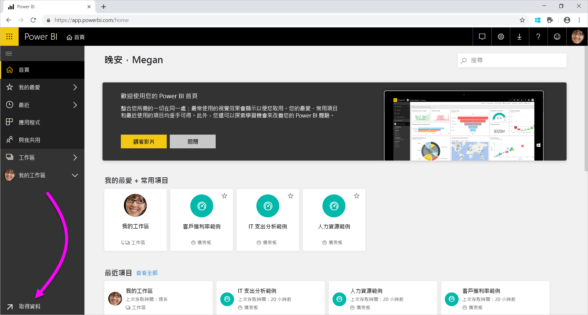

# Power BI 服務的資料來源
資料是 Power BI 的核心。 假設您正在探索資料。 您可能會先建立圖表與儀表板，或利用 [問與答]  提出問題，以執行上述作業。 系統顯示的視覺效果和解答會從資料集擷取其基礎資料。 但是，該資料集又來自何處？ 資料集是由資料來源而來。

本文將探討可以透過 Power BI 服務連接的資料來源類型。 請注意，您還可以從許多其他資料來源類型取得資料。 如果您選擇這些資料來源，您可能需要先使用 Power BI Desktop 或 Excel 的進階資料查詢與模型化功能。 我們稍後會進一步討論這些選項的詳細資訊。 現在，讓我們看看您可以直接從 Power BI 服務網站取得哪些不同資料來源類型。

您可以選取頁面左下角的 [取得資料]  ，以透過 Power BI 的任何資料來源取得資料。

 

選取 [取得資料]  ，您即可選擇要存取的資料

## 探索內容

[探索內容]  區段包含您需要的所有現有資料與報表。 Power BI 提供下列兩種類型的內容套件：組織和服務。 

**組織**：如果您和組織中的其他使用者都有 Power BI Pro 帳戶，即可建立、共用及使用內容套件。 如需深入了解，請參閱[組織內容套件簡介](../collaborate-share/service-organizational-content-pack-introduction.md)。

**服務**：適用於 Power BI 的內容套件實際上可提供數十種服務，且不斷增加中。 大部分服務都要求您具有帳戶。 如需深入了解，請參閱[使用 Power BI 連接到所用服務](service-connect-to-services.md)。

## 建立新內容

[建立新內容]  區段包含用來自行建立和匯入內容的選項。 在 Power BI 中，您可以使用下列兩種方式來建立或匯入自己的內容：檔案和資料庫。 

### 檔案

**Excel** ( *.xlsx*, *.xlsm*) - 在 Excel 中，活頁簿可能包含不同資料類型。 例如，它可能包含您自行輸入工作表的資料， 也可能包含您使用 Power Query 從外部資料來源查詢及載入的資料。 您可以透過 Excel 2016 或 Power Pivot 中的 [取得與轉換資料]  來使用 Power Query。 您可以從工作表中的資料表匯入資料，或從資料模型匯入資料。 如需深入了解，請參閱[針對 Power BI 從檔案取得資料](service-get-data-from-files.md)。

**Power BI Desktop** ( *.pbix*) - 您可以使用 Power BI Desktop，從外部資料來源查詢及載入資料，並建立報表。 您也可以使用量值與關聯性來擴充您的資料模型，或將 Power BI Desktop 檔案匯入 Power BI 網站。 Power BI Desktop 最適合更進階的使用者。 這些使用者通常非常了解自己的資料來源， 也充分掌握資料查詢與轉換以及資料模型化概念。 如需深入了解，請參閱[連接至 Power BI Desktop 中的資料](desktop-connect-to-data.md)。

**逗點分隔值** ( *.csv*) - 檔案是具有多列資料的簡單文字檔。 每個資料列可包含一或多個值，並以逗號分隔每個值。 例如，包含名稱與地址資料的 *.csv* 可能會有多個資料列。 每個資料列可能會有名字、姓氏、街道地址、縣/市、州/省等的值。 您無法將資料匯入 *.csv* 檔案，但 Excel 等許多應用程式可以將簡單的資料表資料另存為 *.csv* 檔案。

針對 XML 資料表 ( *.xml*) 或文字檔 ( *.txt*) 等其他檔案類型，您可以使用 [取得與轉換]  ，以查詢資料、轉換資料並將其載入 Excel 或 Power BI Desktop 檔案。 然後再將 Excel 或 Power BI Desktop 檔案匯入 Power BI。

您儲存檔案的位置也會形成顯著的差異。 商務用 OneDrive 提供最大的彈性以及與 Power BI 的整合。 您可以將檔案保留在本機磁碟機上， 不過如果您需要重新整理資料，就必須採取一些額外的步驟。 如需詳細資訊，請參閱以下文章連結。

### 資料庫

**雲端資料庫** - 您可以透過 Power BI 服務即時連接下列項目：

* Azure SQL Database
* Azure SQL 資料倉儲
* Azure HDInsight 上的 Spark

Power BI 與這些資料庫的連線都是即時的。 假設您要連接 Azure SQL Database， 因此您在 Power BI 中建立報表以開始探索其資料。 每當您將資料配量，或將其他欄位新增至視覺效果時，Power BI 即會直接對資料庫進行查詢。 如需深入了解，請參閱 [Azure 和 Power BI](service-azure-and-power-bi.md)。

**內部部署資料庫** - 您可以從 Power BI 服務直接連線到 SQL Server Analysis Services 表格式模型資料庫。 若要這樣做，您必須具備 Power BI Enterprise Gateway。 如果您不清楚如何連接到組織的表格式模型資料庫，請洽詢您的系統管理員或 IT 部門。 如需深入了解，請參閱 [Power BI 中的 SQL Server Analysis Services 即時資料](sql-server-analysis-services-tabular-data.md)。

針對組織中的其他資料庫類型，您必須使用 Power BI Desktop 或 Excel 來連接及查詢資料，並將該資料載入資料模型。 然後，您即可將檔案匯入資料集所在的 Power BI。 如果您設定排程重新整理，Power BI 會使用檔案中的這項設定與連線資訊，直接連接到資料來源並查詢更新。 接著，Power BI 即會將這些更新載入資料集。 如需深入了解，請參閱[連接至 Power BI Desktop 中的資料](desktop-connect-to-data.md)。

## 如果我的資料來自不同的來源，該怎麼辦？
Power BI 可以搭配使用數百種不同的資料來源。 無論您由何處取得資料，該資料之格式都必須為 Power BI 服務可取用的格式。 藉由這些可取用的資料，Power BI 服務即可建立報表和儀表板，並透過 [問與答]  來回答問題等。

有些資料來源已針對 Power BI 服務進行資料格式化。 這些來源包括來自 Google Analytics 和 Twilio 等服務提供者的內容套件。 SQL Server Analysis Services 表格式模型資料庫也可供使用。 您也可以即時連接到雲端資料庫，例如 Azure SQL Database 與 HDInsight 上的 Spark。

在其他情況下，您可能必須查詢所需的資料並將該資料載入檔案。 例如，假設您擁有組織的物流資料， 並將該資料儲存在伺服器的資料倉儲資料庫中。 在 Power BI 服務中，您無法連接到該資料庫並開始探索其資料 (除非是表格式模型資料庫)。 不過，您可以使用 Power BI Desktop 或 Excel 查詢物流資料並將該資料載入資料模型，接著儲存為檔案。 然後，您即可將該檔案匯入資料集所在的 Power BI。

您可能會問：「但是，該資料庫上的物流資料每天都在變。 該如何重新整理我的 Power BI 資料集？」 當您將資料匯入資料集時，您也會從 Power BI Desktop 或 Excel 檔案匯入連線資訊。

假設您設定排程的重新整理，或手動重新整理資料集。 Power BI 會使用資料集的連線資訊與幾個其他設定，直接連接資料庫。 接著，它會更新查詢並將這些更新載入資料集。 請注意，您可能需要使用 Power BI Gateway 來保護內部部署伺服器與 Power BI 之間的任何資料傳輸。 完成傳輸時，系統會自動重新整理報表和儀表板中的任何視覺效果。

您會發現，即使無法直接從 Power BI 服務連接資料來源，但您仍可以將該資料匯入 Power BI。 只需要一些額外步驟及 IT 部門的一些協助，就能辦到。 如需深入了解，請參閱 [Power BI Desktop 中的資料來源](desktop-data-sources.md)。

## 其他一些詳細資料
Power BI 中經常使用資料集與資料來源等詞彙。 這兩個詞彙通常會用來表示相同意義， 但實際上卻是兩個相關的不同項目。

當您使用 [取得資料]  時，即會自動在 Power BI 中建立**資料集**。 [取得資料]  可讓您從內容套件連接資料、檔案並加以匯入；或者，您可以連接即時資料來源。 資料集包含資料來源和資料來源認證的相關資訊。 在許多情況下，它也會包含從資料來源複製的資料子集。 當您在報表與儀表板中建立視覺效果時，所看到的資料通常就是來自資料集。

**資料來源**是指資料集資料的實際來源處。 例如，資料可能來自：

* Google Analytics 或 QuickBooks 等線上服務
* Azure SQL Database 等雲端資料庫
* 本機電腦或您組織伺服器上的資料庫或檔案

## 資料重新整理
您可能將檔案儲存在本機磁碟機或組織的某個磁碟機中。 您可能需要 Power BI Gateway，以便重新整理 Power BI 中的資料集。 進行重新整理作業時，儲存檔案的電腦必須已開機。 您可以重新匯入檔案，或使用 [從 Excel 發佈] 或 [從 Power BI Desktop 發佈]，但這些選項不是自動化程序。

如果您將檔案儲存在商務用 OneDrive 或 SharePoint - 小組網站，即可將其連線或匯入 Power BI。 這樣一來，您的資料集、報表與儀表板會一律保持在最新狀態。 由於 OneDrive 與 Power BI 都在雲端上，所以 Power BI 可以直接連接已儲存的檔案， 並且約每小時連線一次，同時檢查更新。 如果資料集和任何視覺效果有任何更新，即會自動重新整理。

來自服務的內容套件會自動更新。 在大部分情況下，他們會一天更新一次。 您可以手動重新整理，但是否顯示任何更新的資料則取決於服務提供者。 組織人員提供的內容套件更新取決於所使用資料來源。 這些更新也取決於建立內容套件的人員如何設定重新整理而定。

Azure SQL Database、Azure SQL 資料倉儲與 Azure HDInsight 上的 Spark 是雲端上的資料來源。 由於 Power BI 服務也是在雲端中，所以 Power BI 可以使用 **DirectQuery** 即時連接到這些資料來源。 您在 Power BI 中看到的內容一律會同步處理，而不需要設定排程的重新整理。

當您從 Power BI 連接到 SQL Server Analysis Services 時，就如同在雲端中 Azure 資料庫的即時連線。 差別在於，資料庫本身是在您組織的伺服器上。 這種連線需要 Power BI Gateway，並由 IT 部門進行設定。

資料重新整理是 Power BI 很重要的一部分，不是本文所能深入探討。 如果您想要徹底了解，請務必查看 [Power BI 的資料重新整理](refresh-data.md)。

## 考量與限制
針對 Power BI 服務中使用的所有資料來源，請注意下列限制。 特定功能有其他適用限制，但下列清單適用於整個 Power BI 服務︰

* **資料集大小限制** - Power BI 服務之共用容量中儲存的資料集限制為 1 GB。 若您需要較大的資料集，您可以使用 [Power BI Premium](../admin/service-premium-what-is.md)。

* **資料行中的相異值** - 快取 Power BI 資料集中的資料 (有時稱為「匯入」模式) 時，資料行中可以儲存之相異值的限制為 1,999,999,997 個。

* **資料列限制** - 使用 **DirectQuery** 時，Power BI 會在傳送到您底層資料來源的查詢結果上加諸限制。 若傳送至資料來源的查詢傳回超過 1 百萬列，您會看到錯誤，而且查詢會失敗。 您的底層資料仍然可以包含超過 1 百萬列。 因為大部分的報表都會將資料彙總成較小的結果集，您不太可能會遇到此限制。

* **資料行限制** - 資料集允許的資料行數目上限；資料集中所有資料表加起來是 16,000 個資料行。 此限制適用於 Power BI 服務以及 Power BI Desktop 中使用的資料集。 Power BI 會使用此方式追蹤資料集中的資料行與資料表數目，這表示資料集中每個資料表的資料行數目上限是 16,000 減一。
