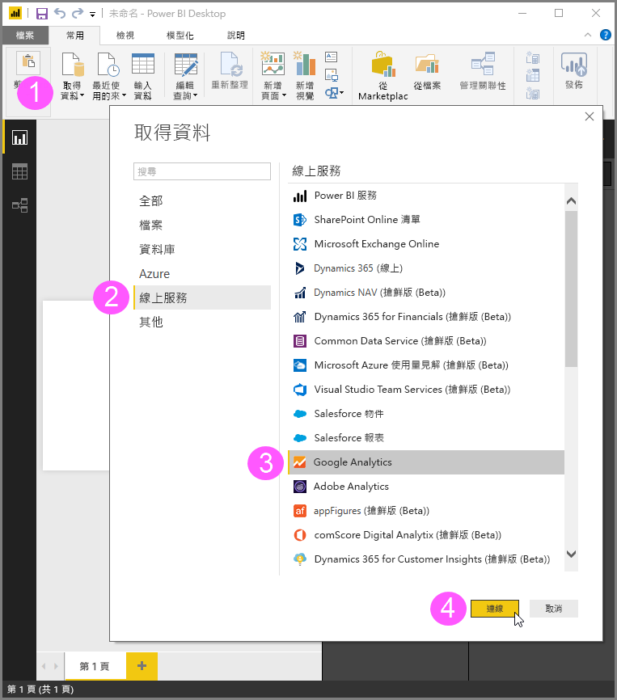
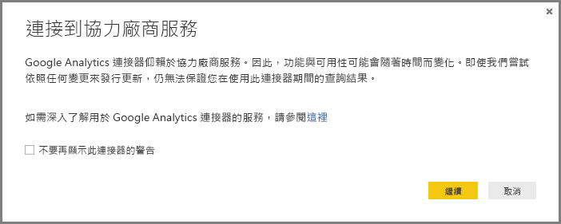
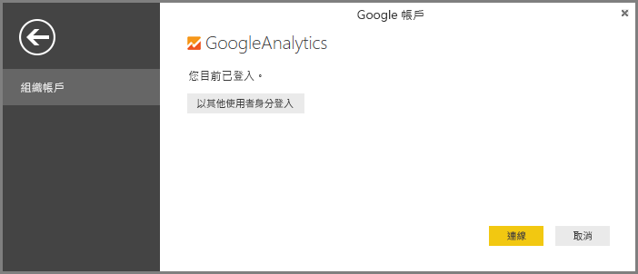
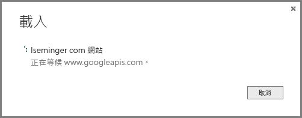

# 使用 Power BI Desktop 的 Google Analytics 連接器
> [!NOTE]
> Power BI Desktop 中的 Google Analytics (分析) 內容套件和連接器仰賴 Google Analytics (分析) 核心報告 API。 因此，功能與可用性可能會隨著時間而變化。

您可以使用 **Google Analytics (分析)** 連接器連接 Google Analytics 資料。 若要連接，請遵循下列步驟：

1. 在 **Power BI Desktop** 中，從 [主資料夾]  功能區索引標籤選取 [取得資料]  。
2. 在 [Get Data]  \(取得資料\) 視窗中，從左窗格的類別中選取 [線上服務]  。
3. 從右窗格的選項中選取 [Google Analytics]  。
4. 在視窗底部選取 [連接]  。  
   

您會看到系統提示的對話方塊，說明連接器是協力廠商服務，功能和可用性可能會隨著時間遷移而改變及其他相關事項。  

選取 [繼續]  時，系統會提示您登入 Google Analytics (分析)。  

當您輸入認證時，系統會提示您 Power BI 想要離線存取。 這是您使用 **Power BI Desktop** 存取 Google Analytics (分析) 資料的方式。  

只要接受，**Power BI Desktop** 就會顯示您目前為登入狀態。  

選取 [連接]  ，Google Analytics (分析) 資料即連接至 **Power BI Desktop** 並載入資料。  

## 應用程式開發介面的變更
雖然我們嘗試一有變更即發行更新，但是應用程式開發介面變更的方式可能會影響我們產生查詢的結果。 在某些情況下，可能不再支援某些查詢。 由於這種相依性，我們無法保證您使用這個連接器的查詢結果。

如需 Google Analytics (分析) API 變更的詳細資訊，請參閱其[變更記錄](https://developers.google.com/analytics/devguides/changelog).

