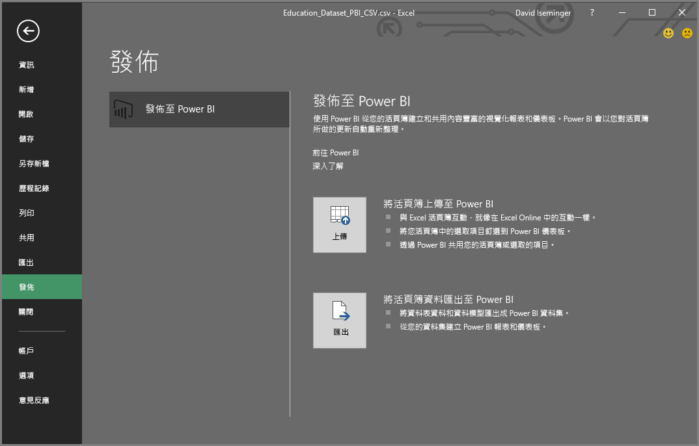
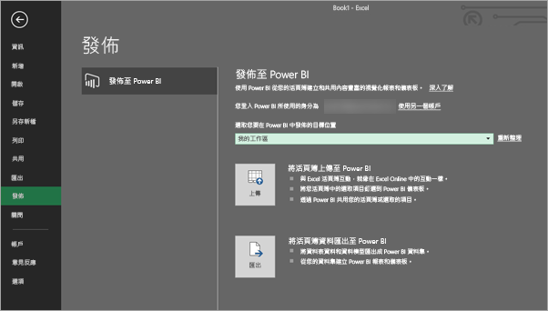
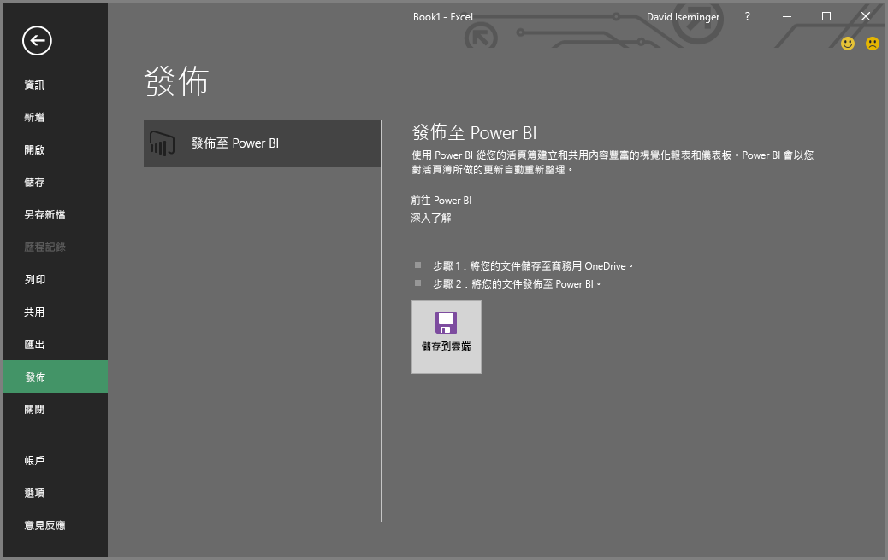
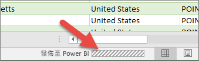

# 從 Microsoft Excel 發佈至 Power BI
在 Microsoft Excel 2016 和更新版本中，您可以將 Excel 活頁簿直接發佈至 [Power BI](https://powerbi.microsoft.com) 工作區，並在此根據活頁簿的資料建立互動性極高的報表和儀表板。 然後，您就可以與組織中的其他人分享深入解析。

將活頁簿發佈到 Power BI 時，有一些事項需要考量：

* 您用來登入 Office、商務用 OneDrive (如果使用在該處儲存的活頁簿) 和 Power BI 的帳戶必須是相同的帳戶。
* 您無法發佈空白活頁簿，或是未含任何 Power BI 支援內容的活頁簿。
* 您無法發佈加密或受密碼保護的活頁簿，或是使用資訊保護管理的活頁簿。
* 發佈到 Power BI 需要啟用新式驗證 (預設值)。 如果停用，[檔案] 功能表就無法使用 [發佈] 選項。

## 發佈 Excel 活頁簿
若要發佈 Excel 活頁簿，請在 Excel 中，選取 [檔案]  >  [發佈]，然後選取 [上傳] 或 [匯出]。

如果您將您的活頁簿 [上傳] 至 Power BI，您可以像是使用 Excel Online 進行互動一樣，與活頁簿互動。 您也可以將活頁簿中的選取範圍釘選到 Power BI 儀表板上，然後透過 Power BI 來共用您的活頁簿或所選取元素。

如果您選取 [匯出]，則可以將資料表資料和其資料模型匯出至 Power BI 資料集，然後您可以用其建立 Power BI 報表和儀表板。

### 本機檔案發佈
Excel 支援發佈本機 Excel 檔案。 您不需要將這些檔案儲存至商務用 OneDrive 或 SharePoint Online。

> [!IMPORTANT]
> 只有當您使用 Excel 2016 (或更新版本) 搭配 Microsoft 365 訂閱時，才可以發佈本機檔案。 Excel 2016 獨立安裝可以發佈至 Power BI，但是只有在將活頁簿儲存至商務用 OneDrive 或 SharePoint Online 時才可行。
> 

當您選取 [發佈] 時，您可以選取想要發佈的目標工作區。 若您的 Excel 檔案存放在商務用 OneDrive 上，您只能發佈到「我的工作區」。 若您的 Excel 檔案存放在本機磁碟上，您可以發佈至「我的工作區」或有權存取的共用工作區。

兩個關於如何將活頁簿放入 Power BI 的選項。

發佈之後，您發佈的活頁簿內容會匯入 Power BI，並與本機檔案分開。 如果您想要更新 Power BI 中的檔案，則必須再次發佈更新的版本，或者您可以在活頁簿或 Power BI 的資料集上設定排程的重新整理，重新整理資料。

### 從獨立 Excel 安裝發佈
從獨立 Excel 安裝發佈時，必須將活頁簿儲存至商務用 OneDrive。 選取 [儲存至雲端]，然後選擇商務用 OneDrive 中的一個位置。

將您的活頁簿儲存至商務用 OneDrive 之後，當您選取 [發佈] 時，就會有兩個選項可將活頁簿放入 Power BI：[上傳] 或 [匯出]：

#### 將活頁簿上傳至 Power BI
當您選擇 [上傳] 選項時，您的活頁簿會顯示在 Power BI 中，就像是在 Excel Online 中一樣。 但不同於 Excel Online，您有一些選項可協助您將工作表中的項目釘選到儀表板。

您無法在 Power BI 中編輯活頁簿。 如果您需要對資料進行一些變更，您可以按一下 [編輯]，然後選擇在 Excel Online 中編輯活頁簿，或在電腦上以 Excel 開啟活頁簿。 您所做的任何變更都會儲存到商務用 OneDrive 上的活頁簿。

**上傳**時，不會在 Power BI 中建立任何資料集。 您的活頁簿會顯示在工作區導覽窗格的 [報表] 中。 上傳至 Power BI 的活頁簿會有特殊的 Excel 圖示，將其識別為已上傳的 Excel 活頁簿。

如果您只有工作表中的資料，或是有想要在 Power BI 中查看的樞紐分析表和圖表，請選擇 [上傳]。

在 Excel 中從 [發佈至 Power BI] 使用 [上傳]，類似於在瀏覽器中從 Power BI 使用 [取得資料] > [檔案] > [商務用 OneDrive] > [在 Power BI 中連接、管理及檢視 Excel] 的體驗。

#### 將活頁簿資料匯出至 Power BI
當您選擇 [匯出] 時，資料表及/或資料模型中任何支援的資料都會匯出至 Power BI 中的新資料集。 活頁簿中的任何 Power View 工作表，都會在 Power BI 中重新建立為報表。

您可以繼續編輯活頁簿。 當您儲存變更後，這些變更通常會在一小時內與 Power BI 中的資料集同步處理。 如果您需要更立即的更新，您可以從 Excel 再次選取 [發佈]，您的變更就會立即匯出。 報表與儀表板中的任何視覺效果也都會更新。

如果您使用 [取得和轉換資料] 或 Power Pivot 功能將資料載入資料模型，或是您的活頁簿具有想要在 Power BI 中查看的 Power View 工作表及視覺效果，請選擇 [發佈]。

使用 [匯出]，相當類似於在瀏覽器中從 Power BI 使用 [取得資料] > [檔案] > [商務用 OneDrive] > [將 Excel 資料匯出至 Power BI]。

## 發佈
當您選擇任何一個選項時，Excel 會使用您目前的帳戶登入 Power BI，然後將您的活頁簿發佈至 Power BI 工作區。 您可以在 Excel 中監視狀態列，以查看發佈程序的進度。

完成時，即可直接從 Excel 移至 Power BI。

## 後續步驟
[Power BI 的 Excel 資料](service-excel-workbook-files.md)  
有其他問題嗎？ [試試 Power BI 社群](https://community.powerbi.com/)

