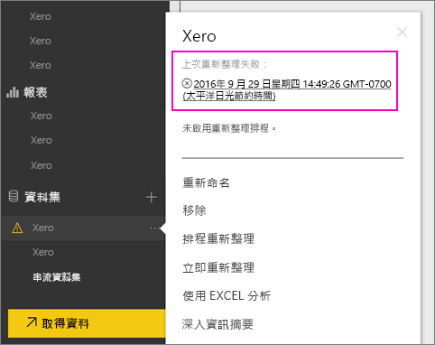
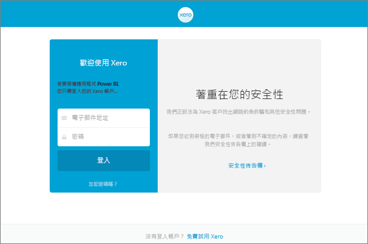

# 如何在重新整理失敗時，重新整理 Xero 內容套件認證
如果您使用 Xero Power BI 內容套件，內容套件每日更新可能會因為最近的 Power BI 服務事件而發生問題。

您可以檢查 Xero 資料集上次的重新整理狀態，如以下螢幕擷取畫面所示，查看內容套件是否成功重新整理。

如果看到如上所示的重新整理失敗，請依照下列步驟更新內容套件認證。

1. 按一下 Xero 資料集旁邊的 [更多選項] (...)，然後按一下 [排程重新整理]。 這會開啟 Xero 內容套件的設定頁面。
   
    ![Xero 對話方塊的螢幕擷取畫面，其中顯示 [排程重新整理] 選取項目。](media/service-refresh-xero-credentials/powerbi-xero-schedule-refresh.png)
2. 在 [Settings for Xero] \(Xero 設定) 頁面上，選取 [資料來源認證] > [編輯認證]。
   
    ![Xero 設定對話方塊的螢幕擷取畫面，其中顯示已選取 [編輯認證] 的 Xero 設定。](media/service-refresh-xero-credentials/powerbi-xero-settings-page.png)
3. 輸入貴組織名稱 > [下一步]。
   
    ![[設定 Xero] 對話方塊的螢幕擷取畫面，其中顯示組織的名稱。](media/service-refresh-xero-credentials/powerbi-xero-configure.png)
4. 使用您的 Xero 帳戶登入。
   
    
5. 更新認證後，讓我們來確定重新整理排程設定為每日執行。 按一下 Xero 資料集旁邊的 [更多選項] (...)，然後按一下 [排程重新整理] 來進行檢查。
   
    ![[排程重新整理] 對話方塊的螢幕擷取畫面，其中顯示 [重新整理頻率] 和 [時區]。](media/service-refresh-xero-credentials/powerbi-xero-refresh-schedule.png)
6. 您也可以選擇立即重新整理資料集。 按一下 Xero 資料集旁邊的 [更多選項] (...)，然後按一下 [立即重新整理]。
   
    ![[Xero] 對話方塊的螢幕擷取畫面，其中顯示已選取 [立即重新整理]。](media/service-refresh-xero-credentials/powerbi-xero-refresh-now.png)

如果重新整理仍然有問題，歡迎來信詢問：[https://support.powerbi.com](https://support.powerbi.com) 

如需深入了解 Power BI 的 Xero 內容套件，請瀏覽 [Xero 內容套件說明頁](service-connect-to-xero.md)。

### 後續步驟
* 有其他問題嗎？ [試試 Power BI 社群](https://community.powerbi.com/)

