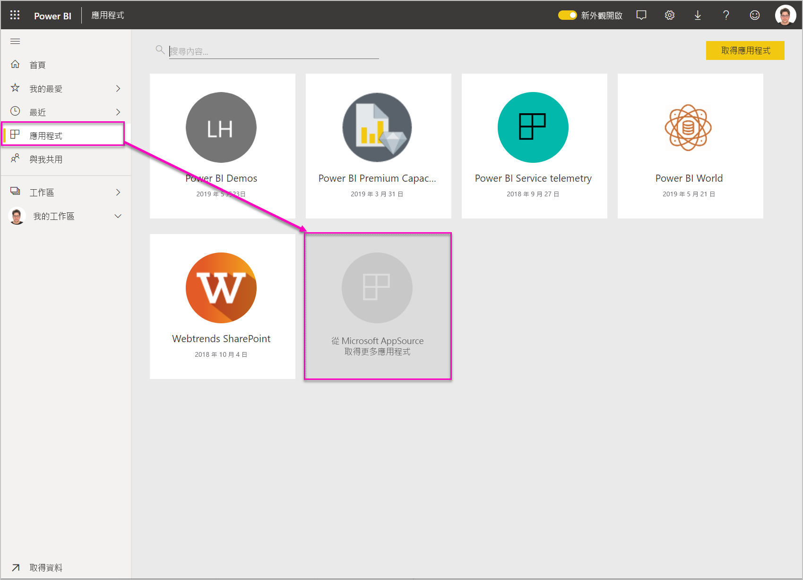
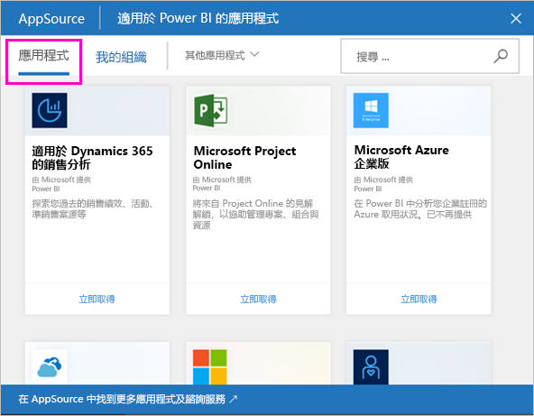
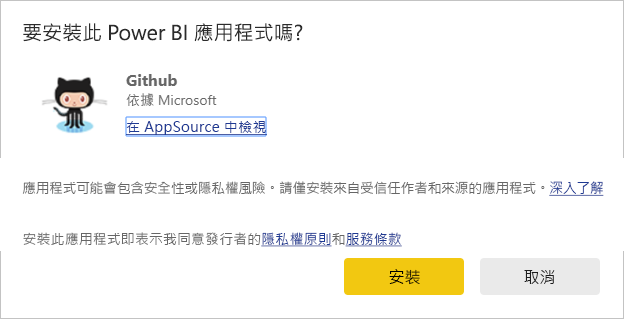
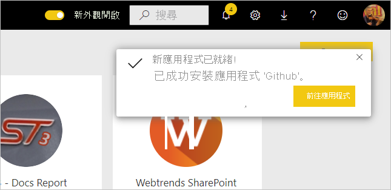
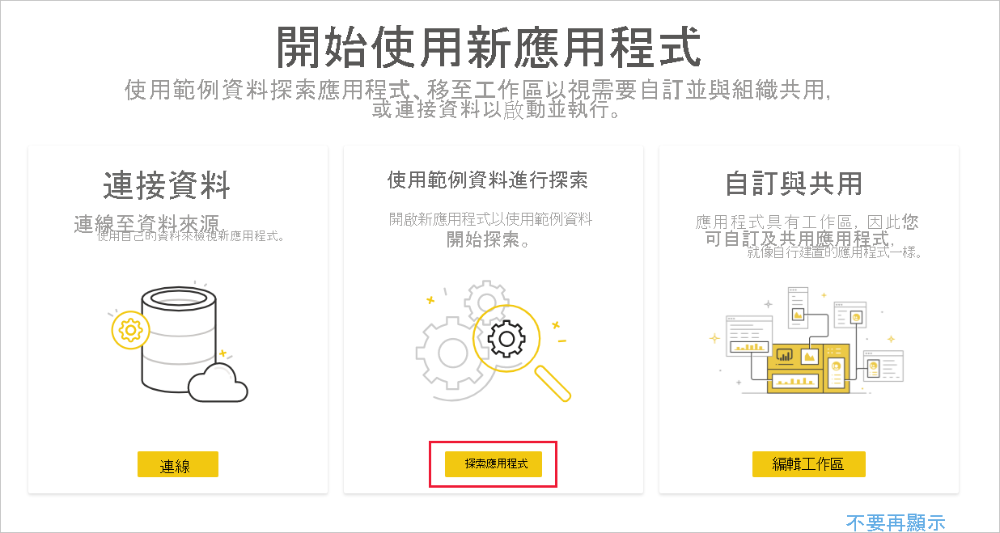
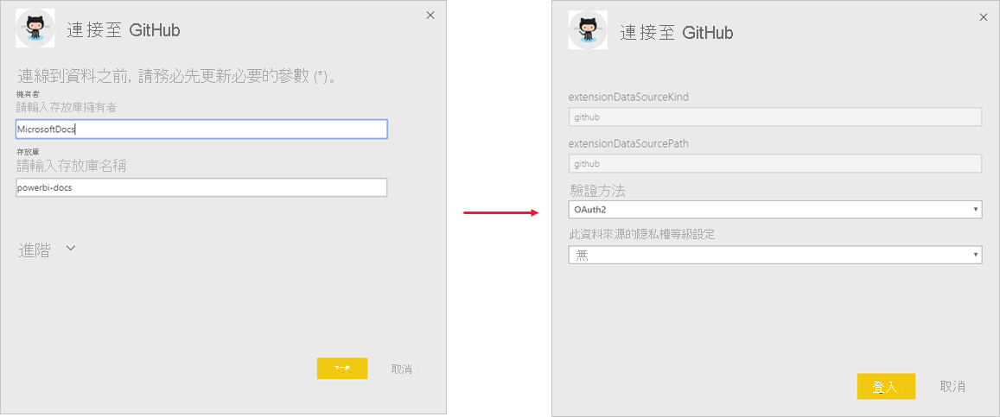
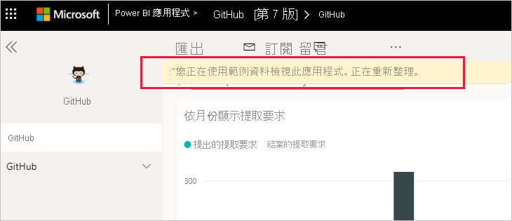
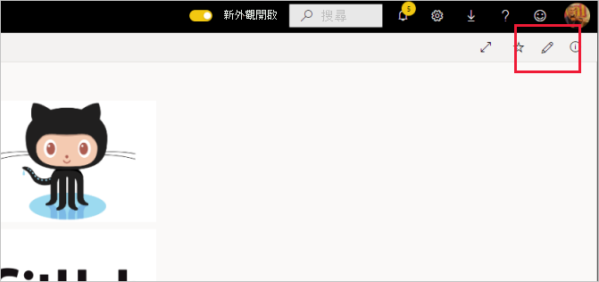
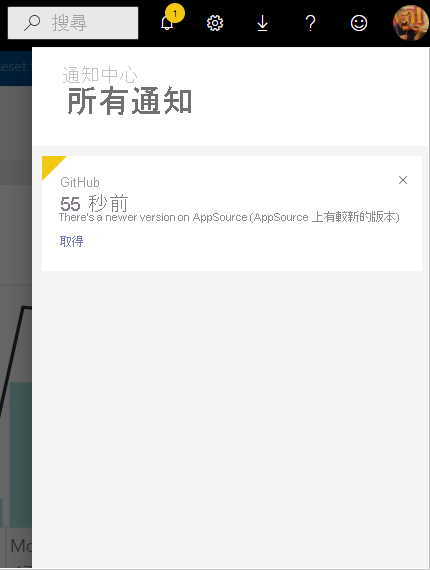
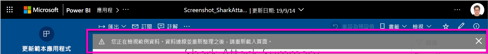

# 在組織中安裝並散發範本應用程式

您是 Power BI 分析員嗎？ 如果是，則本文會說明如何安裝[範本應用程式](service-template-apps-overview.md)，以連線並使用多項服務來執行業務，例如 Salesforce、Microsoft Dynamics，以及 Google Analytics。 您可以修改範本應用程式的預先建立儀表板與報表來符合組織需求，然後以[應用程式](../consumer/end-user-apps.md)的形式散發給同事。 

如有興趣自行建立範本應用程式並散發至組織外部，請參閱[在 Power BI 中建立範本應用程式](service-template-apps-create.md)。 Power BI 合作夥伴只要撰寫少量程式碼或無須撰寫程式碼，即可建置 Power BI 應用程式，並供 Power BI 客戶使用。 

## 必要條件  

若要安裝、自訂和散發範本應用程式，您需要： 

* [Power BI Pro 授權](../fundamentals/service-self-service-signup-for-power-bi.md)。
* 在租用戶上安裝範本應用程式的權限。
* 有效的應用程式安裝連結，其可從 AppSource 或應用程式建立者取得。
* 熟悉 [Power BI 的基本概念](../fundamentals/service-basic-concepts.md)。

## 安裝範本應用程式

1. 在 Power BI 服務的導覽窗格中選取 [應用程式] > [取得應用程式]。

    

1. 在出現的 [AppSource] 視窗中，選取 [應用程式]。 瀏覽或搜尋所需的應用程式，然後選取 [立即取得]。

    

1. 在出現的對話方塊中，選取 [安裝]。

    
    
    應用程式會與相關聯的工作區一併安裝。 **如果決定要自訂應用程式，您將會在此相關聯的工作區中執行此動作**。

    > [!NOTE]
    > 若使用未列於 AppSource 上的應用程式安裝連結，則會出現驗證對話方塊要求您確認選擇。
    >
    >若要安裝未列於 AppSource 上的範本應用程式，則必須向系統管理員要求相關權限。如需詳細資料，請參閱 Power BI 管理入口網站中的[範本應用程式設定](../admin/service-admin-portal.md#template-apps-settings)。

    當安裝成功完成時，會通知您新的應用程式已就緒。

    

## 連線至資料

1. 選取 [前往應用程式]。

1. 在 [開始使用新應用程式] 視窗中，選取 [探索]。

   

   應用程式隨即開啟，其中顯示範例資料。

1. 在頁面頂端的橫幅中，選取 [連線至資料] 連結。

   ![GitHub 應用程式 [連線至資料] 連結](media/service-template-apps-install-distribute/power-bi-template-app-connect-data.png)

    
    此動作將開啟一或數個對話方塊，您可以在其中將範例資料中資料來源變更為您自己的資料來源。 這通常表示重新定義資料集參數與資料來源認證。 請參閱[已知的限制](service-template-apps-overview.md#known-limitations)。
    
    在以下範例中，連線至資料會涉及兩個對話方塊。

   

    當完成填寫連線對話方塊之後，即會開始連線程序。 橫幅會通知資料正在重新整理，同時您也會看到範例資料。

    

   報表資料會每天自動重新整理一次，除非您在登入流程期間停用此功能。 您也可以視需要[設定自己的重新整理排程](./refresh-scheduled-refresh.md)，以將報表資料保持在最新狀態。

## 自訂和共用應用程式

當連線至資料並完成資料重新整理之後，您可自訂應用程式所包含的任何報表和儀表板，並與同事共用應用程式。 但請注意，當使用新版本來更新應用程式時，將會覆寫您所做的全部變更，除非將變更的項目儲存在不同名稱之下。 [請參閱關於覆寫的詳細資料](#overwrite-behavior)。

若要自訂和共用應用程式，請選取頁面右上角的鉛筆圖示。

如需在工作區中編輯成品的詳細資訊，請參閱
* [Power BI 中的報表編輯器導覽](../create-reports/service-the-report-editor-take-a-tour.md)
* [Power BI 服務中的設計工具基本概念](../fundamentals/service-basic-concepts.md)

當完成對工作區中成品的任何變更之後，即可開始發佈和共用應用程式。 請參閱[發佈應用程式](../collaborate-share/service-create-distribute-apps.md#publish-your-app)，以了解如何執行此操作。

## 更新範本應用程式

範本應用程式建立者時不時會透過 AppSource 或直接連結 (或兩者) 來發行改善的範本應用程式新版本。

如果您一開始是從 AppSource 下載應用程式，則當有新版的範本應用程式可用時，會以兩種方式收到通知：
* Power BI 服務會顯示更新橫幅，以通知有新的應用程式版本可供使用。
  
* 您會在 Power BI 的 [通知] 窗格中收到通知。

  

>[!NOTE]
>如果原本是透過直接連結而非 AppSource 來取得應用程式，則必須與範本應用程式建立者取得聯繫，才能得知新版本的推出時間。

  若要安裝更新，請按一下通知橫幅或通知中心的 [取得]，或在 AppSource 中再次尋找該應用程式，然後選擇 [立即取得]。 如果您已從範本應用程式建立者取得更新的直接連結，只要按一下連結即可。
  
  系統會詢問所要覆寫目前的版本，還是在新的工作區中安裝新版本。 預設會選取「覆寫」。

  

- **覆寫現有的版本：** 使用範本應用程式的更新版本來覆寫現有工作區。 [請參閱關於覆寫的詳細資料](#overwrite-behavior)。

- **安裝到新的工作區：** 安裝新版本的工作區與應用程式，需要重新設定 (亦即連線至資料、定義瀏覽與權限等步驟)。

### 覆寫行為

* 覆寫會更新工作區內的報表、儀表板和資料集，而非應用程式。 覆寫不會變更應用程式的瀏覽、設定和權限。
* 更新工作區之後，**您必須更新應用程式，以將變更從工作區套用到應用程式**。
* 覆寫會保留已設定的參數和驗證。 更新之後，隨即開始自動資料集重新整理。 **在此重新整理期間，應用程式、報表和儀表板會顯示範例資料**。

  

* 覆寫一律會顯示範例資料，直到重新整理完成為止。 如果範本應用程式作者對資料集或參數進行變更，則在重新整理完成之前，工作區與應用程式的使用者將無法看到新的資料， 但使用者仍會在這段期間內繼續看到範例資料。
* 覆寫一律不會刪除已新增至工作區的新報表或儀表板， 只會覆寫原始作者所變更的原始報表和儀表板。

>[!IMPORTANT]
>請記得在覆寫之後[更新應用程式](#customize-and-share-the-app)，以將變更套用至組織應用程式使用者的報表和儀表板。

## 後續步驟

[與同事在 Power BI 中建立工作區](../collaborate-share/service-create-the-new-workspaces.md)
