# 教學課程：在 Power BI 中建置機器學習模型

在本教學課程文章中，您會使用**自動化機器學習服務**，在 Power BI 中建立二進位預測模型並且套用。 教學課程包含建立 Power BI 資料流程，以及使用資料流程中所定義的實體，直接在 Power BI 中定型及驗證機器學習模型的指導。 我們接著會使用該模型來為新資料評分以產生預測。

首先，您會建立二進位預測機器學習模型，根據線上顧客的一組線上工作階段屬性，預測他們的購買意圖。 效能評定機器學習服務資料集會用於此演練。 定型模型後，Power BI 會自動產生驗證報表，解釋模型結果。 您接著可以檢視驗證報表，並將模型套用到您的資料以進行評分。

本教學課程由下列步驟組成：
> [!div class="checklist"]

> * 使用輸入資料建立資料流程
> * 建立及定型機器學習模型
> * 檢閱模型驗證報表
> * 將模型套用到資料流程實體
> * 在 Power BI 報表中使用模型的評分輸出

## 使用輸入資料建立資料流程

本教學課程的第一個部分是使用輸入資料建立資料流程。 該流程包含數個步驟，如下列各節所示，並會從取得資料開始。

### 取得資料

建立資料流程的第一個步驟，是將您的資料來源準備就緒。 在我們的案例中，我們會使用來自一組線上工作階段的機器學習服務資料集，其中有些最後會形成購買。 資料集包含一組與這些工作階段相關的屬性，而我們會使用這些屬性來定型我們的模型。

您可以從 UC Irvine 網站下載資料集。 針對本教學課程，我們也在以下連結提供此資料集：[online_shoppers_intention.csv](https://raw.githubusercontent.com/santoshc1/PowerBI-AI-samples/master/Tutorial_AutomatedML/online_shoppers_intention.csv)。

### 建立實體

若要在資料流程中建立實體，請登入 Power BI 服務，並巡覽至您已啟用 AI 專用容量上的工作區。

如果還沒有工作區，則您可在 Power BI 服務的導覽窗格功能表中選取 [工作區]  來建立一個工作區，然後在出現的面板底部選取 [建立工作區]  。 如此會在右側開啟一個面板，輸入工作區詳細資料。 輸入工作區名稱，然後選取 [進階]  。 透過圓形按鈕，確認工作區使用專用容量，並且指派給已開啟 AI 預覽的專用容量執行個體。 接著，選取 [儲存]  。

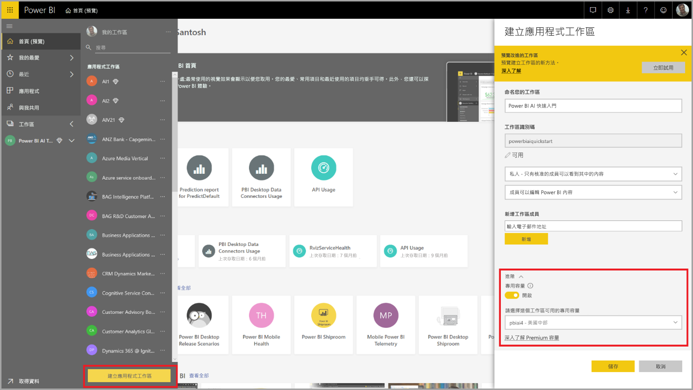

建立工作區後，您可以選取 [歡迎] 畫面右下角的 [略過]  ，如下圖所示。

 選取工作區右上角的 [建立]  按鈕，然後選取 [資料流程]  。

選取 [新增實體]  。 這會在瀏覽器中啟動 **Power Query** 編輯器。

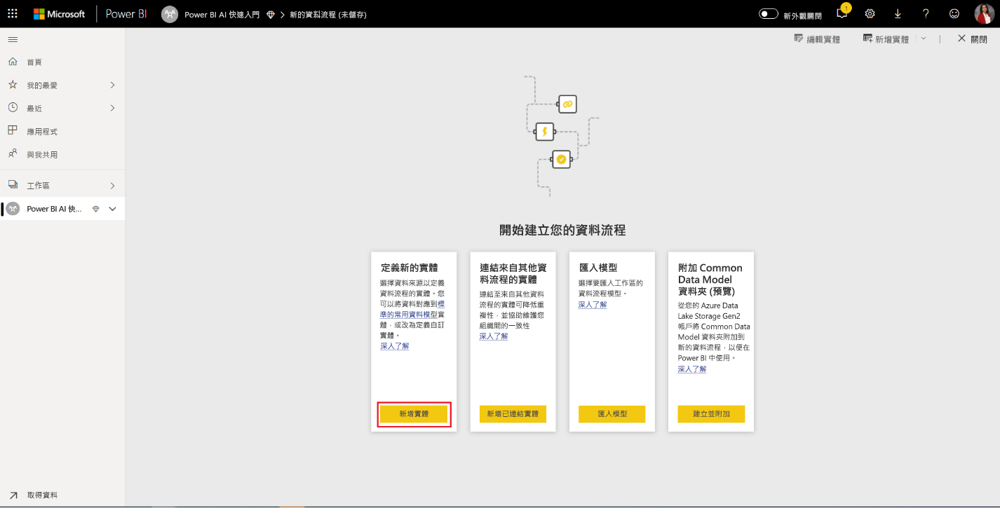

選取 [文字/CSV 檔案]  作為資料來源，如下圖所示。

![已選取 [文字/CSF 檔案]](media/service-tutorial-build-machine-learning-model/tutorial-machine-learning-model-05.png)

在接下來出現的 [連線到資料來源]  頁面中，將下列 _online_shoppers_intention.csv_ 的連結貼入 [檔案路徑或 URL]  方塊，然後選取 [下一步]  。

`https://raw.githubusercontent.com/santoshc1/PowerBI-AI-samples/master/Tutorial_AutomatedML/online_shoppers_intention.csv`

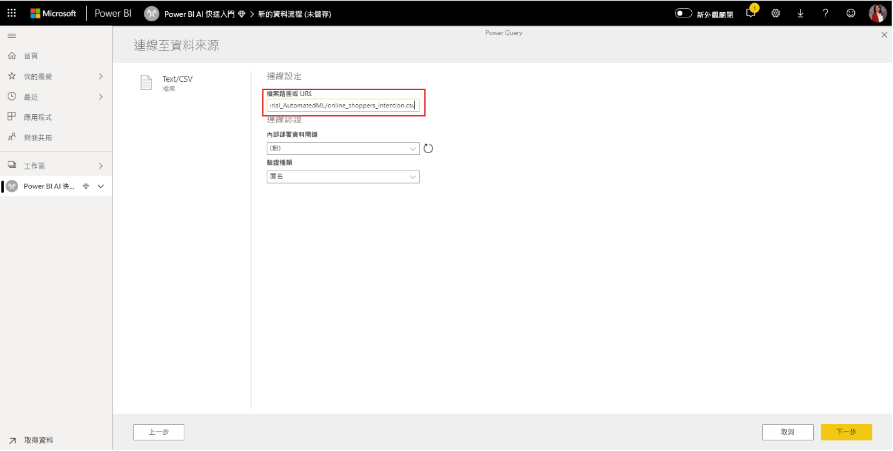

Power Query 編輯器會從 CSV 檔案中顯示資料的預覽。 您可以透過變更右側窗格中 [名稱] 方塊內的值，將查詢重新命名為較易記的名稱。 例如，您可以將查詢的名稱變更為「線上訪客」  。

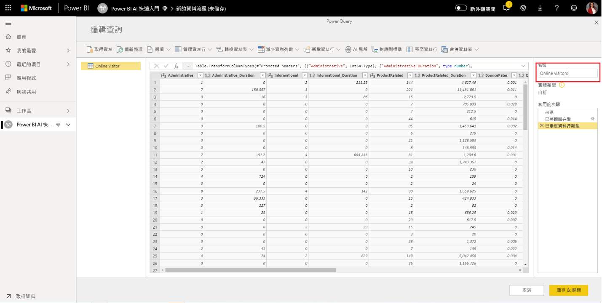

Power Query 會自動推斷資料行的類型。 您可以按一下資料行標題頂端的屬性類型圖示來變更資料行類型。 在此範例中，我們將 [Revenue] 資料行的類型變更為 True/False。

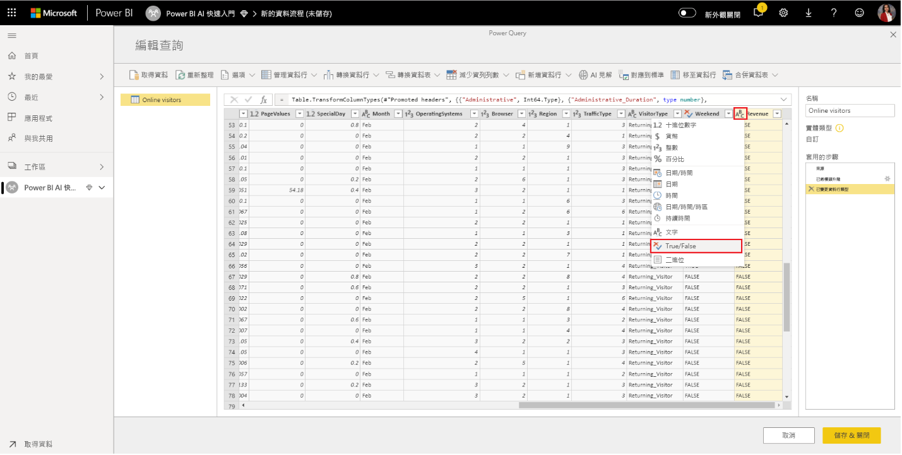

選取 [儲存並關閉]  按鈕來關閉 Power Query 編輯器。 提供資料流程的名稱，然後在對話方塊上選取 [儲存]  ，如下圖所示。

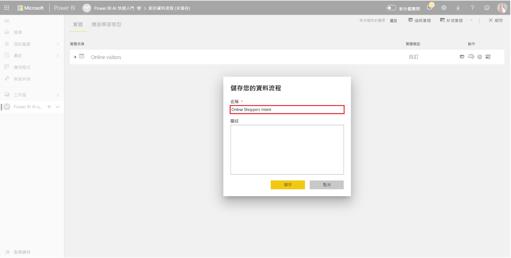

## 建立及定型機器學習模型

若要新增機器學習模型，請在包含您定型資料及標籤資訊基底實體的 [動作]  清單中，選取 [套用 ML 模型]  按鈕，然後選取 [新增機器學習模型]  。

建立我們機器學習模型的第一個步驟是識別歷史資料，包含您要預測的結果欄位。 模型的建立將從學習此資料而來。

針對我們正在使用的資料集，這是 **Revenue** 欄位。 選取 [Revenue]  作為「結果欄位」的值，然後選取 [下一步]  。

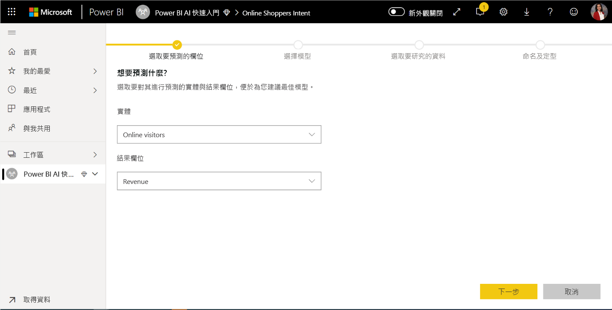

接下來，我們必須選取要建立的機器學習模型類型。 Power BI 會分析您所識別結果欄位中的值，並建議可建立並用來預測欄位的機器學習模型類型。

在此案例中，我們正在預測使用者是否會進行購買的二元結果，因此 [二元預測] 是建議選項。 由於我們想要預測會進行購買的使用者，因此請選取 [True] 作為您最感興趣的 [Revenue] 結果。 此外，您可以為結果提供易記標籤；這些結果會用於自動產生報表，其摘要模型驗證的結果。 接著，請選取 [下一步]。

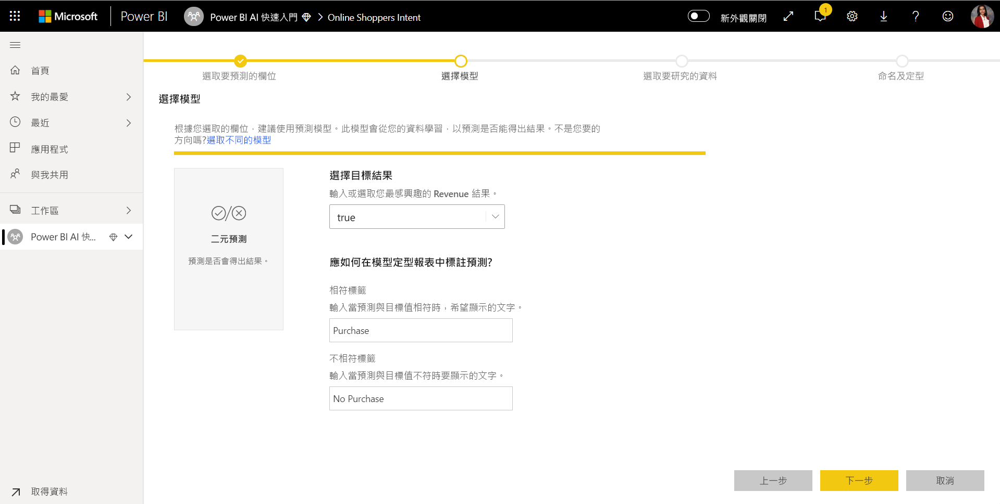

接下來，Power BI 會對資料範例進行初步掃描，並建議可能產生更正確預測的輸入。 若 Power BI 並未建議欄位，便會在旁邊提供解釋。 您可以選擇變更選取項目以僅包含您想要模型進行研究的欄位，或可透過選取實體名稱旁的核取方塊來選取所有欄位。 選取 [下一步]  ，接受輸入。

![選取 [下一步] 核取方塊](media/service-tutorial-build-machine-learning-model/tutorial-machine-learning-model-13.png)

在最終步驟中，我們必須提供模型的名稱。 將模型命名為「購買意圖預測」  。 您可以選擇減少定型時間來更快看到結果，或增加花在定型的時間來取得最佳模型。 然後選取 [儲存並定型]  來開始定型模型。

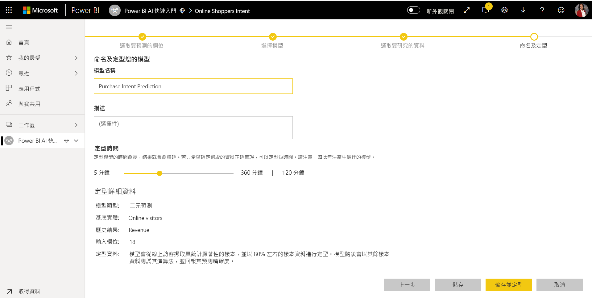

定型處理序會從取樣及正常化您的歷史資料開始，並將您的資料集分成兩個新實體：「購買意圖預測定型資料」  及「購買意圖預測測試資料」  。

取決於資料集的大小，定型流程所花費時間可能自數分鐘到先前畫面中所選取的定型時間不等。 此時，您可以在資料流程的 [機器學習模型]  索引標籤中看見模型。 「準備就緒」狀態表示模型已排入定型佇列，或正在定型。

您可以透過資料流程的狀態來確認模型正在定型或正在進行驗證。 這會在工作區的 [資料流程]  索引標籤中，顯示為正在進行的資料重新整理。

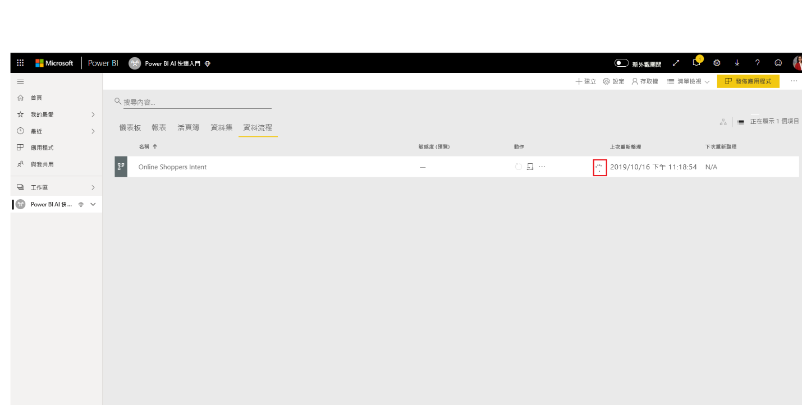

模型定型完成後，資料流程會顯示更新後的重新整理時間。 您可以巡覽至資料流程中的 [機器學習模型]  索引標籤，來確認模型已定型。 您建立的模型應會顯示狀態為 [已定型]  ，且 [上次定型]  時間現在應該已經更新。

## 檢閱模型驗證報表
若要檢閱模型驗證報表，請在 [機器學習模型] 索引標籤中，選取模型 [動作] 欄中的 [檢視定型報表] 按鈕。 此報表會描述您機器學習模型可能執行的方式。

在報表的 [模型效能]  頁面中，選取查看 [最高預測指標]  來檢視您模型的最高預測指標。 您可以選取其中一個預測指標來查看結果分佈與該預測指標建立關聯的方式。

您可以使用 [模型效能] 頁面上的 [可能性閾值]  交叉分析篩選器，檢查其對模型精確度和回收的影響。

報表的其他頁面會描述模型的統計效能計量。

報表也會包含 [定型詳細資料] 頁面，描述已執行的不同反覆運算、從輸入擷取特徵的方式，以及針對最終模型使用的超參數。

## 將模型套用到資料流程實體

選取報表頂端的 [套用模型]  按鈕來叫用此模型。 在 [套用]  對話方塊中，您可以指定擁有應套用模型來源資料的目標實體。

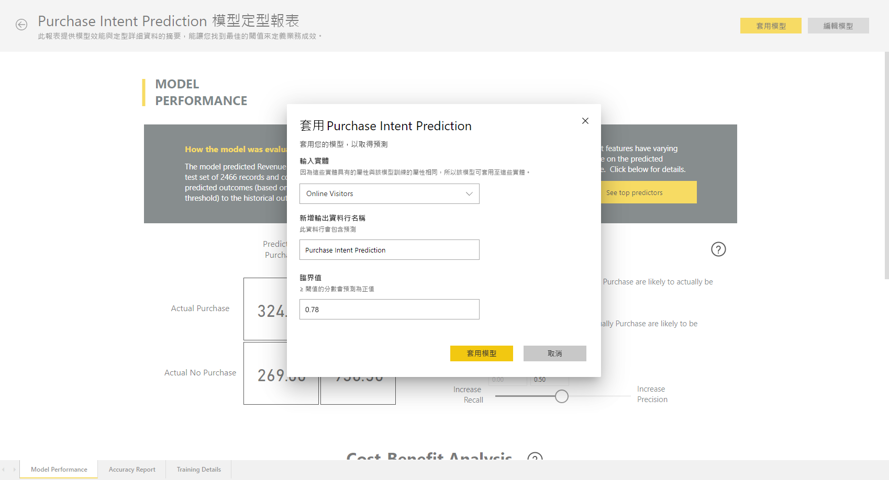

出現提示時，您必須 [重新整理]  資料流程，以便預覽您模型的結果。

套用模型將會建立兩個新實體，其中包含 **enriched <model_name>** 尾碼和 **enriched <model_name> explanations** 尾碼。 在我們的案例中，將模型套用到**線上訪客**實體將會建立**線上訪客擴充購買意圖預測** (其中包含從模型產生的預測輸出)，以及**線上訪客擴充購買意圖預測解釋** (其中包含針對預測最關鍵的記錄限定影響因素)。 

套用二元預測模型會新增四個資料行，其中包含預測結果、可能性分數、針對預測最關鍵的記錄限定影響因素，以及解釋索引，且每個都會加上所指定的資料行名稱前置詞。  

在完成資料流程重新整理後，您可以選取**線上訪客擴充購買意圖預測**實體來檢視結果。

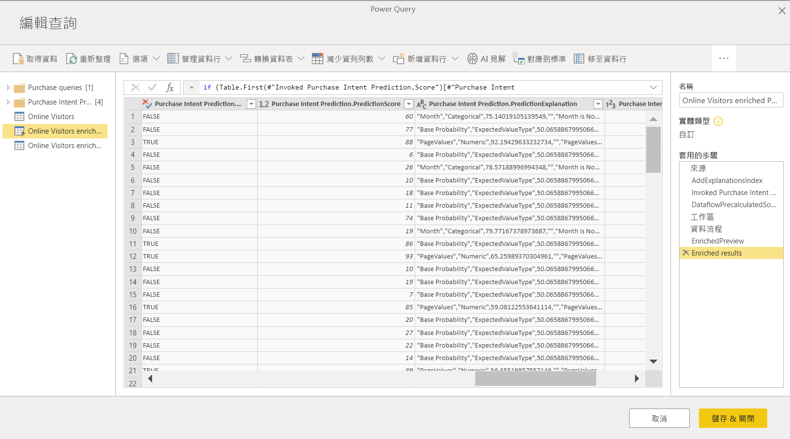

您也可以直接從資料流程中的 Power Query 編輯器，叫用工作區中的任何 AutoML 模型。 若要存取 AutoML 模型，請針對要從您的 AutoML 模型豐富見解的實體選取 [編輯] 按鈕，如下列影像所示。

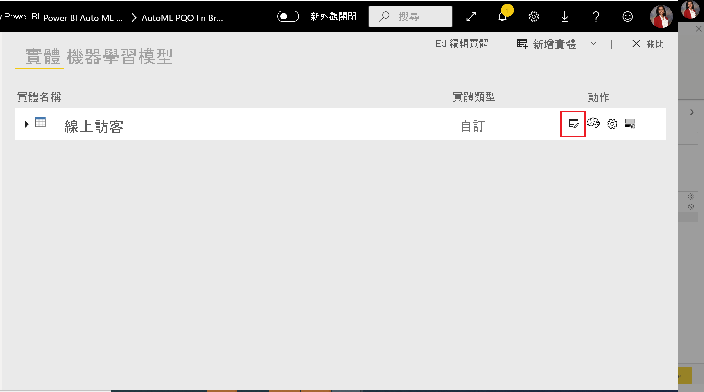

選取 [編輯] 按鈕以針對您資料流程中的實體開啟 Power Query 編輯器。 選取功能區中的 [AI 見解] 按鈕。

 從瀏覽窗格功能表中，選取 [Power BI 機器學習模型] 資料夾。 您擁有存取權的所有 AutoML 模型都會在這裡列為 Power Query 函式。 此外，AutoML 模型的輸入參數會自動對應為相對應 Power Query 函式的參數。 請注意，只有當參數的名稱與資料類型相同時，才會自動對應參數。
 
若要叫用 AutoML 模型，您可以從下拉式清單中指定任何所選實體的資料行作為輸入。 您也可以將資料行圖示切換至 [輸入] 對話方塊的左側，以指定要當作輸入使用的常數值。

選取 [套用]，以檢視 AutoML 模型的輸出作為實體資料表中新資料行的預覽。 您也將看到模型叫用作為查詢套用的步驟。

一旦您儲存資料流程之後，當您針對實體資料表中任何新的或更新的資料列重新整理資料流程時，將會自動叫用模型。

## 在 Power BI 報表中使用模型的評分輸出

若要使用機器學習模型的評分輸出，您可從 Power BI Desktop 使用資料流程連接器來連線到資料流程。 **線上訪客擴充購買意圖預測**實體現在可以用來將模型的預測併入 Power BI 報表。

## 後續步驟

在本教學課程中，您已使用這些步驟，在 Power BI 中建立並套用二進位預測模型：

* 使用輸入資料建立資料流程
* 建立及定型機器學習模型
* 檢閱模型驗證報表
* 將模型套用到資料流程實體
* 在 Power BI 報表中使用模型的評分輸出

如需 Power BI 中機器學習服務自動化的詳細資訊，請參閱 [Power BI 中的自動化機器學習服務](../transform-model/service-machine-learning-automated.md)。
