# <a name="tutorial-use-cognitive-services-in-power-bi"></a>教學課程：在 Power BI 中使用認知服務

Power BI 會提供存取權，可存取一組來自 Azure 認知服務的功能，強化資料流程自助資料準備中的資料。 目前支援的服務包括[情感分析](https://docs.microsoft.com/azure/cognitive-services/text-analytics/how-tos/text-analytics-how-to-sentiment-analysis)、[關鍵片語擷取](https://docs.microsoft.com/azure/cognitive-services/text-analytics/how-tos/text-analytics-how-to-keyword-extraction)、[語言偵測](https://docs.microsoft.com/azure/cognitive-services/text-analytics/how-tos/text-analytics-how-to-language-detection)，和[影像標記](https://docs.microsoft.com/azure/cognitive-services/computer-vision/concept-tagging-images)。 轉換會在 Power BI 服務上執行，且不需要 Azure 認知服務 訂用帳戶。 此功能需要 Power BI Premium。

[適用於資料流程的自助資料準備](https://powerbi.microsoft.com/blog/introducing-power-bi-data-prep-wtih-dataflows/) \(英文\) 中支援認知服務。 使用下面用於文字分析和影像標記的逐步說明範例來開始學習。

在本教學課程中，您會了解如何：

> [!div class="checklist"]
> * 將資料匯入到資料流程中
> * 針對資料流程中的文字欄位進行情感評分及擷取關鍵片語
> * 從 Power BI Desktop 連線至結果


## <a name="prerequisites"></a>必要條件

若要完成此教學課程，您需要下列項目： 

- 一個 Power BI 帳戶。 如果您尚未註冊 Power BI，請先進行[免費註冊](https://app.powerbi.com/signupredirect?pbi_source=web)再開始。
- 在啟用 AI 工作負載的情況下存取 Power BI Premium 容量。 預覽期間將預設關閉此工作負載。 如果正在使用 Premium 容量而且未顯示 AI 見解，請洽詢您的 Premium 容量系統管理員，以在系統管理員入口網站中啟用 AI 工作負載。

## <a name="text-analytics"></a>文字分析

請依照此節的步驟完成此教學課程的文字分析部分。

### <a name="step-1-apply-sentiment-scoring-in-power-bi-service"></a>步驟 1：在 Power BI 服務中盜用情感評分

若要開始，請瀏覽至具備 Premium 容量的 Power BI 工作區，並使用畫面右上角的 [建立]  按鈕建立新的資料流程。

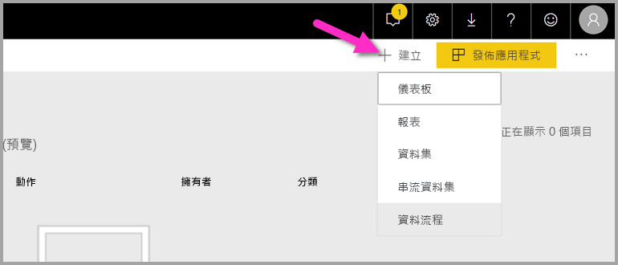

[資料流程] 對話方塊會顯示用於建立新資料流程的選項，請選取 [新增實體]  。 接下來，從資料來源功能表選擇 [文字/CSV]  。


將此 URL 貼到 [URL] 欄位︰[https://pbiaitutorials.blob.core.windows.net/textanalytics/FabrikamComments.csv](https://pbiaitutorials.blob.core.windows.net/textanalytics/FabrikamComments.csv)，然後按一下 [下一步]  。


資料現在已經就緒，可用於進行文字分析，而且我們可以在客戶註解資料行中使用情感評分和關鍵片語擷取。

在 Power Query 編輯器中，選取 [AI 見解] 

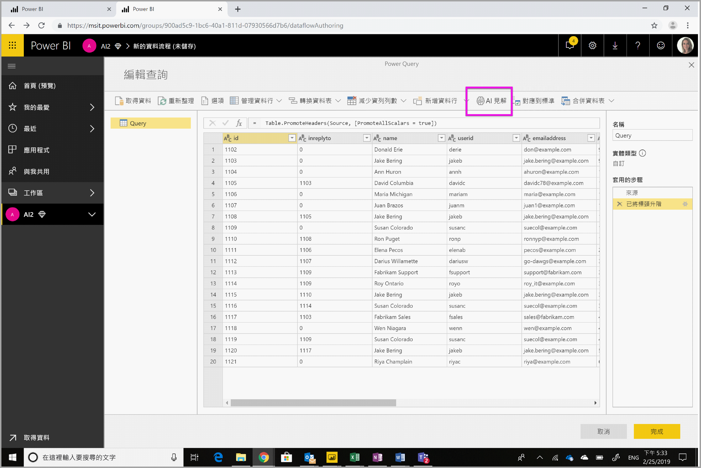

展開 [認知服務]  資料夾並選取想要使用的功能。 此範例會針對註解資料行進行情感評分，但是您可以依照相同步驟試用語言偵測和關鍵片語擷取功能。


選取功能之後，將會顯示必要和選擇性欄位。 若要針對範例評論進行情感評分，請選取評論資料行作為文字輸入。 文化特性資訊是選擇性的輸入，而且需要為 ISO 格式。 例如，如果想要將文字視為英文，請輸入 'en'。 當欄位保留空白時，Power BI 會在進行情感評分之前，先偵測輸入值的語言。

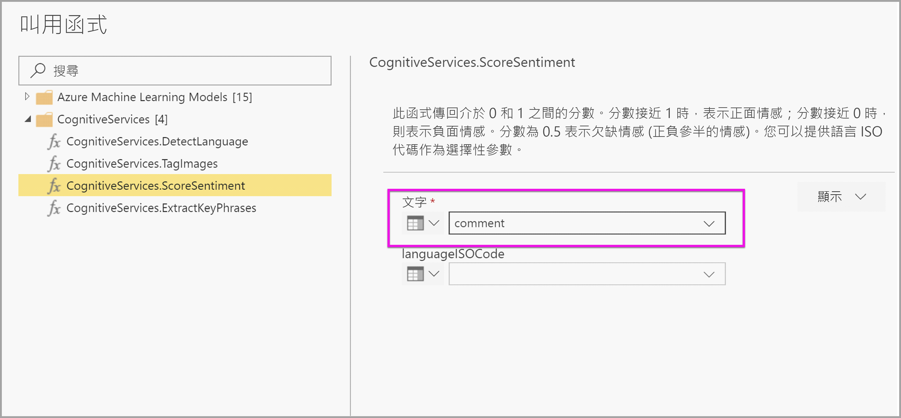

現在請選取 [叫用]  以執行功能。 就會將一個包含每一資料行情感分數的新資料行新增至資料表。 您可以回到 [AI 見解]  ，以相同方式擷取評論文字的關鍵片語。

完成轉換之後，請將查詢名稱變更為「客戶評論」並選取 [完成]  。


接下來，請 [儲存]  資料流程並將它命名為 Fabrikam。 選取儲存資料流程後顯示的 [立即重新整理]  按鈕。


儲存資料流程並重新整理之後，就可以在 Power BI 報表中使用。

### <a name="step-2-connect-from-power-bi-desktop"></a>步驟 2：從 Power BI Desktop 連線

開啟 Power BI Desktop。 在 [常用] 功能區中，選取 [取得資料]  。

在 Power BI 區段中瀏覽至 [Power BI 資料流程 (Beta)]  ，然後選取 [連線]  。

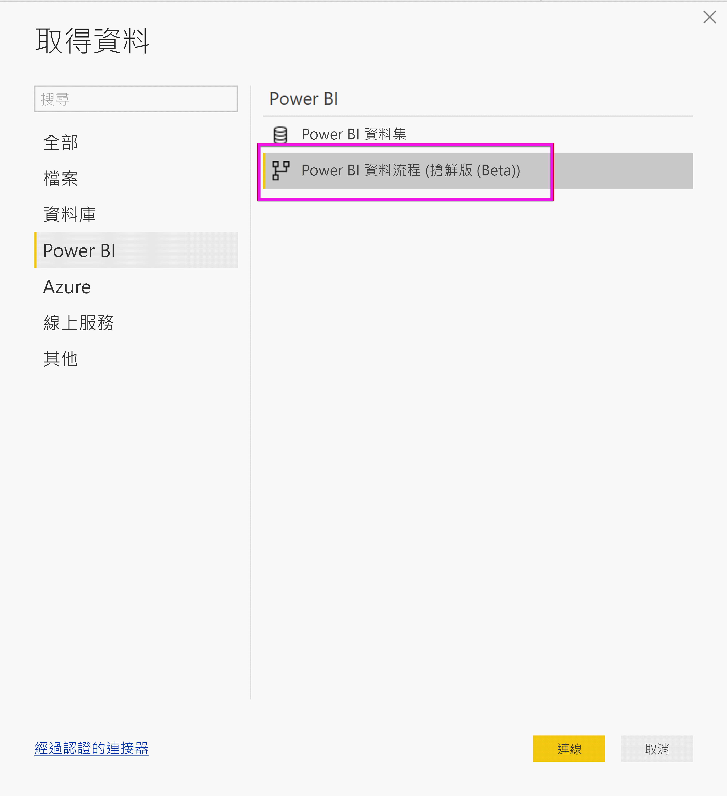

由於這是一個預覽功能，因此連接器會要求您接受預覽條件。 接受之後，請使用您的組織帳戶登入。


選取您剛才建立的資料流程。 瀏覽至 [客戶評論] 資料表，然後按一下 [載入]  。


現在已載入資料，可以開始建置報表了。

## <a name="image-tagging"></a>影像標記

瀏覽至具備 Premium 容量 的 Power BI 工作區。 使用畫面右上角的 [建立]  按鈕建立新資料流程。


選取 [新增實體]  。

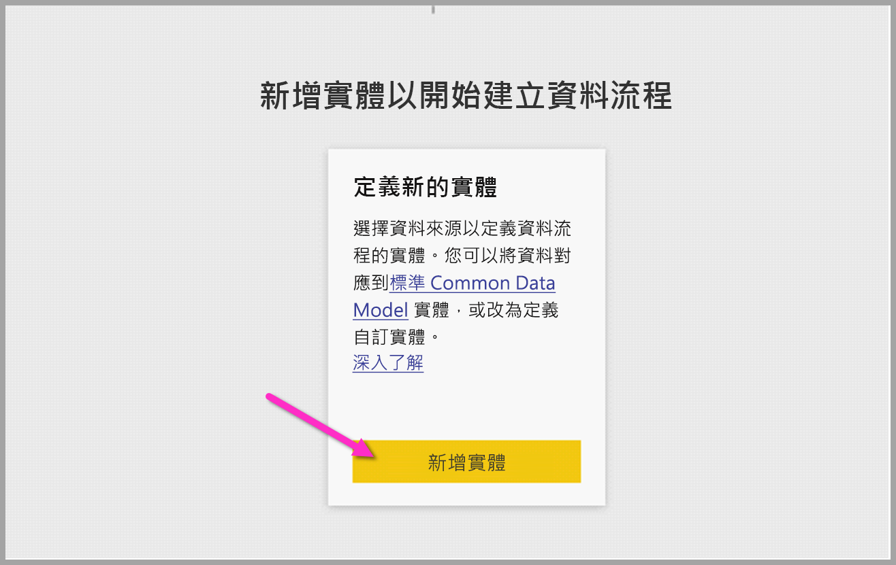

系統要求您選擇資料來源之後，請選取 [空白查詢]  。

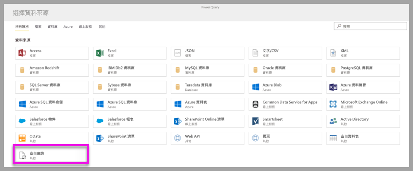

在查詢編輯器中複製下方的查詢，然後按一下 [下一步]。 您可以使用其他影像取代下面的 URL 路徑，或加入更多資料列。 *Web.Contents* 函式會以二進位方式匯入影像 URL。 如果您有包含儲存為二進位影像的資料來源，也可以直接使用它。


```python
let
  Source = Table.FromRows({
  { Web.Contents("https://images.pexels.com/photos/87452/flowers-background-butterflies-beautiful-87452.jpeg") },
  { Web.Contents("https://upload.wikimedia.org/wikipedia/commons/5/53/Colosseum_in_Rome%2C_Italy_-_April_2007.jpg") }}, { "Image" })
in
  Source
```

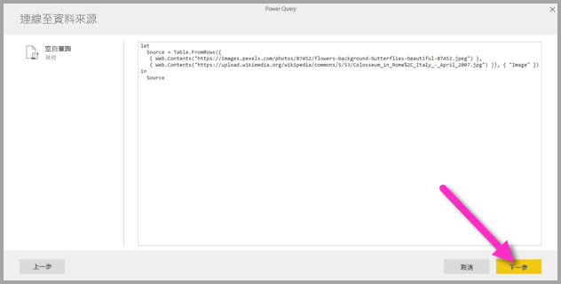

當系統提示您輸入認證時，請選取 [匿名]  。

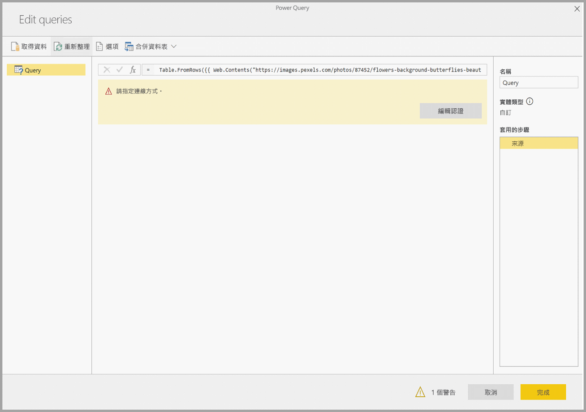

您會看到以下影像。


系統會提示您為每個個別網頁輸入認證。

在查詢編輯器中選取 [AI 見解]  。

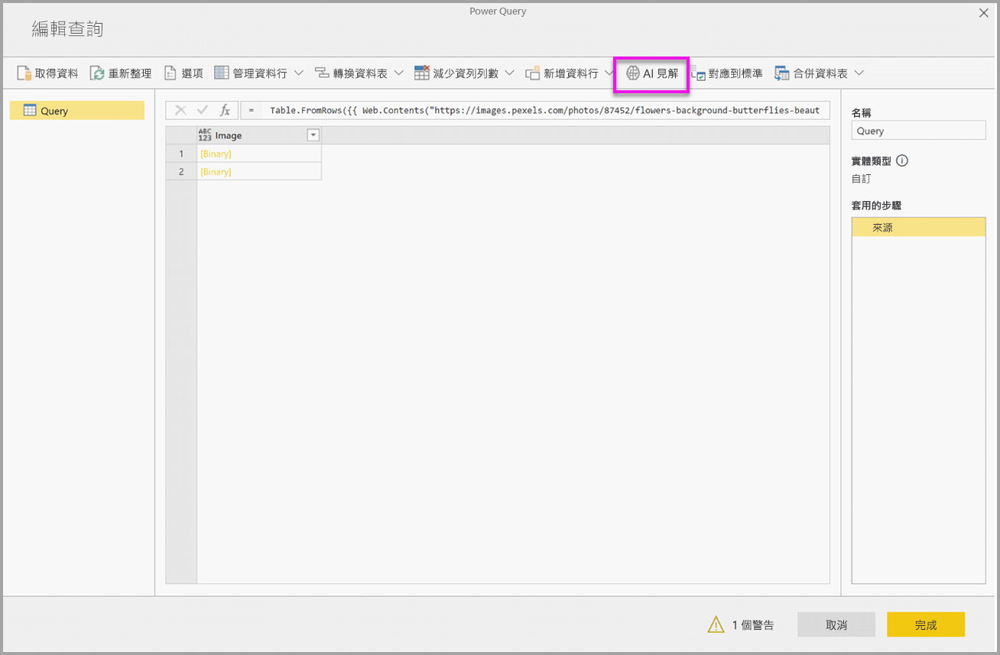

接下來，請使用您的**組織帳戶**登入。

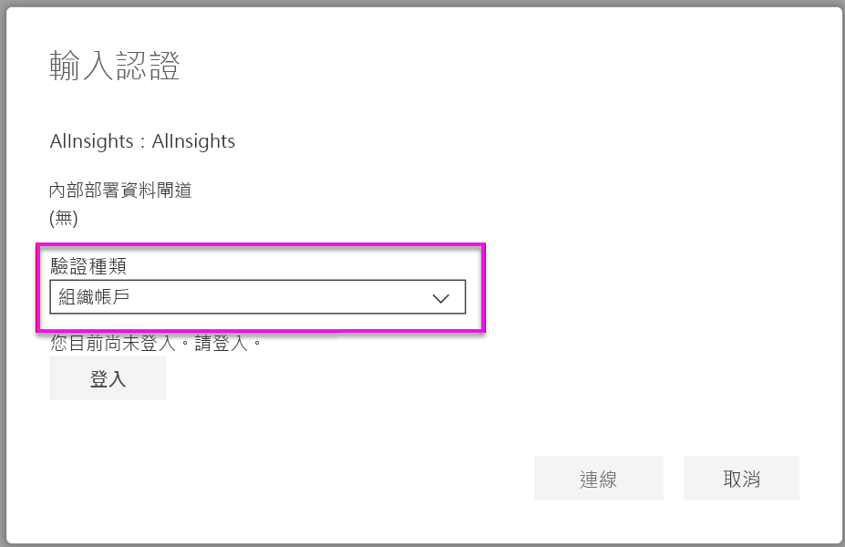

選取「標記影像」函式，在資料行欄位中輸入 _[Binary]_ ，並在文化特性資訊欄位中輸入 _en_。 

> [!NOTE]
> 您目前無法使用下拉式清單挑選資料行，我們會盡快在個人預覽版發佈期間解決這個問題。

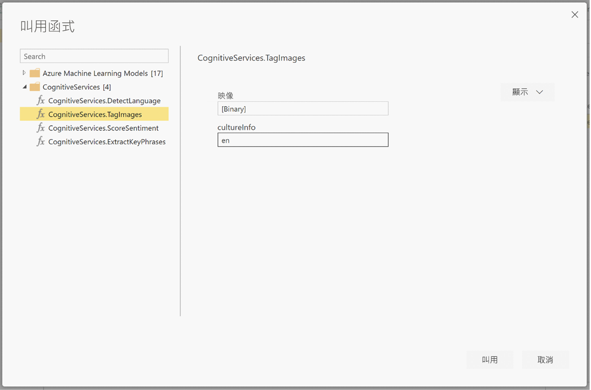

在函式編輯器中，移除括住資料行名稱的引號。 

> [!NOTE]
> 移除引號是暫時性的解決方法，我們將盡快在預覽版發佈期間解決這個問題。

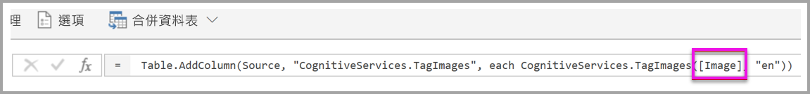

函式會傳回包含以下格式標籤的記錄：以逗號區隔的格式和 json 記錄格式。 選取展開按鈕以將其中之一或兩者以資料行方式新增至資料表。


選取 [完成]  並儲存資料流程。 在您重新整理第一個資料流程之後，就可以使用資料流程連接器從 Power BI Desktop 連接到該資料流程。 (請參閱此文件第 5 頁的步驟)。

## <a name="clean-up-resources"></a>清除資源

當不再需要某個查詢時時，請在 Power Query 編輯器中滑鼠右鍵按一下查詢名稱，然後選取 [刪除]  以刪除查詢。

## <a name="next-steps"></a>後續步驟

您會在此教學課程中，將情感評分和「影像標記」函式套用在 Power BI 資料流程上。 請參閱下列文章，以深入了解 Power BI 中的認知服務。

* [Azure 中的認知服務帳戶](https://docs.microsoft.com/azure/cognitive-services/)
* [在資料流程上開始使用自助資料準備](../transform-model/service-dataflows-overview.md)
* 深入了解 [Power BI Premium](https://powerbi.microsoft.com/power-bi-premium/)

您可能也會對下列文章感興趣。

* [教學課程：在 Power BI 中叫用 Machine Learning Studio (傳統) 模型 (預覽)](service-tutorial-invoke-machine-learning-model.md)
* [Power BI 與 Azure Machine Learning 的整合 (預覽)](../transform-model/service-machine-learning-integration.md)
* [Power BI 中的認知服務 (預覽)](../transform-model/service-cognitive-services.md)