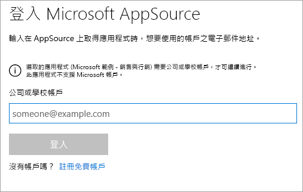
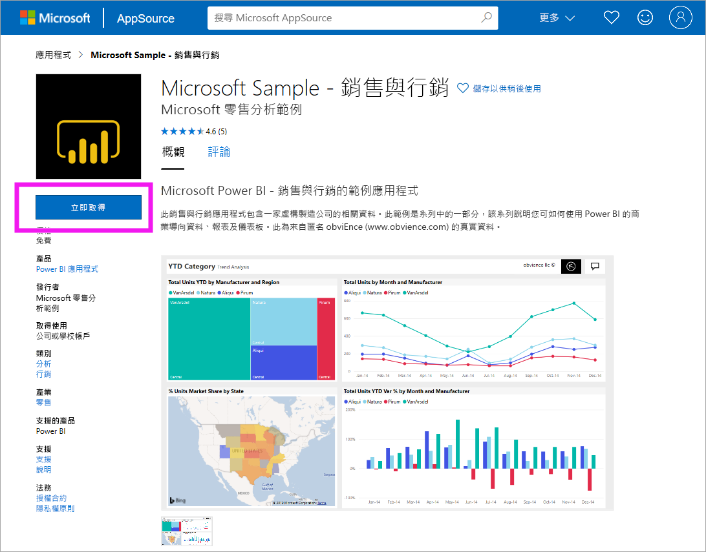
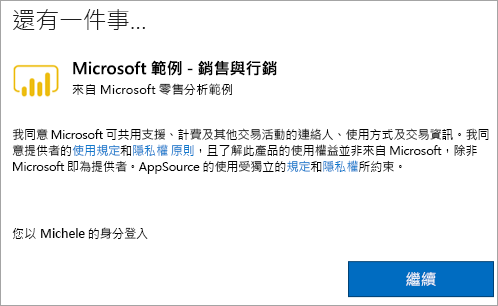

# 在 Power BI 服務中安裝和使用範例「銷售與行銷」應用程式
既然您已[基本了解如何取得 Power BI 的內容](end-user-app-view.md)，讓我們從 Microsoft AppSource (appsource.com) 取得「銷售與行銷」應用程式。 

## Microsoft AppSource (appsource.com)
以下是應用程式的連結：[行銷與銷售應用程式](https://appsource.microsoft.com/product/power-bi/microsoft-retail-analysis-sample.salesandmarketingsample?tab=Overview)。 當您選取此連結時，即可在 Microsoft AppSource 上開啟此應用程式的下載頁面。 

1. 系統可能會要求您登入，以取得應用程式。 請使用您 Power BI 所用的相同電子郵件地址登入。 

    

2. 選取 [立即取得]  。 

    

3. 如果這是您第一次登入 AppSource，您必須同意使用規定。 

    

4. 隨即開啟 Power BI 服務。 確認您想要安裝此應用程式。

    

5. 安裝應用程式之後，Power BI 服務會顯示成功訊息。 選取 [前往應用程式]  以開啟應用程式。 根據設計師建立應用程式的方式，會顯示應用程式儀表板或應用程式報表。

    

    您也可以選取 [應用程式]  ，然後選擇 [銷售與行銷]  ，直接從您的應用程式內容清單中開啟應用程式。

    

6. 選擇是否要探索或自訂並共用您的新應用程式。 由於我們已選取 Microsoft 範例應用程式，讓我們開始探索。 

    

7.  您的新應用程式會以儀表板開啟。 不過，應用程式「設計師」  可能會將應用程式改設定為開啟報表。  

    

## 與應用程式中的儀表板和報表互動
請花一些時間探索組成應用程式的儀表板和報表中資料。 您可以進行所有標準 Power BI 互動，例如篩選、醒目提示、排序和向下切入。  還是有點分不清儀表板與報表之間的差異？  請參閱[儀表板](end-user-dashboards.md)和[報表](end-user-reports.md)的相關文章。  

## 後續步驟
* [回到應用程式概觀](end-user-apps.md)
* [檢視 Power BI 報表](end-user-report-open.md)
* [與我共用內容的其他方式](end-user-shared-with-me.md)
