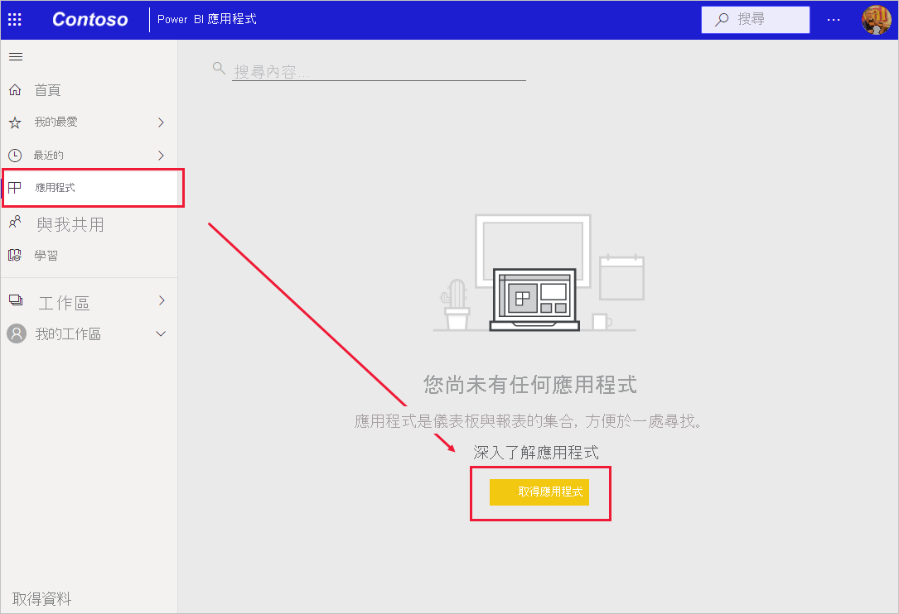
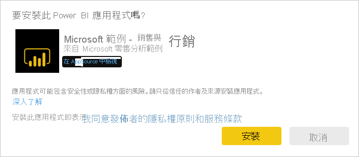

# 在 Power BI 服務中安裝和使用範例「銷售與行銷」應用程式

[!INCLUDE[consumer-appliesto-yyny](../includes/consumer-appliesto-yyny.md)]

既然您已[基本了解如何取得 Power BI 的內容](end-user-app-view.md)，讓我們從 Microsoft AppSource (appsource.com) 取得「銷售與行銷」應用程式。 

## 從 Power BI 應用程式市集取得應用程式

1. 如果您還沒有登入，請[登入 Power BI 服務](./end-user-sign-in.md)。 

1. 當您位於 Power BI 之後，選取 [應用程式] > [取得應用程式]。 

    

1. Power BI 應用程式市集隨即開啟。 尋找「銷售與行銷」應用程式。 如果您沒有看到此應用程式，請嘗試在搜尋方塊中輸入「銷售」。

    

1. 按一下應用程式磚。 AppSource 上的應用程式供應項目隨即開啟。 按一下 [立即取得]。

   

1. 確認您想要安裝此應用程式。

   

5. Power BI 服務會在安裝應用程式之後顯示成功訊息。 選取 [前往應用程式] 以開啟應用程式。 根據設計師建立應用程式的方式，會顯示應用程式儀表板或應用程式報表。

    

    您也可以選取 [應用程式]，然後選擇 [銷售與行銷]，直接從您的應用程式內容清單中開啟應用程式。

    

6. 選擇是否要探索或自訂並共用您的新應用程式。 由於我們已選取 Microsoft 範例應用程式，讓我們開始探索。 

    

7.  您的新應用程式會以儀表板開啟。 不過，應用程式「設計師」可能會將應用程式改設定為開啟報表。  

    

## 與應用程式中的儀表板和報表互動
請花一些時間探索組成應用程式的儀表板和報表中資料。 您可以進行所有標準 Power BI 互動，例如篩選、醒目提示、排序和向下切入。  還是有點分不清儀表板與報表之間的差異？  請參閱[儀表板](end-user-dashboards.md)和[報表](end-user-reports.md)的相關文章。  

## 後續步驟
* [回到應用程式概觀](end-user-apps.md)
* [檢視 Power BI 報表](end-user-report-open.md)
* [與我共用內容的其他方式](end-user-shared-with-me.md)
