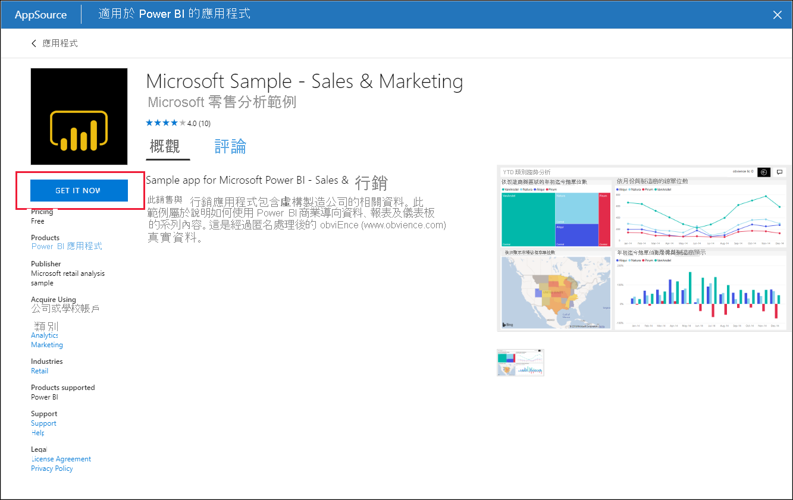
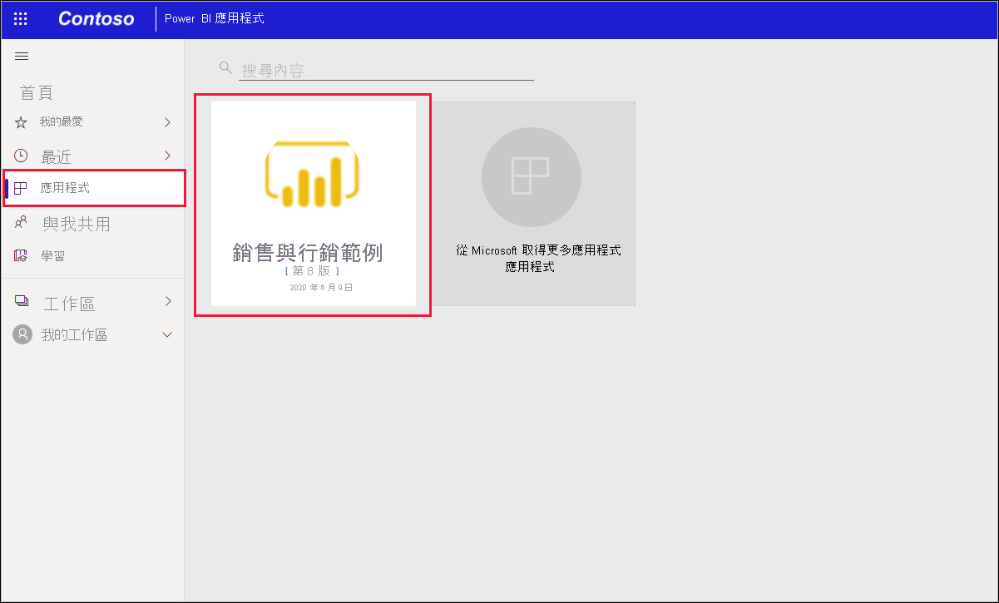

# 在 Power BI 服務中安裝和使用範例「銷售與行銷」應用程式

[!INCLUDE[consumer-appliesto-yyny](../includes/consumer-appliesto-yyny.md)]

知道[如何取得 Power BI 內容的基本認識](end-user-app-view.md)後，讓我們從 Microsoft AppSource 取得行銷與銷售應用程式。 

## 從 Microsoft AppSource 取得應用程式

1. 開啟 [https://appsource.microsoft.com](https://appsource.microsoft.com)。

   

1. 在搜尋方塊中，輸入**行銷**，然後勾選 [依產品縮小搜尋範圍] > [Power BI 應用程式]。 

    

1. 選取 [Microsoft 範例 - 銷售與行銷] 的應用程式磚。 選擇性閱讀概觀與評論，並參考影像。  然後選取 [立即取得]。

   

1. 確認您想要安裝此應用程式。

   

5. Power BI 服務會在安裝應用程式之後顯示成功訊息。 選取 [前往應用程式] 以開啟應用程式。 根據設計師建立應用程式的方式，會顯示應用程式儀表板或應用程式報表。

    

    您也可以選取 [應用程式]，然後選擇 [銷售與行銷] 應用程式磚，直接從應用程式內容清單中開啟應用程式。

    

6. 選擇要連線到您自己的資料、使用範例資料進行探索，還是自訂並共用您的新應用程式。 由於我們已選取 Microsoft 範例應用程式，讓我們開始探索。 

    ![螢幕擷取畫面顯示 [開始使用您的新應用程式]，其中已標註 [使用範例資料進行探索] 選項。](./media/end-user-app-marketing/power-bi-explore-app.png)

7.  您的新應用程式會以儀表板開啟。 不過，應用程式「設計師」可能會將應用程式改設定為開啟報表。  

    

## 與應用程式中的儀表板和報表互動
請花一些時間探索組成應用程式的儀表板和報表中資料。 您可以進行所有標準 Power BI 互動，例如篩選、醒目提示、排序和向下切入。  還是有點分不清儀表板與報表之間的差異？  請參閱[儀表板](end-user-dashboards.md)和[報表](end-user-reports.md)的相關文章。  

## 後續步驟
* [回到應用程式概觀](end-user-apps.md)    
* [檢視 Power BI 報表](end-user-report-open.md)    
* [與我共用內容的其他方式](end-user-shared-with-me.md)
