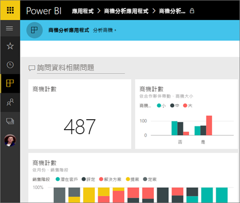
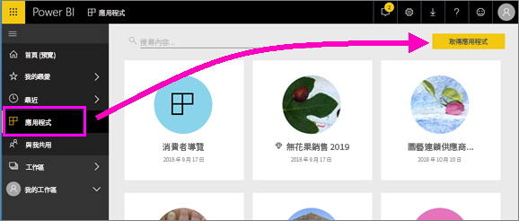
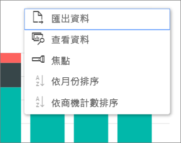

# 使用 Power BI 中的儀表板和報表安裝並使用應用程式
您現在已[基本了解應用程式](end-user-apps.md)，接下來讓我們了解如何開啟並與應用程式互動。 

## 取得新應用程式的方式
請記住，有數種方式可取得新的應用程式。 報表設計師同事可以在您的 Power BI 帳戶中自動安裝應用程式，或向您傳送應用程式的直接連結。 而您可以前往 AppSource，並搜尋可供您從公司內外部使用的應用程式。 

在行動裝置上的 Power BI 中，您只能從直接連結安裝應用程式，而不能從 AppSource 安裝。 如果應用程式作者自動安裝應用程式，您就會在您的應用程式清單中看到它。

## 透過直接連結安裝應用程式
自行安裝新應用程式的最簡單方式，是以電子郵件向應用程式作者取得直接連結。  

**在您的電腦上** 

選取電子郵件中的連結，即會在瀏覽器中開啟 Power BI 服務 ([https://powerbi.com](https://powerbi.com))。 確認您想要安裝應用程式，Power BI 就會開啟應用程式登陸頁面。

**在您的 iOS 或 Android 行動裝置上** 

當您在行動裝置上選取電子郵件中的連結時，應用程式就會自動安裝，並開啟行動裝置應用程式中的應用程式內容清單。 

## 從 Microsoft AppSource 取得應用程式
您也可以從 Microsoft AppSource 尋找並安裝應用程式。 只有可存取的應用程式 (亦即，應用程式作者已將權限授與您或所有人) 才會顯示。

1. 選取 [應用程式]  > [取得應用程式]。 
   
     
2. 在 AppSource 的 [我的組織] 下方，您可以進行搜尋以縮小結果範圍，並尋找您要尋找的應用程式。
   
     ![在 AppSource 的 [我的組織] 下](./media/end-user-app-view/power-bi-appsource-my-org.png)
3. 選取 [立即取得]，將它新增至 [應用程式] 內容清單。 

## 與應用程式中的儀表板和報表互動
現在，您可以探索應用程式中儀表板和報表的資料。 您可以進行所有標準 Power BI 互動，例如篩選、反白顯示、排序和向下鑽研。 您也可以從報表中的資料表或其他視覺效果[將資料匯出至 Excel](end-user-export-data.md)。 閱讀[與 Power BI 中的報表互動](end-user-reading-view.md)。 

## 後續步驟
* [外部服務的 Power BI 應用程式](end-user-connect-to-services.md)
* 有問題嗎？ [嘗試在 Power BI 社群提問](http://community.powerbi.com/)

