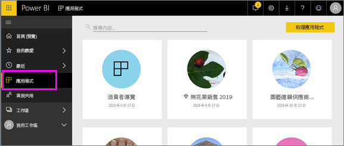

# Power BI 的應用程式
## 什麼是 Power BI 應用程式？
「應用程式」是將相關儀表板和報表全都結合到同一處的 Power BI 內容類型。 應用程式可以有一或多個儀表板和一或多個報表，所有儀表板和報表都會組合在一起。 應用程式是由 Power BI「設計師」所建立，這些設計師會散發應用程式並與像您一樣的「取用者」共用。 

您的應用程式會在 [應用程式] 內容清單中加以組織。

> [!NOTE]
> 使用應用程式功能需要有 Power BI Pro 授權。 <!-- add link to how to figure out your license -->

## 應用程式「設計師」和應用程式「取用者」
視您的角色而定，您可能是建立應用程式供自己使用，或與同事共用的人 (設計師)。 或者，您可能是接收並下載其他人所建立應用程式的人 (取用者)。 本文適用於應用程式「取用者」。

## 應用程式的優點
在 Power BI 服務 ([https://powerbi.com](https://powerbi.com)) 中和您的行動裝置上，可輕鬆找到並安裝應用程式。 安裝完應用程式之後，因為所有儀表板都會集中在一個應用程式、瀏覽器或在行動裝置中，所以您不必記住許多不同儀表板的名稱。

透過應用程式，每當應用程式作者發行更新時，您就會自動看到變更。 作者也會控制資料重新整理的排程頻率，因此您無須擔心如何將其保持在最新狀態。 

<!-- add conceptual art -->
## 取得新的應用程式
您可以透過一些不同的方式取得應用程式。 
- 應用程式作者可以在您的 Power BI 帳戶中自動安裝應用程式，因此您下一次開啟 Power BI 時，就會在 [應用程式] 內容清單中看到新的應用程式。 
- 應用程式作者可以透過電子郵件向您傳送應用程式的直接連結。 選取連結即會在 Power BI 中開啟應用程式。
- 您可以在 AppSource 搜尋應用程式，在其中會顯示可存取的所有應用程式。 AppSource 包含報表設計師在公司內外部所發佈的應用程式。 例如，您可能會在 AppSource 上發現適用於已使用服務 (例如 Google Analytics、GitHub 或 Microsoft Dynamics) 的應用程式。 
- 在行動裝置上的 Power BI 中，您只能從直接連結安裝應用程式，而不能從 AppSource 安裝。 如果應用程式作者自動安裝應用程式，您就會在您的應用程式清單中看到它。

## 下一個步驟
* [開啟應用程式並與其互動](end-user-app-view.md)

