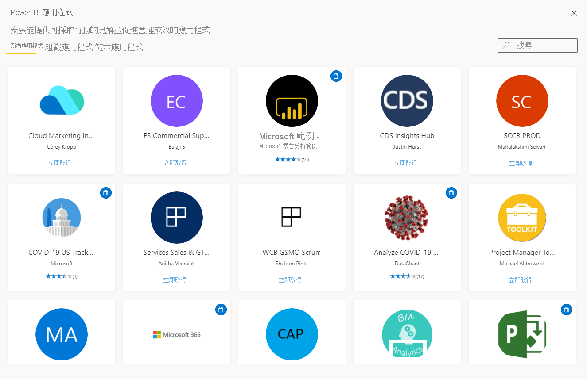
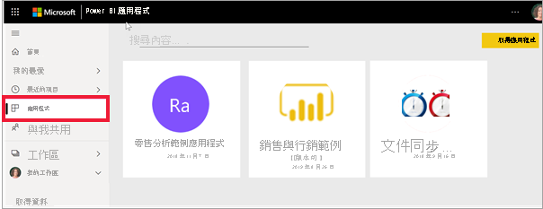

# Power BI 的應用程式

[!INCLUDE[consumer-appliesto-ynny](../includes/consumer-appliesto-ynny.md)]

[!INCLUDE [power-bi-service-new-look-include](../includes/power-bi-service-new-look-include.md)]

## 什麼是 Power BI 應用程式？
「應用程式」是將相關儀表板和報表全都結合到同一處的 Power BI 內容類型。 應用程式可以有一或多個儀表板和一或多個報表，所有儀表板和報表都會組合在一起。 應用程式是由散佈並與同事共用應用程式的 Power BI「設計師」所建立。 「設計師」有多種不同的方式可以共用應用程式。 若要深入了解，請參閱下面的**取得新的應用程式**一節。 

## 應用程式「設計師」與應用程式「使用者」
視您的角色而定，您可能是建立應用程式供自己使用，或與同事共用的人 (「設計師」)。 或者，您可能是接收及下載其他人所建立之應用程式的人 (「商務使用者」)。 本文適用於「商務使用者」。

查看及開啟應用程式需要有特定的權限。 收件者必須擁有 Power BI Pro 授權，或者在特殊類型的雲端儲存體 (稱為 **Premium 容量**) 中共用應用程式。 若要深入了解授權與 Premium 容量，請參閱 [Power BI 服務的授權](end-user-license.md)。

## 應用程式的優點
應用程式可讓「設計師」輕鬆地一次就能共用不同類型的內容。 應用程式「設計師」會建立儀表板和報表，並將它們組合成一個應用程式。 然後，「設計師」會將應用程式共用或發佈至您，即「商務使用者」可以存取的位置。 由於相關的儀表板和報表會組合在一起，因此您可以更輕鬆地在 Power BI 服務 ([https://powerbi.com](https://powerbi.com)) 和行動裝置上尋找和進行安裝。 安裝應用程式之後，因為所有儀表板都會集中在一個應用程式、瀏覽器或行動裝置中，所以您不必記住許多不同儀表板或報表的名稱。

透過應用程式，每當應用程式作者發行更新時，您就會自動看到變更。 作者也會控制資料重新整理的排程頻率，因此您無須擔心如何將其保持在最新狀態。 

<!-- add conceptual art -->
## 取得新的應用程式
有數種不同方式可取得新的應用程式。 您可以搜尋、尋找及安裝應用程式，而應用程式設計師可以與您共用應用程式。 

### 您可從 Power BI 應用程式 Marketplace 尋找並安裝應用程式
尋找應用程式的一種方式是從 Power BI 的 [應用程式] 畫面中，選取 [取得應用程式]。 

![[應用程式] 畫面的螢幕擷取畫面，其中顯示取得應用程式圖示](./media/end-user-apps/power-bi-get-apps-icon.png)

瀏覽 Power BI 應用程式 Marketplace 中的應用程式清單，直到找到其中一個來安裝。 從 [組織應用程式] (僅適用於公司中的人員)，或 [範本應用程式] (由 Microsoft 和該社區發佈，供任何 Power BI 使用者安裝) 選擇。 

還有一些其他方式可以取得應用程式。 以下列出這其中一些方式。 但如需取得和探索應用程式的詳細逐步指示，請參閱[開啟應用程式並與其互動](end-user-app-view.md)。

* 應用程式設計工具可在 Power BI 帳戶中自動安裝應用程式，因此下次開啟 Power BI 服務時，即會在 [應用程式] 內容清單中看到新的應用程式。 
* 應用程式設計師可以將應用程式的直接連結以電子郵件傳送給您。 選取連結即會在 Power BI 服務中開啟應用程式。
* 在行動裝置上的 Power BI 中，您只能從直接連結安裝應用程式，而不能從應用程式 Marketplace 安裝。 如果應用程式作者自動安裝應用程式，您就會在您的應用程式清單中看到它。 

您的應用程式會在 [應用程式] 內容清單中加以組織。 只要選取 [應用程式] 即可顯示您的應用程式。 將滑鼠停留在應用程式上，以查看上次更新日期和擁有者。 

## 後續步驟
* [開啟應用程式並與其互動](end-user-app-view.md)
* [共用內容的其他方式](end-user-shared-with-me.md)

