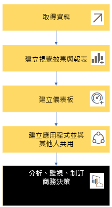
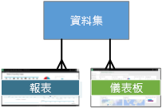
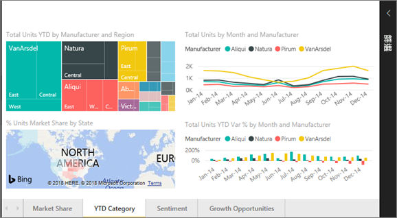
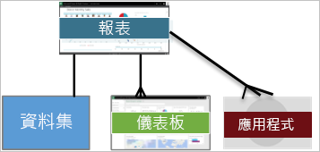
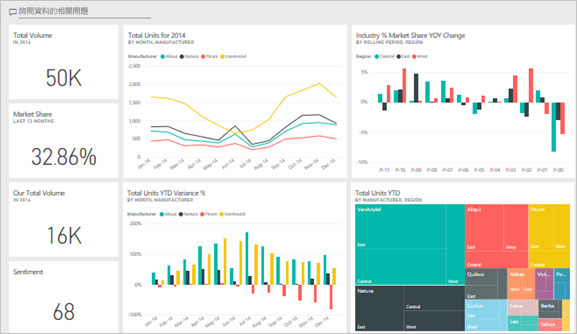
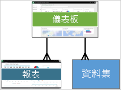
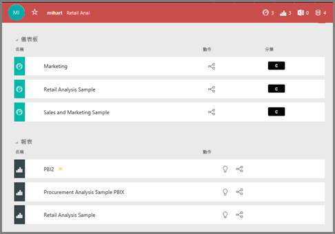

# Power BI 服務「取用者」的基本概念

## Power BI 取用者和設計工具
本文假設您已閱讀 [Power BI 概觀](../power-bi-overview.md)，並將自已識別為 Power BI 的「取用者」。 取用者可從同事收到 Power BI 內容，例如儀表板和報表。 取用者會使用 Power BI 服務，也就是 Power BI 的網站版本。

您一定會聽到 "Power BI Desktop" 或只是 "Desktop" 一詞，這是一種獨立工具，供建置儀表板和報表並與您共用的「設計工具」使用。 請務必了解還有其他的 Power BI 工具，但只要您是取用者，就只能使用 Power BI 服務。 此外，本文僅適用於 Power BI 服務。

## 術語和概念
本文不是 Power BI 的視覺導覽，也不是實際操作教學課程。 相反地，它是我們希望讓您熟悉 Power BI 術語和概念的概觀文章。 可告訴您專用術語的涵義和使用情況。 如需導覽 Power BI 服務及其巡覽，請前往[開始導覽](end-user-experience.md)。

## 第一次開啟 Power BI 服務
大部分的 Power BI 取用者可取得 Power BI 服務，因為 1) 其公司會購買授權，而且 2) 系統管理員會將這些授權指派給像您一樣的員工。

若要開始使用，只要開啟瀏覽器並鍵入 **app.powerbi.com** 即可。 當您第一次開啟 Power BI 服務時，會看到類似下面的內容。

![Power BI 服務的 [歡迎使用] 畫面](media/end-user-basic-concepts/power-bi-open.png)

當您使用 Power BI 時，您會將每次開啟網站時所看到的內容個人化。  例如，有些人想要將 Power BI 開啟至首頁，而有些則有想要先查看他們的最愛儀表板。 別擔心，我們將告訴您如何完成此操作。
- [首頁預覽](https://powerbi.microsoft.com/blog/introducing-power-bi-home-and-global-search)    
- [設定內容作為**精選**](end-user-featured.md)

![會顯示 [首頁] 檢視和 [儀表板] 檢視](media/end-user-basic-concepts/power-bi-first.png)

但是，在我們更進一步深入之前，讓我們來回顧一下並討論構成 Power BI 服務的建置組塊。

## Power BI 內容
### 建置組塊簡介
Power BI 取用者的 5 個建置組塊如下：視覺效果、儀表板、報表、應用程式和資料集。 這些有時稱為「Power BI 內容」。 而「內容」存在於「工作區」中。 一般工作流程牽涉到所有這些建置組塊：Power BI 的「設計者」(下圖中的黃色) 會收集「資料集」中的資料，將其帶入 Power BI 中進行分析、建立充滿「視覺效果」(醒目提示感興趣的事實和見解) 的「報表」，將報表中的視覺效果釘選到儀表板，並與像您一樣 (下圖中的黑色) 的「取用者」以「應用程式」或其他類型共用內容的形式共用報表與儀表板。

最基本概念。
*  「視覺效果」是 Power BI「設計工具」使用「報表」和「資料集」資料所建置的一種圖表。 「設計工具」通常會在 Power BI Desktop 中建置視覺效果。

    如需詳細資訊，請參閱 [Power BI 取用者的視覺效果](end-user-visualizations.md)

*  「資料集」是資料的容器。 例如，它可能是來自世界衛生組織的 Excel 檔案、可能是公司擁有的客戶資料庫，也可能是 Salesforce 檔案。  

*  「儀表板」是具有互動式視覺效果、文字和圖形的單一畫面。 儀表板會在一個畫面上收集您最重要的計量，以表達意涵或回答問題。 儀表板內容來自一或多份報表以及一或多個資料集。

    如需詳細資訊，請參閱 [Power BI 取用者的儀表板](end-user-dashboards.md)

*  「報表」是一或多個頁面的互動式視覺效果、文字和圖表，共同組成單一個報表。 報表是以單一資料集為基礎。 報表頁面通常會組織成為每個處理一項感興趣的中央區域，或回答單一問題。

    如需詳細資訊，請參閱 [Power BI 取用者的報表](end-user-reports.md)

*  「應用程式」是可讓「設計工具」將相關的儀表板和報表組合在一起並共用的方式。 「取用者」自動會收到某些應用程式，但也可以搜尋由同事或由社群建立的其他應用程式。 例如，也許您已在使用 Google Analytics (分析) 和 Microsoft Dynamics CRM 這類外部服務，而其中提供 Power BI 應用程式。

明確的說，如果您是全新使用者，且為第一次登入 Power BI，您還沒有任何儀表板、應用程式或報表。
_______________________________________________________

## 資料集
「資料集」是「設計工具」匯入或連線至其中，然後用來建立報表和儀表板的資料集合。 身為取用者，您不會直接與資料集互動，但了解如何將它們放入較大的圖片仍然不錯。  

每個資料集代表單一來源的資料，例如 OneDrive 上的 Excel 活頁簿、內部部署的 SSAS 表格式資料集或 Salesforce 資料集。 支援許多不同的資料來源。

當設計工具與您共用應用程式時，您可以看到應用程式包含哪些資料集。

![已選取 [應用程式] 且箭頭指向畫布上的 [資料集] 區段](media/end-user-basic-concepts/power-bi-dataset-list.png)

**一個** 資料集...

* 可一再重複使用
* 可用在許多不同的報表中
* 可在許多不同的儀表板中顯示該單一資料集的視覺效果

  

此外，來自其他工作空間的資料集，可以用來在您的工作區中建立內容 (報表、儀表板)。 這些資料集使用參考的資料集圖示來顯示：

請前進到下一個建置組塊 -- 視覺效果。
__________________________________________________________

## 視覺效果
視覺效果會顯示在資料中探索到的見解。 例如，視覺效果可讓您更輕鬆地解譯見解，因為您的大腦能夠比數字試算表更快地理解圖片。

在 Power BI 中會遇到的一些視覺效果如下：瀑布圖、功能區、矩形式樹狀結構圖、圓形圖、漏斗圖、卡片、散佈圖和量測計。 請參閱 [Power BI 包含的視覺效果完整清單](../power-bi-visualization-types-for-reports-and-q-and-a.md)。

   

社群也會提供視覺效果，這些視覺效果稱為「自訂視覺效果」。 如果您收到無法辨識具有視覺效果的報表時，它可能是自訂視覺效果。 如果您需要解譯自訂視覺效果方面的協助，請<!--[look up the name of the report or dashboard *designer*](end-user-owner.md)-->查閱報表或儀表板設計工具的姓名並連絡該人員。

報表中的**一個**視覺效果...

* 可在相同的報表中利用複製/貼上一再重複使用。
* 可用於許多不同的儀表板
__________________________________________________
## 報表
Power BI 報表是一或多個頁面的視覺效果、圖表及文字。 報表中的所有視覺效果都是來自單一資料集。 「設計工具」會與[在「閱讀檢視」與報表互動](end-user-reading-view.md)的「取用者」共用報表。

**一個** 報表...

* 可以與多個儀表板相關聯 (從該單一報表釘選的磚可出現在多個儀表板上)。
* 只使用一個資料集的資料建立而成。  
* 可以是多個應用程式的一部分

  

________________________________________________

## 儀表板
儀表板表示基礎資料集其中一部分子集的自訂檢視。 「設計工具」會建置儀表板，並將其與「取用者」共用；單獨或作為應用程式的一部分。 儀表板是包含「圖格」、圖表和文字的單一畫布。

  

圖格是視覺效果的呈現，例如，「設計工具」可將其從報表「釘選」到儀表板。  每個已釘選圖格會顯示從某個資料集建立並釘選到該儀表板的[視覺效果](end-user-visualizations.md)。 圖格也可以包含整份報表頁面，而且可以包含即時串流資料或影片。 「設計工具」有許多方法可將圖格新增至儀表板中；本概觀主題無法全部涵蓋。 若要深入了解，請參閱 [Power BI 的儀表板磚](end-user-tiles.md).

從取用者的角度來看，無法編輯儀表板。 不過，您可以新增註解、檢視相關資料、將它設為我的最愛、訂閱等。

儀表板的一些用途為何？  以下只列出幾項：

* 所有必要的資訊一目了然，以利做出決策
* 監視最重要的業務相關資訊
* 確保所有同事有一致的共識，並檢視與使用相同資訊
* 監視企業、產品、業務單位或行銷活動等的狀況
* 建立較大型儀表板的個人化檢視 -- 放入所有重要的計量

**一個** 儀表板...

* 可顯示許多不同資料集的視覺效果
* 可顯示許多不同報表的視覺效果
* 可以顯示從其他工具 (例如 Excel) 釘選的視覺效果

  

________________________________________________

## 應用程式
這些儀表板和報表的集合會將相關內容一起組織成單一套件。 Power BI 的「設計工具」可建置它們，並將其與個人、群組、整個組織或大眾共用。 身為取用者，您可以確信您和您的同事正在使用相同的資料；這是事實的單一受信任版本。

![在左瀏覽窗格中已選取 [應用程式]](media/end-user-basic-concepts/power-bi-app.png)

在 Power BI 服務 (https://powerbi.com) 和行動裝置中，可輕鬆找到並安裝應用程式。 安裝完應用程式之後，因為所有儀表板都會集中在一個應用程式、瀏覽器或在行動裝置中，所以您不必記住許多不同儀表板的名稱。

此應用程式有三個相關的儀表板和三個相關的報表，這些項目會構成單一應用程式。

透過應用程式，每當應用程式作者發行更新時，您就會自動看到變更。 作者也會控制資料重新整理的排程頻率，因此您無須擔心如何將其保持在最新狀態。

您可以透過一些不同的方式取得應用程式。 應用程式設計工具可以在您的 Power BI 帳戶中自動安裝應用程式，或將應用程式的直接連結傳送給您，您也可以在 Microsoft AppSource 中搜尋應用程式，而在 Microsoft AppSource 中，您可以看到所有可存取的應用程式。 在行動裝置上的 Power BI 中，您只能從直接連結安裝應用程式，而不能從 AppSource 安裝。 如果應用程式設計工具自動安裝應用程式，您就會在應用程式清單中看到它。

應用程式安裝之後，只需從您的應用程式清單中選取它，並選取要先開啟及瀏覽的儀表板或報表。   

我希望本文可讓您了解針對取用者構成 Power BI 服務的建置組塊。

## 後續步驟
- 檢閱[字彙](end-user-glossary.md)並加入書籤    
- 開始 [Power BI 服務導覽](end-user-experience.md)
- 閱讀[特別針對取用者所撰寫的 Power BI 概觀](end-user-consumer.md)    
- 觀看影片，在此影片中，Will 會檢閱基本概念並介紹 Power BI 服務。 <iframe width="560" height="315" src="https://www.youtube.com/embed/B2vd4MQrz4M" frameborder="0" allowfullscreen></iframe>
