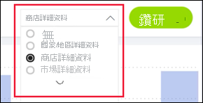
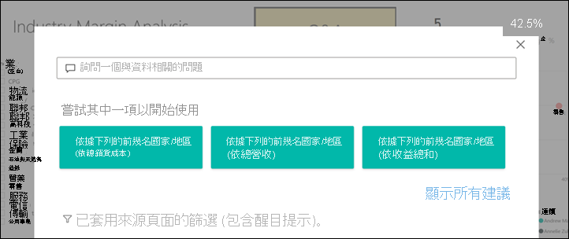
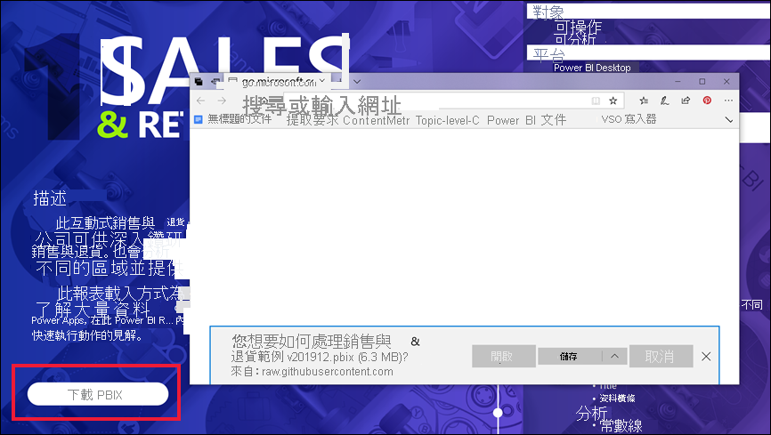

# Power BI 服務中的按鈕
在從同事收到的報表中，您可能會注意到其中包含按鈕，且會好奇如何使用這些按鈕。 有些按鈕包含單字，有些則包含箭號，其他則包含圖形，甚至有些還有下拉式功能表。 本文會教導您如何辨識按鈕，以及如何釐清這些按鈕的使用方式。

## 如何辨識按鈕
按鈕看起來與報表頁面上的圖形、影像或圖示相似。 但如果在選取 (按一下) 按鈕時發生動作，則其便很可能是一個按鈕。

## 按鈕類型
報表建立者會將按鈕新增到報表，以協助進行瀏覽和探索。 按鈕類型包括：**返回**、**書籤**、**鑽研**、**頁面瀏覽**、**問與答**，以及 **Web URL**。 

### 返回按鈕 
返回按鈕可能會有一個箭號圖示，且在選取的時候，Power BI 將會帶您回到上一個頁面。  返回按鈕通常會搭配鑽研使用。 以下是搭配鑽研使用 [返回] 按鈕的範例。

1. 在橫條圖中選取 **Word**。
1. 選取 [鑽研]，然後選擇 [購物籃分析]。

    ![[返回] 按鈕的螢幕擷取畫面](media/end-user-buttons/power-bi-drillthrough.png)

    透過選擇 [購物籃分析]，Power BI 會開啟 [購物籃分析] 報表頁面，然後使用在來源頁面上選取的項目來篩選在目的地頁面上所顯示內容。

    ![[返回] 按鈕的螢幕擷取畫面](media/end-user-buttons/power-bi-go-back.png)

    您現在正在 [購物籃分析] 報表頁面，其已針對 Word 進行篩選。 若要返回上一個頁面，請選取 [返回] 按鈕。 

## [書籤] 按鈕
報表設計人員通常會在其報表中包含書籤。 您可透過選取位於右上角的 [檢視] > [書籤] 來檢視報表書籤清單。 當報表設計人員新增 [書籤] 按鈕時，其只不過是巡覽至與該書籤建立關聯特定報表頁面的另一種方式。 頁面將會包含書籤所擷取到的已套用篩選條件及設定。 [深入了解 Power BI 中的書籤](end-user-bookmarks.md)。 

在本範例中，按鈕具備書籤圖示以及書籤的名稱 (*Urban*)。 

![[書籤] 按鈕的螢幕擷取畫面](media/end-user-buttons/power-bi-bookmark.png)

透過選取 [書籤] 按鈕，Power BI 會帶您前往為該書籤定義的位置和設定。  在此情況下，書籤位於 [成長機會] 報表頁面，且該頁面會針對 **Urban** 進行交叉篩選。

## 鑽研按鈕
有兩種方式可在 Power BI 服務中進行鑽研。 鑽研會帶您前往不同的報表頁面，且該目的地頁面上資料會根據您在來源頁面上篩選和選取的項目來呈現。

在報表中鑽研的其中一種方式是以滑鼠右鍵按一下視覺效果中的資料點、選取 [鑽研]，然後選擇目的地。 上述方法已在名為 **[返回] 按鈕**的章節中說明。 雖然有時候報表設計人員會改為使用鑽研「按鈕」，讓動作更為明顯，並提示重要的見解。  

鑽研按鈕可擁有超過一個先決條件。 除非您滿足所有先決條件，否則按鈕將無法運作。 以下舉例說明。

以下鑽研按鈕會帶您前往 [商店詳細資料] 頁面。 將滑鼠暫留在按鈕上會顯示工具提示，讓我們知道需要同時選取商店和產品。 直到我們選取各一個項目，按鈕都會維持在非使用中狀態。

![包含暫留工具提示的 [鑽研] 按鈕螢幕擷取畫面](media/end-user-buttons/power-bi-drill-two-selections.png)

現在已選取一項產品 (**Word**)，以及一間商店 (**Leo**)，按鈕會變更色彩，讓我們知道按鈕現在已處於作用中狀態。

![包含暫留工具提示的 [鑽研] 按鈕螢幕擷取畫面](media/end-user-buttons/power-bi-select-both.png)

選取鑽研按鈕會帶我們前往 [商店] 報表頁面。 [報表] 頁面已針對我們選取的 **Word** 和 **Leo** 進行篩選。

![包含暫留工具提示的 [鑽研] 按鈕螢幕擷取畫面](media/end-user-buttons/power-bi-store.png)

鑽研按鈕也包含下拉式功能表，其可供選擇目的地。 當在來源報表頁面上進行選取後，請選取目的地報表頁面進行鑽研。 在以下範例中，我們正在將選取項目變更為鑽研至 [市場詳細資料] 報表頁面。 

## 頁面瀏覽

頁面導覽按鈕會帶您前往相同報表中的不同頁面。 報表設計人員通常會建立導覽按鈕來告知一段故事，或引導您使用報表見解。 在以下範例中，報表設計人員會在每個報表頁面上新增按鈕，其會帶您前往報表中第一個，也就是最上層的摘要頁面。 這個頁面導覽按鈕相當有幫助，因為報表中有許多頁面。

## 問與答按鈕 
選取問與答按鈕會開啟 Power BI [問與答] 總管視窗。 [問與答] 視窗會顯示在報表的頂端，且可透過選取 X 來關閉。[了解問與答](end-user-q-and-a.md)

## Web URL
Web URL 按鈕會開啟新的瀏覽器視窗。 報表設計人員可將這種按鈕類型作為參考來源新增、連結到公司網站，或作為不同報表或儀表板的連結。 在以下範例中，Web URL 按鈕可供下載報表的原始檔。 

由於頁面會在另一個視窗中開啟，請關閉視窗或選取 Power BI 索引標籤，以返回 Power BI 報表。

## 後續步驟
[書籤](end-user-bookmarks.md)    
[向上切入、向下切入](end-user-drill.md)
