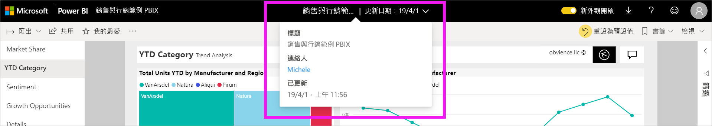

# 變更 Power BI 報表中的圖表排序方式

[!INCLUDE [power-bi-service-new-look-include](../includes/power-bi-service-new-look-include.md)]

> [!IMPORTANT]
> **本文適用於不具有報表或資料集編輯權限的 Power BI 使用者。如需排序的詳細指示，請參閱 [Power BI Desktop 中的依資料行排序](../desktop-sort-by-column.md)** 。

在 Power BI 服務中，您可以依不同資料欄位進行排序來變更視覺效果外觀。 您可以藉由變更視覺效果的排序方式來強調所要傳達的資訊。

您無法排序儀表板上的視覺效果，但可以在 Power BI 報表中排序大部分視覺效果 

無論您是使用數值資料 (例如銷售數字) 或文字資料 (例如州名稱)，都能以想要的方式來排序視覺效果。 Power BI 提供更多的排序彈性，以及可供您使用的快速功能表。 

## 開始使用

若要開始使用，請選取任何視覺效果，然後選擇 [其他動作]  (...)。有三個排序選項：[遞減排序]  、[遞增排序]  和 [排序依據]  。 
    

### 依字母或數值順序排序

您可以依視覺效果類別名稱的字母順序來排序視覺效果，或依每個類別的數值排序。 例如，此圖表是依 X 軸商店**名稱**類別的字母順序排序。

可以輕鬆地將排序從類別 (商店名稱) 變更為值 (每平方英尺銷售額)。 選取 [其他動作]  (...)，然後選擇 [排序依據]  。 選取用於視覺效果的數值。  在此範例中，我們選取了 [每平方英呎的銷售額]  。

![顯示依序選取 [排序依據] 和某個值的螢幕擷取畫面](media/end-user-change-sort/power-bi-sort-value.png)

如有必要，請在遞增和遞減之間變更排序次序。  再次選取 [其他動作]  (...)，然後選擇 [遞減排序]  或 [遞增排序]  。 用來排序的欄位是以粗體顯示，且具有黃色橫條。

   

> [!NOTE]
> 並非所有的視覺效果都可以排序。 例如，下列視覺效果無法排序：樹狀圖、地圖、區域分布圖、散佈圖、量表圖、卡片、瀑布圖。

## 儲存您對排序次序的變更
Power BI 報表保留篩選、交叉分析篩選器、排序和您進行的的其他資料檢視變更。 因此如果您離開報表並稍後返回，則會儲存您的排序變更。  如果您想要將所做的變更還原至報表設計師的設定，請從頂端功能表列選取 [重設為預設值]  。 

不過，如果 [重設為預設值]  按鈕呈現灰色，則表示報表「設計師」  已停用儲存 (保留) 變更的功能。

## 考量與疑難排解

### 使用其他準則排序
有時候，您會想要使用不同欄位 (未包含在視覺效果中的欄位) 或其他準則來排序視覺效果。  例如，您可能想要依月份循序 (而不是依字母順序) 排序，或您可能想要依整個數值而不是數字排序 (例如 0、1、9、20，而不是 0、1、20、9)。  只有設計報表的人員可以為您進行這些變更。 從標頭列選取報表名稱，即可找到「設計師」  的連絡資訊。

## 後續步驟
深入了解 [Power BI 報表中的視覺效果](end-user-visualizations.md)。

[Power BI - 基本概念](end-user-basic-concepts.md)
