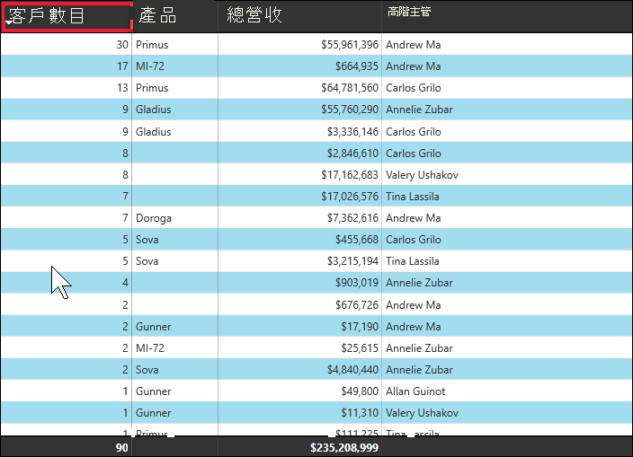
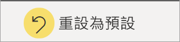
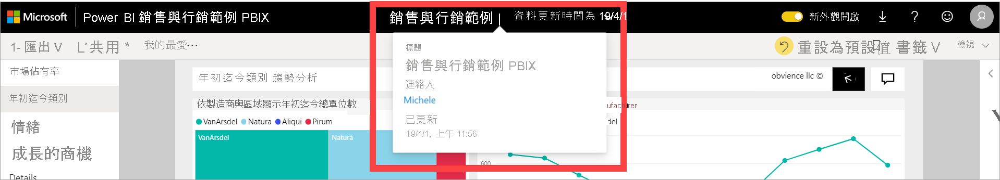

# 變更 Power BI 報表中的圖表排序方式

[!INCLUDE[consumer-appliesto-ynnn](../includes/consumer-appliesto-ynnn.md)]

> [!IMPORTANT]
> **此文章適用於沒有報表或資料集編輯權限，且僅使用 Power BI 線上版本 (Power BI 服務) 的 Power BI 使用者。如果您是報表「設計師」或「系統管理員」或「擁有者」，此文章可能不包含您所需的所有資訊。相反地，請參閱[在 Power BI Desktop 中依資料行排序](../create-reports/desktop-sort-by-column.md)** 。

在 Power BI 服務中，您可以依不同資料欄位進行排序來變更視覺效果外觀。 您可以藉由變更視覺效果的排序方式來強調所要傳達的資訊。 無論您是使用數值資料 (例如銷售數字) 或文字資料 (例如州名稱)，都能以想要的方式來排序視覺效果。 Power BI 提供更多的排序彈性，以及可供您使用的快速功能表。 

無法排序儀表板上的視覺效果。 但是在 Power BI 報表中，您可以一次依一個欄位 (有時可以依兩個欄位) 對大部分的視覺效果進行排序。 針對特定類型的視覺效果，則完全無法使用排序，這些視覺效果包括樹狀結構地圖、量測計、地圖等等。 

## 開始使用

若要開啟，請開啟您建立的任何報表或任何與您共用的報表。 選取一項 (可以排序的) 視覺效果，然後選擇 [更多選項] (...)。有三個排序選項：[遞減排序]、[遞增排序] 和 [排序依據]。 
    

### 依字母或數值順序排序

您可以依視覺效果類別名稱的字母順序來排序視覺效果，或依每個類別的數值排序。 例如，此圖表是依 X 軸商店**名稱**類別的字母順序排序。

若要將排序從類別 (商店名稱) 變更為值 (每平方英呎銷售額)，請選取 [更多動作] \(...\) 並選擇 [排序依據]。 選取用於視覺效果的數值。  在此範例中，我們選取了 [每平方英呎的銷售額]。

![顯示依序選取 [排序依據] 和某個值的螢幕擷取畫面](media/end-user-change-sort/power-bi-sort-value.png)

如有必要，請在遞增和遞減之間變更排序次序。  再次選取 [其他動作] (...)，然後選擇 [遞減排序] 或 [遞增排序]。 用來排序的欄位是以粗體顯示，且具有黃色橫條。

   

> [!NOTE]
> 並非所有的視覺效果都可以排序。 例如，下列視覺效果無法排序：樹狀圖、地圖、區域分布圖、散佈圖、量表圖、卡片、瀑布圖。

## 依多個資料行排序
此資料表中的資料是依**客戶數目**排序的。  我們知道這是因為*數目*下的小箭號。 箭號向下指，表示資料行是以「遞減」順序排序。

若要在排序次序中加入更多資料行，請按下 Shift 並按一下您要在排序次序中加入的下一個資料行標頭。 例如，如果您按一下 [客戶數目]，然後按住 Shift 並按一下 [總收益]，則資料表會先依客戶排序，然後再依收益排序。 紅色外框會顯示排序次序變更的區域。

如果您再次於在相同的資料行上按住 Shift 並按一下，將會變更該資料行的排序方向 (遞增，遞減)。 此外，如果您按住 Shift + 按一下先前加入排序次序的資料行，會將該資料行移至排序次序的後面。

## 儲存您對排序次序的變更
Power BI 報表會保留您所做的篩選、交叉分析篩選器、排序與其他資料檢視變更 -- 即使您是在[閱讀檢視](end-user-reading-view.md)中工作也一樣。 因此如果您離開報表並稍後返回，系統會儲存您的排序變更。  如果您想要將所做的變更還原至報表設計師的設定，請從頂端功能表列選取 [重設為預設值]。 

不過，如果 [重設為預設值] 按鈕呈現灰色，則表示報表「設計師」已停用儲存 (保留) 變更的功能。

## 考量與疑難排解

### 使用其他準則排序
有時候，您會想要使用不同欄位 (未包含在視覺效果中的欄位) 或其他準則來排序視覺效果。  例如，您可能想要依月份循序 (而不是依字母順序) 排序，或您可能想要依整個數值而不是數字排序 (例如 0、1、9、20，而不是 0、1、20、9)。  

只有設計報表的人員可以為您進行這些變更。 從標頭列選取報表名稱，即可找到「設計師」的連絡資訊。

如果您是設計師並擁有內容的編輯權限，請閱讀 [Power BI Desktop 中的依資料行排序](../create-reports/desktop-sort-by-column.md)，以了解如何更新資料集並啟用此類型的排序。

## 後續步驟
深入了解 [Power BI 報表中的視覺效果](end-user-visualizations.md)。

[Power BI - 基本概念](end-user-basic-concepts.md)
