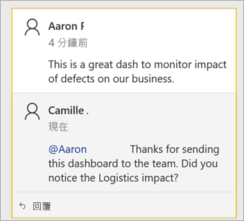
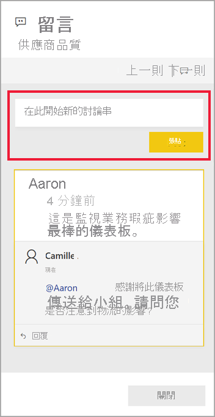
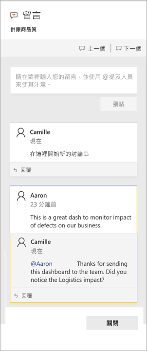
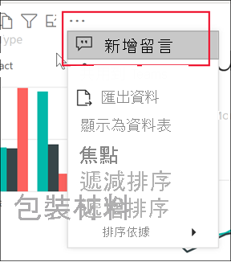
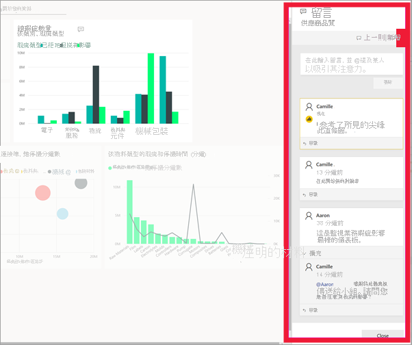

# 將註解新增至儀表板或報表

[!INCLUDE[consumer-appliesto-ynny](../includes/consumer-appliesto-ynny.md)]

[!INCLUDE [power-bi-service-new-look-include](../includes/power-bi-service-new-look-include.md)]

新增個人註解，或是和您的同事開始儀表板或報表相關交談。 **註解**功能只是「企業用戶」可與其他人進行共同作業的其中一種方法。 

> [!NOTE]
> 需有 Power BI Pro 授權，或是將內容裝載於 Power BI Premium 容量中，才可與其他人進行共同作業 (包括在共用報表中新增註解)。 [我有哪種授權類型？](end-user-license.md)

## 如何使用註解功能
可以新增註解至整個儀表板、儀表板上的個別視覺效果、報表頁面、編頁報表，以及報表頁面上的個別視覺效果。 新增一般註解或新增以特定同事為目標的註解。  

當將註解新增至報表時，Power BI 會擷取目前篩選和交叉分析篩選器的值，並建立[書籤](end-user-bookmarks.md)。 這表示當您選取或回應註解時，報表頁面或報表視覺效果可能會變更，以顯示第一次新增註解時，使用中的篩選和交叉分析篩選器選取項目。  

為什麼這很重要？ 假設有一位同事套用了篩選，以顯示他們想要與小組共用的有趣見解。 若未選取該篩選，註解可能沒有意義。

如果您使用編頁報表，則只能留下有關報表的一般註解。  不提供對個別編頁報表視覺效果留言的支援。

### 將一般註解新增至儀表板或報表
將註解新增至儀表板或報表的處理程序很類似。  在本例中，我們使用儀表板。 

1. 開啟 Power BI 儀表板或報表，然後選取 [註解] 圖示。 這會開啟 [註解] 對話方塊。

    ![功能表列上的 [註解] 圖示](media/end-user-comment/power-bi-comment-icon.png)

    在此我們會看到儀表板建立者已新增一般註解。  有權存取此儀表板的任何人都可以看到此註解。

    ![儀表板的螢幕擷取畫面，其中已選取 [註解] 區段](media/end-user-comment/power-bi-first-comments.png)

2. 若要回應，請選取 [回覆]，鍵入您的回應，然後選取 [張貼]。  

    ![選取 [回覆] 的畫面](media/end-user-comment/power-bi-comments-reply.png)

    根據預設，Power BI 將引導您回應發起註解討論串的同事，在本例中為 Aaron。 

    

 3. 如果您想要新增不屬於現有討論串的註解，請在上方文字欄位中輸入您的註解。

    

    此儀表板的註解現在看起來如下。

    

### 將註解新增至特定儀表板或報表的視覺效果
除了將註解新增至整個儀表板或整個報表頁面之外，您還可以將註解新增至個別儀表板磚和個別報表視覺效果。 處理程序很類似，且我們在本範例中使用報表。

1. 將滑鼠暫留在視覺效果上並選取 [其他動作] \(...\)。    
2. 從下拉式清單中，選取 [新增註解]****。

      

3.  [註解] 對話方塊隨即開啟，且頁面上的其他視覺效果會呈現灰色。此視覺效果還沒有任何註解。 

    ![已選取視覺效果且 [註解] 對話方塊隨即開啟的螢幕擷取畫面](media/end-user-comment/power-bi-comments-column.png)  

4. 鍵入您的註解，然後選取 [張貼]。

    ![具有新訊息的 [註解] 對話方塊](media/end-user-comment/power-bi-comment-spikes.png)  

    - 在報表頁面上，選取在視覺效果上所輸入的註解即會醒目提示該視覺效果 (如下所示)。

    - 在儀表板上，圖表圖示  可讓我們知道註解會繫結至特定的視覺效果。 套用到整個儀表板的註解沒有特殊圖示。 選取圖表圖示會醒目提示儀表板上的相關視覺效果。
    

    

5. 按一下 [關閉] 返回儀表板或報表。

### 使用 @ 符號吸引同事注意
不論您是建立儀表板、報表、磚或視覺效果的註解，請使用 "\@" 符號來吸引同事注意。  當您鍵入 "\@" 符號時，Power BI 會開啟下拉式清單，您可以在其中搜尋並選取組織中的個人。 任何前面加上 "\@" 符號的已驗證名稱都會以藍色字型顯示。 @mentioned 人員會立即在收件匣中收到電子郵件，如果這些人員使用 Power BI 行動版應用程式，則其會在裝置上收到推播通知。 這些人員可直接從通知開啟註解、檢視資料，並據以回覆。

以下是我和視覺效果「設計師」進行的交談。 他們會使用 @ 符號，確保我看到註解。 我收到一則通知，並選取連結以開啟此儀表板和相關的交談。  

  

## 考量與疑難排解

- 當回覆交談時，則不會擷取書籤。 只有交談中的第一則註解會建立書籤。
- 如果您使用編頁報表，則只能留下有關報表的一般註解。  不提供對個別編頁報表視覺效果留言的支援。

## 後續步驟
返回[適用於企業用戶的視覺效果](end-user-visualizations.md)    
[選取視覺效果以開啟報表](end-user-report-open.md)
