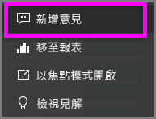
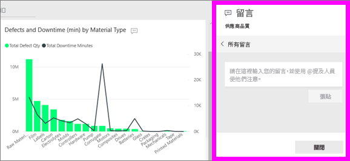
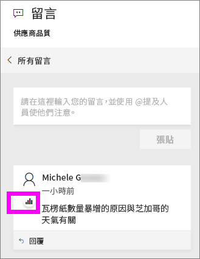
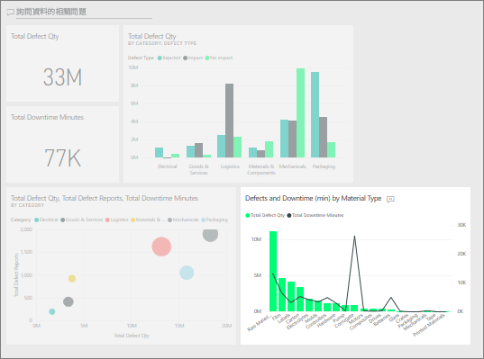

# 在儀表板中新增註解
新增個人註解，或是和您的同事開始儀表板相關交談。 **註解**功能只是「取用者」可與其他人共同作業的其中一種方法。 

## 如何使用註解功能
您可以將註解新增至整個儀表板，或新增至儀表板上的個別視覺效果。 請新增一般註解或鎖定特定同事的註解。  

### 新增一般儀表板註解
1. 開啟 Power BI 儀表板，然後選取**註解**圖示。 這會開啟 [註解] 對話方塊。

    

    在此我們會看到儀表板建立者已新增一般註解。  有權存取此儀表板的任何人都可以看到此註解。

    

2. 若要回應，請選取 [回覆]，鍵入您的回應，然後選取 [張貼]。  

    

    根據預設，Power BI 將引導您回應發起註解討論串的同事，在本例中為 Aaron F。 

    

 3. 如果您想要新增不屬於現有討論串的儀表板註解，請在上方文字欄位中輸入您的註解。

    

    此儀表板的註解現在看起來如下。

    

### 在特定儀表板視覺效果中新增註解
1. 將滑鼠暫留在視覺效果上並選取省略符號 (...)。    
2. 從下拉式清單中，選取 [新增註解]。

      

3.  隨即開啟 [註解] 對話方塊。 此視覺效果還沒有任何註解。 

      

4. 鍵入您的註解，然後選取 [張貼]。

      

    圖表圖示  可讓我們知道這個註解會繫結至特定的視覺效果。 請選取要在儀表板上醒目提示相關視覺效果的圖示。

    

5. 按一下 [關閉] 返回儀表板或報表。

### 使用 @ 符號吸引同事注意
不論您是建立儀表板註解或是在特定視覺效果上加上註解，請使用 "@" 符號來吸引同事注意。  當您鍵入 "@" 符號時，Power BI 會開啟下拉式清單，您可以在其中搜尋並選取組織中的個人。 任何前面加上 "@" 符號的已驗證名稱都會以藍色字型顯示。 

以下是我和視覺效果「設計師」進行的交談。 他使用 @ 符號，確保我看到註解。 我知道這個註解是寫給我看的。 當我在 Power BI 中開啟這個應用程式儀表板時，從標頭選取 [註解]。 [註解] 窗格會顯示我們的交談。

  

## 後續步驟
回到[適用於取用者的視覺效果](end-user-visualizations.md)    
<!--[Select a visualization to open a report](end-user-open-report.md)-->