# 將註解新增至儀表板或報表
新增個人註解或啟動與您的同事的儀表板或報表的相關交談。 **註解**功能只是「取用者」  可與其他人共同作業的其中一種方法。 

## 如何使用註解功能
可以加入註解，整個儀表板、 儀表板上的個別視覺效果、 報表頁面，及至報表頁面上的個別視覺效果。 將一般註解或註解目標為特定的同事。  

當您在報表中加入註解時，Power BI 會擷取目前的篩選和交叉分析篩選器值。 這表示當您選取，或回應意見時，報表頁面或報表視覺效果可能會改變，以顯示篩選和交叉分析篩選器選取項目處於作用中的第一個註解時加入。  

這為何重要？ 假設有位同事套用揭露有趣的深入解析，他想要與小組分享了篩選器。 不含該選取的篩選，註解可能沒有任何意義。 

### 將一般註解新增至儀表板或報表
將註解新增至儀表板或報表的處理程序很類似。 在此範例中，我們使用儀表板。 

1. 開啟 Power BI 儀表板或報表，然後選取**註解**圖示。 這會開啟 [註解] 對話方塊。

    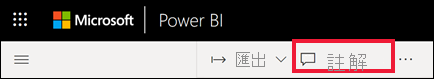

    在此我們會看到儀表板建立者已新增一般註解。  有權存取此儀表板的任何人都可以看到此註解。

    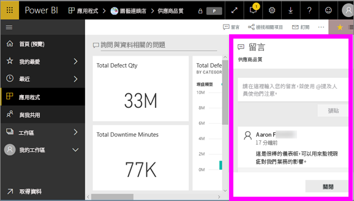

2. 若要回應，請選取 [回覆]  ，鍵入您的回應，然後選取 [張貼]  。  

    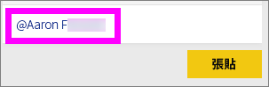

    根據預設，Power BI 將引導您回應發起註解討論串的同事，在本例中為 Aaron F。 

    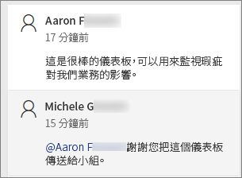

 3. 如果您想要加入的註解不屬於現有的執行緒，輸入您的註解的上方的文字欄位中。

    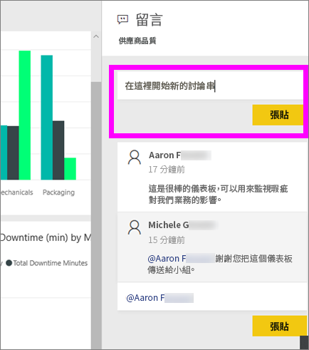

    此儀表板的註解現在看起來如下。

    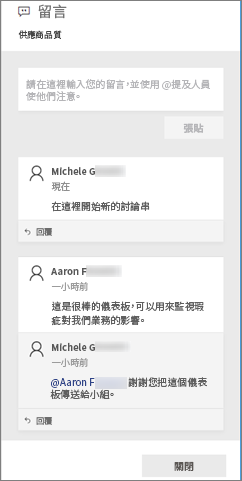

### 將註解新增至特定儀表板或報表視覺效果
除了整個儀表板或整份報表頁面，請新增註解，您可以加入註解，個別的儀表板磚和個別的報表視覺效果。 處理程序類似，而且在此範例中，我們會使用報表。

1. 將滑鼠暫留在視覺效果上並選取省略符號 (...)。    
2. 從下拉式清單中，選取 [新增註解]  。

    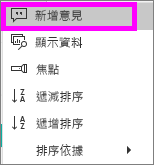  

3.  **註解** 對話方塊隨即開啟，並在頁面上的其他視覺效果會呈現灰色。此視覺效果還沒有任何註解。 

    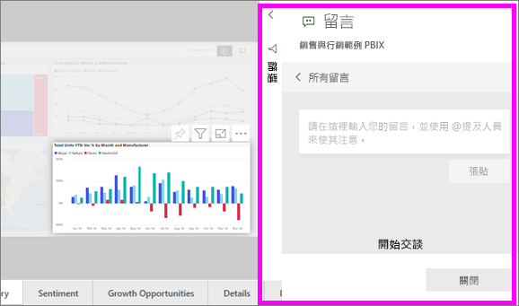  

4. 鍵入您的註解，然後選取 [張貼]  。

    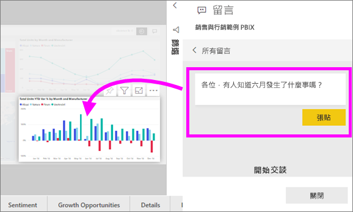  

    - 報表頁面上，選取 視覺效果，所做的註解會醒目提示該視覺效果 （請參閱前述）。

    - 在儀表板、 圖表圖示  可讓我們知道，繫結至特定的視覺效果的註解。 套用至整個儀表板的註解不需要特殊的圖示。 選取圖表圖示會反白顯示相關的視覺效果的儀表板上。

        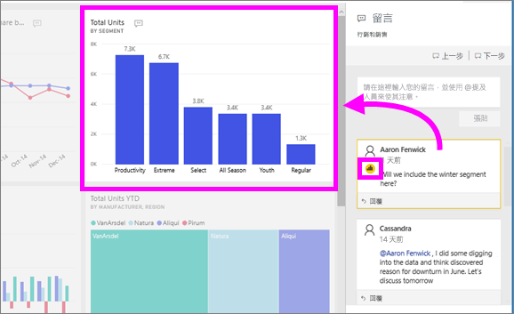

5. 按一下 [關閉]  返回儀表板或報表。

### 使用 @ 符號吸引同事注意
您建立的儀表板、 報表、 磚或視覺的註解，擷取您的同事注意使用 「\@"符號。  當您輸入"\@」 符號，Power BI 會開啟下拉式清單，您可以在其中搜尋並選取從您的組織的個人。 任何前面加上 "\@" 符號的已驗證名稱都會以藍色字型顯示。 

以下是我和視覺效果「設計師」  進行的交談。 他使用 @ 符號，確保我看到註解。 我知道這個註解是寫給我看的。 當我在 Power BI 中開啟這個應用程式儀表板時，從標頭選取 [註解]  。 [註解]  窗格會顯示我們的交談。

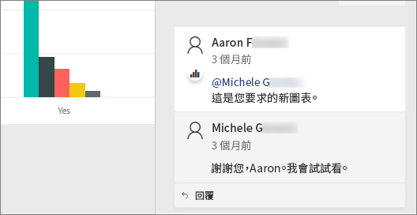  

## 後續步驟
回到[適用於取用者的視覺效果](end-user-visualizations.md)    
<!--[Select a visualization to open a report](end-user-open-report.md)-->
