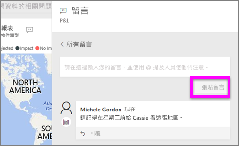

# 新增註解至視覺效果
新增個人註解，或是和您的同事開始視覺效果的相關交談。 **註解**功能只是「取用者」可和視覺效果互動的其中一種方法。 

## 如何使用註解功能

1. 將滑鼠暫留在視覺效果上並選取省略符號 (...)。    
2. 從下拉式清單中，選取 [新增註解]。

      

3.  鍵入您的註解，然後選取 [張貼註解]。 這是寫給自己的註解，在沒有任何拼字錯誤的情況下完成。

      

4. 以下是我和視覺效果「設計師」進行的交談。 他使用 @ 符號，確保我看到註解。 我知道這個註解是寫給我看的。 當我在 Power BI 中開啟這個應用程式儀表板時，從標頭選取 [註解]。 [註解] 窗格會顯示我們的交談。 

      

5. 按一下 [關閉] 來返回儀表板或進行報告。

## 後續步驟
回到[適用於取用者的視覺效果](end-user-visualizations.md)    
<!--[Select a visualization to open a report](end-user-open-report.md)-->