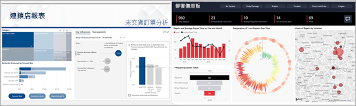

# 適用於取用者的 Power BI 服務

[!INCLUDE[consumer-appliesto-ynny](../includes/consumer-appliesto-ynny.md)]

您活在資料文化中，其會根據事實來制訂商務決策，而不是根據想法。 您需要資料來制訂這些決策，而您的同事並未讓您失望。     
 
他們會傳送所有類型的報表、試算表、含有圖表的電子郵件，甚至是列印的講義給您。 隨著資料越來越多，會越來越難快速找到您需要的內容，且您會擔心可能不是使用最新的資訊。  
 

## 適用於「取用者」  的 Power BI 服務

Power BI 可同時讓您的工作更輕鬆且更具影響力。 所有資料都會變成圖表和圖形，以視覺效果為您呈現資料。 不再是數字和文字的冗長清單或表格，您的資料見解會很「美觀」，以彩色且吸引人之視覺效果來提供有關您資料的見解。 

 
只要在瀏覽器或行動裝置中開啟 Power BI 服務即可。 您和同事可以從相同的受信任儀表板和報表執行作業，這些儀表板和報表會自動更新和重新整理，因此您一律會使用最新的內容。   

由於內容不是靜態的，因此您可以深入探索以尋找趨勢、見解和其他商業智慧。 對內容進行分析，甚至用您自己的話來詢問問題。 或者，放心讓資料為您探索有趣的見解、在資料變更時傳送警示給您，並依照您設定的排程以電子郵件傳送報表給您。 這包括您所有的資料，不論任何時候、雲端或內部部署，或是來自任何裝置。 而這只是 Power BI 可以執行的作業開端。 

## 我是 Power BI「取用者」  嗎？

您與 Power BI 互動的方式將取決於作業角色。 身為終端使用者或「取用者」  ，您會從同事收到內容 (儀表板、報表和應用程式)。 您會在線上或行動裝置版的 Power BI (稱為 Power BI 服務) 中工作，檢視並與此內容互動，以制定商務決策。 
   
身為取用者，您將無法存取 Power BI 的完整功能，但沒關係，因為您的作業不是建置儀表板和報表。 您將會使用 Power BI 服務進行分析、監視、探索和決策制訂。 

您一定會聽到 "Power BI Desktop" 或只是 "Desktop" 一詞，這是一種獨立工具，供建置儀表板和與您共用儀表板與報表的「設計師」  使用。  請務必了解還有其他的 Power BI 工具，但如果您是取用者，就只能使用 Power BI 服務。 

而因為您使用的是「共用」  內容，所以需要有 Power BI Pro 或 Premium 授權。 [我有哪些授權？](end-user-license.md)

## 安全地與內容互動 
在您篩選、配量、訂閱和匯出時，請別擔心，您的工作不會影響基礎資料集或原始共用的內容 (儀表板、報表和應用程式)。  

您不可傷害資料。  Power BI 是進行探索和實驗而無須擔心「破壞」任何項目的絕佳方式。  
 
這並不表示您無法儲存變更；您可以儲存變更。 但這些變更只會影響您對內容的檢視。 而且還原成原始預設檢視非常簡單，只需按一下按鈕即可。  

## 後續步驟

[導覽適用於取用者的 Power BI 服務](end-user-reading-view.md)    
[適用於取用者的 Power BI 服務訓練](https://docs.microsoft.com/learn/paths/consume-data-with-power-bi/)    
[適用於 Power BI 取用者  的術語和概念](end-user-basic-concepts.md)    

