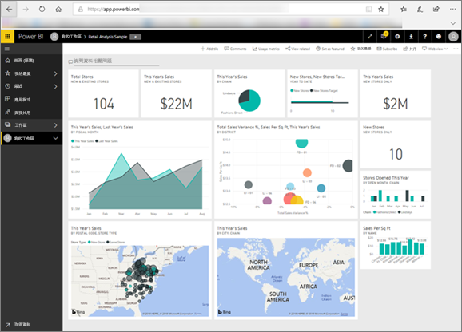

<!-- fold this topic into existing topics -->
# 適用於取用者的 Power BI
您與 Power BI 互動的方式將取決於作業角色。 身為「終端使用者」  或「取用者」  ，您會從同事收到儀表板、報表和應用程式。 您在 ***Power BI 服務***中工作，檢閱並與此內容互動，以制定商務決策。

如果您不熟悉 Power BI，我們建議您先閱讀 [Power BI 概觀](../power-bi-overview.md)。 在那裡，您將深入了解構成 Power BI 的工具組。

身為取用者，您將無法存取 Power BI 的完整功能 -- 沒關係，因為您的作業不是要建置儀表板和報表。 您的作業是要使用 Power BI 進行分析、監視、探索和決策制定。

當您閱讀取用者的文章時，您將了解術語，您將導覽 Power BI 服務、了解如何巡覽至內容，然後了解如何與該內容互動。  讓我們開始吧！

## 後續步驟

[適用於 Power BI 取用者  的術語和概念](end-user-basic-concepts.md)

<!-- [Get started guide for *consumers*] -->
[開始使用 Power BI 服務](../service-get-started.md)

