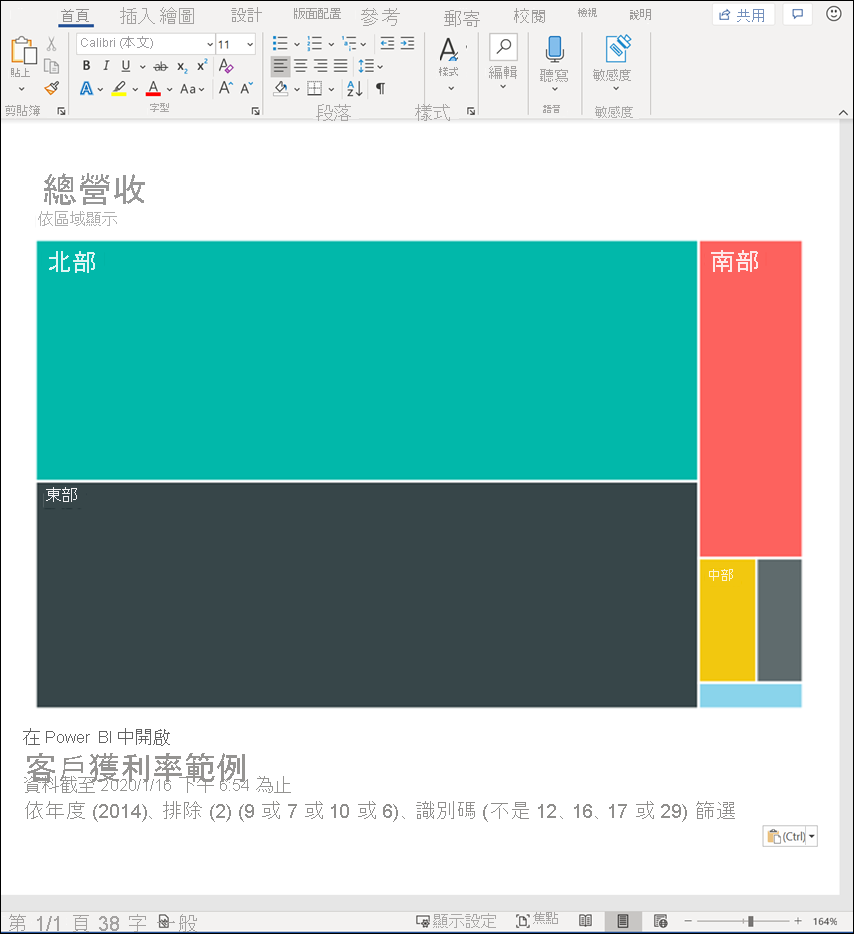
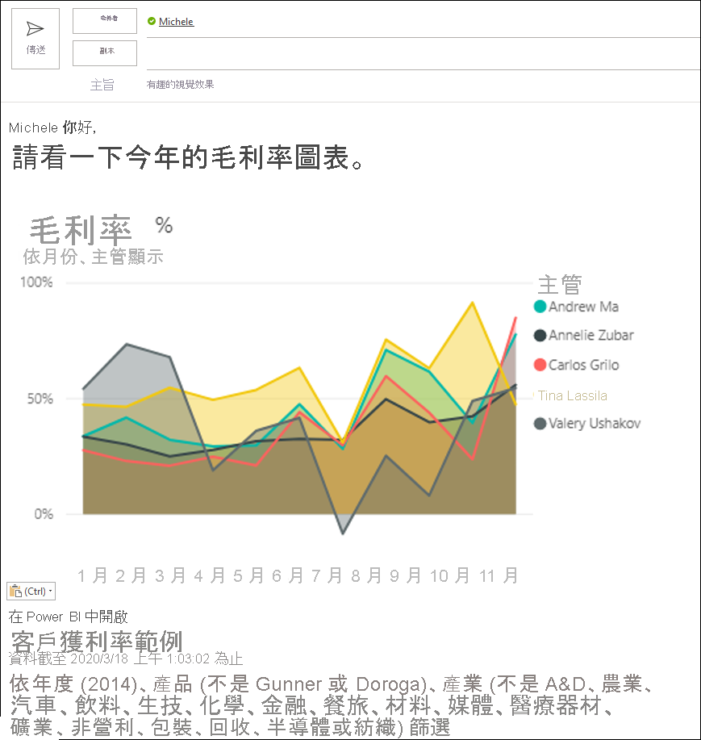
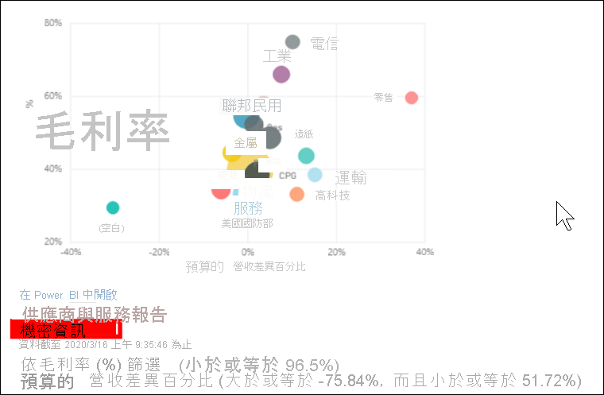
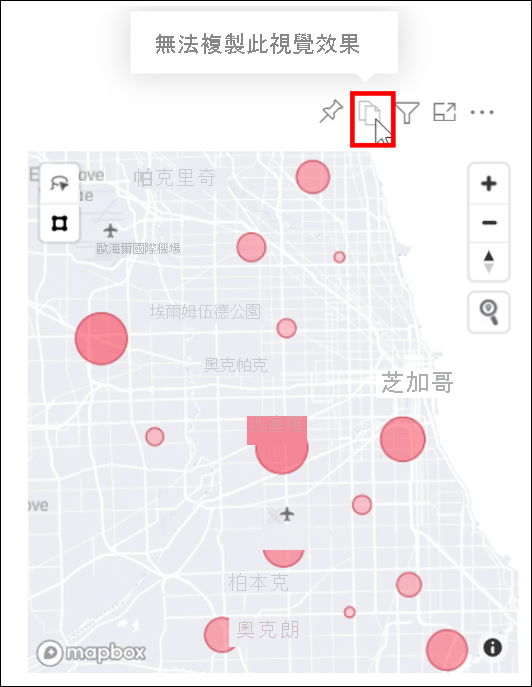

# 將視覺效果以圖片形式複製到剪貼簿

[!INCLUDE[consumer-appliesto-yyyn](../includes/consumer-appliesto-yyyn.md)]

您是否曾想要從 Power BI 報表或儀表板共用圖片？ 現在，您可以將視覺效果複製並貼到任何其他支援貼上的應用程式中。 

複製視覺效果的靜態圖片時，您會取得視覺效果複本及中繼資料。 其中包括：
* 返回 Power BI 報表或儀表板的連結
* 報表或儀表板的標題
* 圖片是否包含機密資訊的通知
* 上次更新時間戳記
* 套用至視覺效果的篩選

### 從儀表板磚複製

1. 瀏覽至您要從中複製的儀表板。

2. 從視覺效果的右上角，選取 [更多動作 (...)]，然後選擇 [將視覺效果複製為圖片]。 

    ![下拉式功能表中顯示 [將視覺效果複製為圖片] 選項](media/end-user-copy-paste/power-bi-copy-dashboard.png)

3. 出現 [您的視覺效果已可複製] 對話方塊時，選取 [複製至剪貼簿]。

    ![具有 [複製至剪貼簿] 選項的對話方塊](media//end-user-copy-paste/power-bi-copied.png)

4. 複製視覺效果之後，使用 **Ctrl + V** 或**按一下滑鼠右鍵** > [貼上]，將其貼到另一個應用程式。 在下方螢幕擷取畫面中，我們已將視覺效果貼到 Microsoft Word 中。 

    

### 從報表視覺效果複製 

1. 瀏覽至您要從中複製的報表。

2. 從視覺效果的右上角，選取 [將視覺效果複製為圖片] 的圖示。 

    ![顯示的 [將視覺效果複製為圖片] 圖示](media/end-user-copy-paste/power-bi-copy-icon.png)

3. 出現 [您的視覺效果已可複製] 對話方塊時，選取 [複製至剪貼簿]。

    ![具有 [複製至剪貼簿] 選項的對話方塊](media//end-user-copy-paste/power-bi-copied.png)

4. 複製視覺效果之後，使用 **Ctrl + V** 或**按一下滑鼠右鍵** > [貼上]，將其貼到另一個應用程式。 在下方螢幕擷取畫面中，我們已將視覺效果貼到電子郵件中。

    

5. 如果報表已套用資料敏感度標籤，當您選取複製圖示時，就會收到警告。  

    

    然後，在所貼上視覺效果底下的中繼資料中會新增一個敏感度標籤。 

    

## 考量與疑難排解

   

問：為什麼視覺效果上的 [複製] 圖示是停用的？    
答：我們目前支援原生的 Power BI 視覺效果和已認證的自訂視覺效果。 針對特定視覺效果提供有限的支援，包括： 
- ESRI 與其他地圖視覺效果 
- Python 視覺效果 
- R 視覺效果 
- PowerApps 視覺效果   

答：您的 IT 部門或 Power BI 管理員可以關閉複製視覺效果的功能。

問：為什麼我的視覺效果未正確貼上？    
答：自訂視覺效果和動畫視覺效果有一些限制。 

## 後續步驟
深入了解 [Power BI 報表中的視覺效果](end-user-visual-type.md)

若您有編輯報表的權限，您可以[在相同的報表內複製並貼上視覺效果](../visuals/power-bi-visualization-copy-paste.md)。 

有其他問題嗎？ [試試 Power BI 社群](https://community.powerbi.com/)

