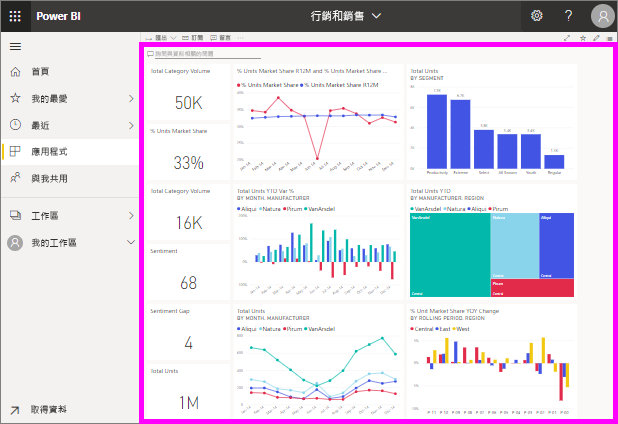

# 檢視儀表板

[!INCLUDE [power-bi-service-new-look-include](../includes/power-bi-service-new-look-include.md)]

Power BI「取用者」  花費大量時間檢視儀表板。 儀表板的目的是從醒目提示基礎報表和資料集中的特定資訊。 而 Power BI 取用者使用該資訊來追蹤、監控、回答問題、測試等，以制定資料驅動的商務決策。

需要 Power BI Pro 才能共用儀表板和檢視共用的儀表板。

## 開啟儀表板

|              |         |
|------------|--------------------------------|
|      |您可以從 Power BI 服務中的許多位置開啟儀表板。   只尋找此儀表板圖示。 一旦找到  儀表板，要開啟它很簡單 - 只要選取它，儀表板就會填滿  您的 Power BI 畫布。 |
|                    |          |

您可在導覽窗格的所有容器中看到儀表板。 

- **首頁** 
- **我的最愛** - 若您已[將儀表板設為我的最愛](end-user-favorite.md)
- **最近** - 若您最近瀏覽過儀表板
- **應用程式** - 大部分的應用程式同時包含儀表板和報表
- **與我共用** - 若您的同事已經[與您共用儀表板](end-user-shared-with-me.md)
- **我的工作區** - 若您已經下載任何 [Power BI 範例](../sample-datasets.md)

## 後續步驟
* 使用[範例儀表板](../sample-tutorial-connect-to-the-samples.md)其中一項教學課程來熟悉儀表板。
* 深入了解[儀表板磚](end-user-tiles.md)以及選取一個磚時會發生什麼情況。