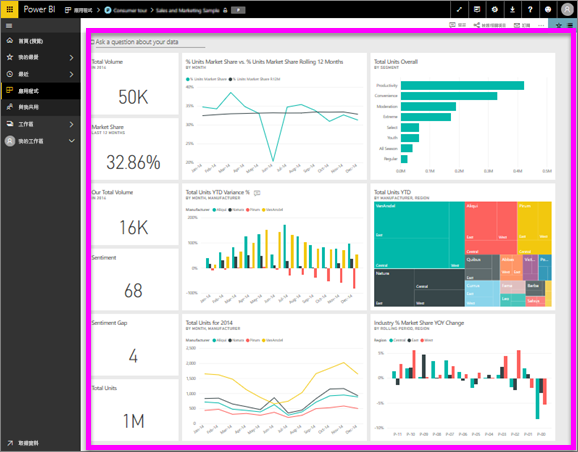

# 檢視儀表板
Power BI 取用者花費大量時間檢視儀表板。 儀表板的目的是從醒目提示基礎報表和資料集中的特定資訊。 而 Power BI 取用者使用該資訊來追蹤、監控、回答問題、測試等，以制定資料驅動的商務決策。

需要 Power BI Pro 才能共用儀表板和檢視共用的儀表板。

## 開啟儀表板
您可以從 Power BI 服務中的許多位置開啟儀表板。  重要的是找出哪些內容是儀表板 (例如相對於報表)。 一旦找到儀表板，要加以開啟就很簡單。只要按一下，儀表板就會填滿您的 Power BI 畫布。

|              |         |
|------------|--------------------------------|
|      |最容易辨識儀表板的方式是尋找這個  儀表板圖示。 當您找到有這個圖示的內容時，請選取它以開啟儀表板。 |
|                    |          |

 

<!--insert aGIF-->

您可在左側瀏覽列的所有容器中看到儀表板。 
- **首頁** (預覽)
- **我的最愛** - 若您已[將儀表板設為我的最愛](end-user-favorite.md)
- **最近** - 若您最近瀏覽過儀表板
- **應用程式** - 大部分的應用程式同時包含儀表板和報表
- **與我共用** - 若您的同事已經[與您共用儀表板](end-user-shared-with-me.md)
- **我的工作區** - 若您已經下載任何 [Power BI 範例](../sample-datasets.md)

## 後續步驟
* 使用[範例儀表板](../sample-tutorial-connect-to-the-samples.md)其中一項教學課程來熟悉儀表板。
* 深入了解[儀表板磚](end-user-tiles.md)以及選取一個磚時會發生什麼情況。
* 想要追蹤個別的儀表板磚，並在它達到某個閾值時收到電子郵件？ [建立磚警示](end-user-alerts.md)。
* 享受向儀表板提問的樂趣。 了解如何使用 [Power BI 問與答](end-user-q-and-a.md)提出與您的資料相關的問題，然後接收視覺效果的回應。 