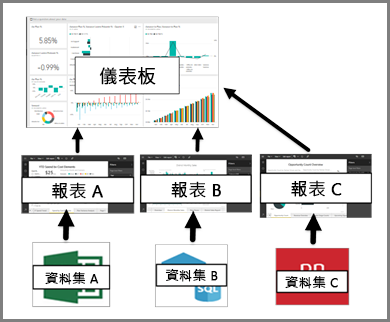

# Power BI 服務取用者的儀表板

Power BI 「儀表板」是使用視覺效果說故事的單一頁面，通常稱為畫布。 因為受限於一張頁面，所以設計良好的儀表板只包含故事最重要的項目。

您在儀表板上看到的視覺效果稱為「磚」，從報表「釘選」在儀表板上。 如果您不熟悉 Power BI，請參閱 [Power BI 基本概念](end-user-basic-concepts.md)來打好基礎。

> [!NOTE]
> 儀表板是 Power BI 服務的功能，Power BI Desktop 不提供此功能。 行動裝置無法建立儀表板，但可以[檢視及共用](mobile/mobile-apps-view-dashboard.md)儀表板。
> 
> 

儀表板上的視覺效果來自報表，而每份報表都是以一個資料集為基礎。 事實上，您可以將儀表板想成是進入基礎報表和資料集的方法。 選取視覺效果會帶您前往建立效果的報表 (和資料集)。

## 儀表板的優點
儀表板是很棒的方式，一眼就可以監視企業、尋找答案以及查看所有最重要的指標。 儀表板上的視覺效果可能來自一或多個基礎資料集，以及來自一或多份基礎報表。 儀表板將內部部署和雲端產生的資料結合在一起，提供不受資料位置限制的合併檢視。

儀表板不只是張漂亮的圖片，其高度互動性和高度可自訂以及磚更新會隨著基礎資料變更。

## 儀表板與報表
報表經常與儀表板相混淆，因為它們也是填滿視覺效果的畫布。 但兩者還是有一些主要差異。

| **功能** | **儀表板** | **報表** |
| --- | --- | --- |
| 頁面 |一個頁面 |一或多個頁面 |
| 資料來源 |每個儀表板一或多份報表以及一或多個資料集 |每份報表單一資料集 |
| Power BI Desktop 可用 |否 |是，可在 Desktop 中建立及檢視報表 |
| 釘選 |只能將目前儀表板中現有的視覺效果 (磚) 釘選到其他儀表板 |可將視覺效果 (以磚的形式) 釘選到任何儀表板。 可將整個報表頁面釘選到任何儀表板。 |
| 訂閱 |無法訂閱儀表板 |可訂閱報表頁面 |
| 篩選 |無法篩選或配量 |有多種不同方法可篩選、反白顯示及配量 |
| 設定警示 |可以建立警示於達到特定條件時發送電子郵件 |否 |
| 功能 |可將一個儀表板設定為「精選」儀表板 |無法建立精選報表 |
| 自然語言查詢 |可從儀表板使用 |無法從報表使用 |
| 可變更視覺效果類型 |否。 事實上，如果報表擁有者變更報表中的視覺效果類型，儀表板上釘選的視覺效果不會更新。 |是 |
| 可以看到基礎資料集的資料表和欄位 |否。 可以匯出資料，但看不到儀表板本身的資料表和欄位。 |是。 可以看到資料集資料表和欄位以及值。 |
| 可以建立視覺效果 |僅限使用 [新增磚] 在儀表板新增小工具 |可以建立許多不同類型的視覺效果、新增自訂視覺效果、編輯視覺效果，以及更多的編輯權限。 |
| 自訂 |可以使用視覺效果 (磚) 執行作業，如移動和排列、調整大小、新增連結、重新命名、刪除和全螢幕顯示。 但是，資料和視覺效果本身都是唯讀的。 |在 [閱讀檢視] 中您可以發佈、內嵌、篩選、匯出、下載為 .pbix、檢視相關內容、產生 QR 代碼、在 Excel 中進行分析等等。  在 [編輯檢視] 中，您可以執行目前述及的所有作業及其他更多。 |

## 儀表板建立者和儀表板取用者
視您的角色而定，您可能是建立儀表板供自己使用，或與同事共用儀表板的人。 您想要了解如何建立和共用儀表板。 或者，您可能是從其他人收到儀表板的人。 您想要了解如何熟悉及與儀表板互動。

以下是依角色協助您開始的一些主題。

需要 Power BI Pro 才能共用儀表板和檢視共用的儀表板。

### 如果您要接收並取用儀表板
* 使用[範例儀表板](../sample-tutorial-connect-to-the-samples.md)其中一項教學課程來熟悉儀表板。
* 深入了解[儀表板磚](end-user-tiles.md)以及選取一個磚時會發生什麼情況。
* 想要追蹤個別的儀表板磚，並在它達到某個閾值時收到電子郵件？ [建立磚警示](end-user-alerts.md)。
* 享受向儀表板提問的樂趣。 了解如何使用 [Power BI 問與答](end-user-q-and-a.md)提出與您的資料相關的問題，然後接收視覺效果的回應。

> [!TIP]
> 如果這裡找不到您要的解答，請使用左邊的目錄。
> 

## 後續步驟
[Power BI 是什麼？](../power-bi-overview.md)  
[Power BI - 基本概念](end-user-basic-concepts.md)  