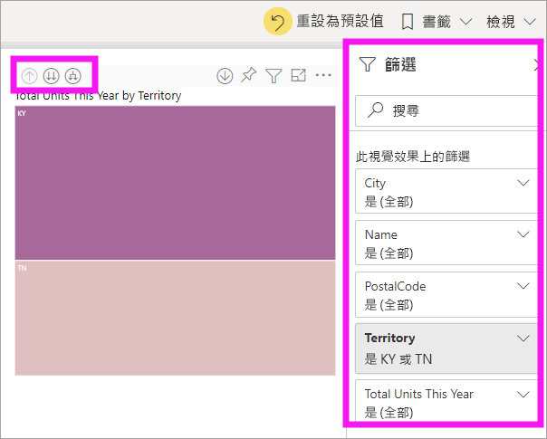
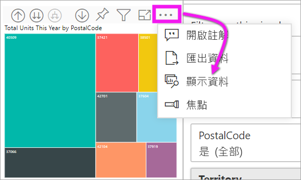

# Power BI 視覺效果中的切入模式

[!INCLUDE[consumer-appliesto-yyny](../includes/consumer-appliesto-yyny.md)]

[!INCLUDE [power-bi-service-new-look-include](../includes/power-bi-service-new-look-include.md)]

本文說明如何向下切入 Microsoft Power BI 服務的視覺效果。 在您的資料點上使用向下切入和向上切入，您可以深入探索資料。 

## 鑽研需要階層

當視覺效果有階層時，您可以向下鑽研以顯示其他詳細資料。 例如，您可能有一個視覺效果，它會以運動、專業領域和活動所構成的階層來查看奧運獎牌計數。 根據預設，視覺效果會依運動 (體操、滑雪、水上運動等) 顯示獎牌計數。 但因為它有階層，因此當您選取其中一個視覺項目 (例如橫條圖、折線圖或泡泡圖) 時，會顯示越來越詳細的圖片。 當您選取 [水上運動]  項目時，會顯示游泳、跳水和水球的資料。  選取 [跳水]  項目素時，會顯示跳板、跳台和雙人跳水活動的詳細資料。

日期是獨特的階層類型。  報表設計師通常會在視覺效果中新增日期階層。 常見的日期階層包含年份、季度、月份和日。 

## 找出可以切入的視覺效果
不確定哪些 Power BI 視覺效果包含階層？ 請將游標停留在視覺效果上。 如果您在頂端看到這些切入控制項的組合，則表示此視覺效果有階層。

  

## 了解如何向下切入和向上切入

在此範例中，我們會使用樹狀圖，其階層由國家/地區、城市、郵遞區號和商店名稱組成。 在切入樹狀圖之前，系統會依國家/地區查看今年售出的單位總量。 

  

### 存取切入功能的兩種方式

針對具有階層的視覺效果，您可以透過兩種方式來存取向下切入、向上切入及展開功能。 請兩種都試試看，並使用您最喜歡的方式。

- 第一種方法：將游標暫留在視覺效果上，以查看並使用圖示。  

    

- 第二種方法：以滑鼠右鍵按一下視覺效果以顯示及使用功能表。

    

## 鑽研路徑

### 一次向下切入所有欄位

您可以透過數種方式來切入視覺效果。 選取向下切入圖示時，會前往階層中的下一個層級。 如果您查看肯塔基州和田納西州的 [國家/地區]  層級，即可向下切入至這兩州的城市層級，然後是這兩州的郵遞區號層級，最後再到這兩州的商店名稱層級。 路徑中的每個步驟都會顯示新的資訊。

選取向上切入圖示  直到您回到 [依國家/地區的今年總單位數]。

### 一次展開所有欄位

「展開」  會將其他階層層級新增至目前的檢視。 因此，如果您正在查看 [國家/地區]  層級，您可以將城市、郵遞區號和名稱的詳細資料展開並新增至您的樹狀圖。 路徑中的每個步驟都會顯示相同的資訊，並在每一個層級新增新的資訊。

您也可以選擇逐一向下切入或展開欄位。

### 一次向下切入一個欄位

1. 選取向下切入圖示將它開啟 .

    現在，當您選取視覺效果項目時，即可選擇 [逐一向下切入欄位]  。 視覺效果項目範例為：橫條圖、泡泡圖和分葉圖。

    

    如果您未開啟向下切入，則選取視覺效果項目 (例如橫條圖、泡泡圖或分葉圖) 時，就不會向下切入。 相反地，它會交叉篩選報表頁面上的其他圖表。

1. 針對 **TN** 選取分葉。 現在，您的樹狀圖會顯示田納西州中擁有商店的全部城市和國家/地區。

    

1. 目前，您可以：

    1. 繼續針對田納西州向下切入。

    1. 針對田納西州中的特定城市向下切入。

    1. 這次，改為展開。

    繼續一次向下切入一個欄位。  選取 [Knoxville, TN]  。 現在樹狀圖會顯示您在 Knoxville 之商店的郵遞區號。

    

    請注意當您向下鑽研並重新往回時，標題會變更。

### 一次全部展開欄位和一次展開一個欄位

只顯示郵遞區號的樹狀圖無法提供足夠的資訊。  那麼，讓我們向下「展開」  階層的一個層級。  

1. 在樹狀圖使用中的情況下，選取「向下展開」  圖示 。 您的樹狀圖現在顯示兩個層級的階層：郵遞區號與商店名稱。

    

1. 若要看到田納西州所有四個階層層級的資料，請選取向上切入箭號直到您到達第二個層級，樹狀圖中的 [依國家/地區和城市的今年總單位數]  。

    

1. 請確定向下切入仍然開啟  並選取「向下展開」  圖示 。 樹狀圖現在會顯示相同數目的分葉 (方塊)，但每個分葉有額外的詳細資料。 除了城市與州之外現在也會顯示郵遞區號。

    

1. 再次選取 [向下展開]  以在樹狀圖上顯示田納西州詳細資料的所有四個階層層級。 將滑鼠停留在分葉以查看更多詳細資料。

    

## 在您切入時顯示資料
使用 [顯示資料]  以在幕後查看外觀。 每次您切入或展開時，[顯示資料]  即會顯示要用來建置視覺效果的資料。 這可能有助您了解階層、切入和展開如何搭配運作以建置視覺效果。 

在右上角選取 [更多選項]  (...)，然後選取 [顯示資料]  。 

下表顯示從國家/地區到商店名稱，一次向下切入所有欄位的結果。  

請注意，[城市]  、[郵遞區號]  和 [名稱]  的總計相同。 情況並不一定都是如此。  但是針對這項資料，每個郵遞區號和每個城市都只有一間商店。  

## 考量與限制
- 根據預設，切入不會篩選報表中的其他視覺效果。 不過，報表設計師可以變更此預設行為。 當您切入時，請查看頁面上的其他視覺效果是否為交叉篩選或交叉醒目提示。

- 檢視與您共用的報表需有 Power BI Pro 或 Premium 授權。 [我有哪些授權？](end-user-license.md)

## 後續步驟

[Power BI 報表中的視覺效果](../visuals/power-bi-report-visualizations.md)

[Power BI 報表](end-user-reports.md)

[Power BI - 基本概念](end-user-basic-concepts.md)

有其他問題嗎？ [試試 Power BI 社群](https://community.powerbi.com/)
