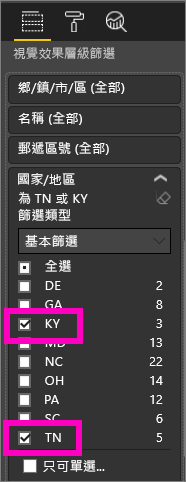

# Power BI 視覺效果中的鑽研模式

## 鑽研需要階層
當視覺效果有階層時，您可以向下鑽研以顯示其他詳細資料。 例如，您可能必須有一個視覺效果，它會以運動、專業領域和活動所構成的階層，查看奧運獎牌計數。 根據預設，視覺效果會依運動 (體操、滑雪、水上運動等) 顯示獎牌計數。 但是因為它有階層，選取其中一個視覺項目 (例如橫條、線條或泡泡) 會顯示越來越詳細的圖片。 選取 [水上運動] 項目，查看游泳、跳水和水球的資料。  選取 [跳水] 項目，查看跳板、平台和同時跳水活動的詳細資料。

您可以新增階層到您擁有的報表，但是不能新增到與您共用的報表。
不確定哪些 Power BI 視覺效果包含階層？  將滑鼠停駐在視覺效果上，如果您在上方角落看到這些鑽研控制項，您的視覺效果即具有階層。

    
   

日期是獨特的階層類型。 當您將日期欄位新增到視覺效果時，Power BI 會自動新增包含年、季、月和日的時間階層。 如需詳細資訊，請參閱[視覺效果階層和向下切入行為](../guided-learning/visualizations.yml?tutorial-step=18)或觀看以下影片。

  <iframe width="560" height="315" src="https://www.youtube.com/embed/MNAaHw4PxzE?list=PL1N57mwBHtN0JFoKSR0n-tBkUJHeMP2cP" frameborder="0" allowfullscreen></iframe>

> [!NOTE]
> 若要了解如何使用 Power BI Desktop 來建立階層，請觀賞影片 - [如何建立及新增階層](https://youtu.be/q8WDUAiTGeU)
> 

## 先決條件

1. 在 Power BI 服務或 Desktop 中，鑽研需要有階層的視覺效果。 
   
2. 若要跟著做，請[開啟零售分析範例](../sample-datasets.md)並建立樹狀圖，依**國家/地區**、**城市**、**郵遞區號**與**名稱** (群組) 來查看**今年總單位數** (值)。  樹狀圖具有由國家/地區、城市、郵遞區號與城市名稱組成的階層。 每個國家/地區有一或多個城市，每個城市有一或多個郵遞區號等等。 根據預設，視覺效果只會顯示國家/地區資料，因為「國家/地區」最先出現在清單中。
   
   ![選取 [國家/地區]](media/end-user-drill/power-bi-hierarcy-list.png)

2. 了解各種鑽研圖示如何一起運作可能會造成混淆，因此我們篩選樹狀圖以僅顯示 2 個較小的國家/地區：**KY** 與 **TN**。 選取樹狀圖，在 [視覺效果層級篩選] 下展開 [國家/地區]，並選取 [KY] 與 [TN]。

        

   現在只有兩個地區顯示於樹狀圖中。

   

## 有三種方式可存取鑽研功能
您有可存取向下切入、向上切入，以及展開具有階層的視覺效果功能的多個選項。 本文示範如何使用以下第一個選項。 一旦您了解向下切入與展開的基本概念，這三種方法皆可完成相同的工作，請嘗試並挑選您最喜歡的一個。

- 將滑鼠停留在視覺效果，以查看並使用圖示。  

    

- 以滑鼠右鍵按一下視覺效果以顯示及使用功能表。
    
    

- 從 Power BI 功能表列中選取 [探索] 按鈕。

   ![選取 [探索] 顯示鑽研圖示與選項](media/end-user-drill/power-bi-explore.png)

## 鑽研路徑
### 向下切入
有數種方式來向下切入至您的視覺效果。 「向下切入」會帶您前往階層中的下一個層級，因此如果您正在查看**國家/地區**層級，您可以向下切入至城市層級、郵遞區號層級與最後的名稱層級。 路徑中的每個步驟都會顯示新的資訊。

### 展開

「展開」會將其他階層層級新增至目前的檢視。 因此，如果您正在查看**國家/地區**層級，您可以將城市、郵遞區號和名稱的詳細資料展開並新增至您的樹狀圖。 路徑中的每個步驟都會顯示相同的資訊，並在每一個層級新增新的資訊。

您也可以選擇要一次對一個欄位或是一次對所有欄位向下切入或展開。 

## 一次向下切入所有欄位

1. 從樹狀圖的最上層開始，該層顯示 KY 與 TN 的資料。 透過選擇其中一個控點並向右拖曳來擴大您的樹狀圖。 

     .

2. 若要「一次向下切入所有欄位」，請選取視覺效果左上角的雙箭號 。 您的樹狀圖現在會顯示肯塔基州與田納西州的城市資料。 

    
   
5. 再次向下切入至階層的郵遞區號層級。

    

3. 若要回頭向上切入，請選取視覺效果左上角的向上箭號 .

## 一次向下切入一個欄位
這個方法會使用視覺效果本身右上角出現的向下切入圖示。 

1. 選取向下切入圖示將它開啟 。 現在您有向下切入「一次一個欄位」選項。 
   
   

   如果您不開啟向下切入，則選取視覺效果元素 (例如橫條圖、泡泡圖或分葉) 將不會向下切入，而會交叉篩選報表頁面上的其他圖表。

2. 針對 **TN** 選取「分葉」。 現在您的樹狀圖會顯示在田納西州中有商店的所有城市。 

    

2. 此時，您可以繼續向下切入田納西州或向下切入田納西州的某個特定城市，或者可以改為展開 (請參閱下面的**一次展開所有欄位**)。 繼續一次向下切入一個欄位。  選取 [Knoxville, TN]。 現在樹狀圖會顯示您在諾克斯維爾之商店的郵遞區號。 

   

    請注意當您向下切入並重新往回時，標題會變更。  

## 一次全部展開欄位和一次展開一個欄位
只顯示郵遞區號的樹狀圖無法提供足夠的資訊。  所以讓我們在階層中向下展開一個層級。  

1. 在樹狀圖使用中的情況下，選取「向下展開」圖示 。 您的樹狀圖現在顯示兩個層級的階層：郵遞區號與商店名稱。 

    

2. 若要看到田納西州所有四個階層層級的資料，請選取向上切入箭號直到您到達第二個層級，樹狀圖中的**依國家/地區和城市的今年總單位數**。 

    

3. 請確定向下切入仍然開啟 ，然後選取「向下展開」圖示 。 您的樹狀圖現在會顯示其他詳細資料；除了城市與州之外現在也會顯示郵遞區號。 

    

4. 再次選取 [向下展開] 以在樹狀圖上顯示田納西州詳細資料的所有四個階層層級。 將滑鼠停留在分葉以查看更多詳細資料。

   

## 鑽研篩選其他視覺效果
隨著您在 [鑽研] 模式中作業，您可以決定向下切入和展開如何影響頁面上的其他視覺效果。 

根據預設，鑽研不會篩選報表中的其他視覺效果。 但是，可以在 Power BI Desktop 和 Power BI 服務中啟用此功能。 

1. 在 Desktop 中，選取 [格式] 索引標籤，然後選取 [鑽研篩選其他視覺效果] 核取方塊。

    

2. 現在當您向下切入 (或向上切入或展開) 具有階層的視覺效果，該動作會篩選頁面上的其他視覺效果。 

    

    

> [!NOTE]
> 若要在 Power BI 服務中啟用此功能，請從頂端功能表列選取 [視覺效果互動] > [鑽研篩選其他視覺效果]。
>
> 

## 了解階層軸和階層群組
您可以將階層軸和階層群組視為可用來增加及減少您想要檢視的資料之資料粒度的機制。 任何可組織成類別和子類別的資料都適合具有階層。 當然，這包括日期和時間。

您可以在 Power BI 中建立具有階層的視覺效果，方法是選取一或多個要新增至 [軸] 區或 [群組] 區的資料欄位，並在 [值] 區中包含您要作為資料欄位查看的資料。 您可以透過視覺效果左上角和右上角是否出現「切入模式」圖示，來判斷資料是否為階層式。 

基本上，您可以將階層式資料簡單分為兩種類型：
- 日期和時間資料 - 如果您有 DateTime 資料類型的資料欄位，則表示您已有階層式資料。 Power BI 會自動為其值可剖析成 [DateTime](https://msdn.microsoft.com/library/system.datetime.aspx) 結構的任何資料欄位建立階層。 您只需要將一個 DateTime 欄位新增至 [軸] 或 [群組] 區。
- 類別目錄資料 - 如果您的資料所衍生的集合包含子集合，或具有共用通用值的資料列，則表示您已有階層式資料。

Power BI 可讓您一次展開一個子集，或一次展開所有子集。 您可以向下切入資料，以查看每個層級的單一子集，或同時查看每個層級的所有子集。 例如，您可以向下切入特定年份，或在階層中一面往下一面查看每年的所有結果。 相反地，您可以利用相同的方式向上切入。

下列各節描述從最高層檢視向下切入到中間層檢視，再到最底層檢視。

### 階層式資料和時間資料
在此範例中，遵循[零售分析範例](../sample-datasets.md)，並建立堆疊直條圖視覺效果，依 [總銷售量] (值) 查看 [月份] (軸)。  

即使 [軸] 資料欄位是 [月份]，它仍會在 [軸] 區中建立 [年份] 類別。 這是因為 Power BI 針對所讀取的所有值，都會提供完整的 DateTime 結構。 階層最上層會顯示該年的資料。

開啟向下切入模式後，按一下圖表中的橫條即可下移一層階層。 您會看到三個橫條代表可用季度的資料。 然後從左上方圖示，選擇 [向下一個階層等級展開全部]。 再執行一次，抵達階層的最底層，以顯示每個月的結果。

除了視覺效果，我們還會看到每份報表呈現資料中所反映的階層。 下表顯示從單一月份或所有月份向下切入的報表中 [顯示資料] 的結果。 

請注意，季度報表與年度報表的資料會相同，但在您向下切入至針對 [值] 所指定的詳細等級之後，您會看到單一報表變得更具體，而「所有月份」報表則有更多資料。

|展開模式|年度|季|月|日|
| ---|:---:|:---:|:---:|---|
|單一|||||
|全部|||||

### 階層式類別目錄資料
來自集合與子集合的模型化資料是階層式資料。 一個很好的範例是位置資料。 假設資料來源中有一個資料表，其資料行包括國家/地區、州/省、城市和郵遞區號。 共用相同國家/地區、州/省和城市的資料是階層式資料。

在此範例中，遵循[零售分析範例](../sample-datasets.md)進行。 建立堆疊直條圖視覺效果，依**國家/地區**、**城市**、**郵遞區號**與**名稱** (群組) 來查看**今年總單位數** (值)。  

開啟向下切入模式後，從左上方圖示，選擇 [向下一個階層等級展開全部] 三次。
您應該會抵達階層的最底層，以顯示國家/地區、城市和郵遞區號的結果。

除了視覺效果，我們還會看到每份報表呈現資料中所反映的階層。 下表顯示向下切入單一國家/地區或所有國家/地區的報表中 [顯示資料] 的結果。 當您向下切入時，您會看到單一報表變得更具體，而「所有國家/地區」報表則有更多資料。

| 展開模式|國家/地區|縣/市|郵遞區號|名稱|
| ---|:---:|:---:|:---:|---|
|單一|||||
|全部|||||

## 考量與限制
* 如果將日期欄位新增至視覺效果不會建立階層，可能是因為「日期」欄位實際上不是儲存為日期。 如果您擁有資料集，請在 Power BI Desktop 的 [資料] 檢視中開啟它，選取包含日期的資料行，然後在 [模型] 索引標籤中將 [資料類型] 變更為 [日期] 或 [日期/時間]。 如果報表已與您共用，請連絡擁有者以要求變更。  
  
  ![選取資料檢視，在右上角看到 [資料類型]](media/end-user-drill/power-bi-change-data-type2.png)

## 後續步驟
[Power BI 報表的視覺效果](../visuals/power-bi-report-visualizations.md)

[Power BI 報表](end-user-reports.md)

[Power BI - 基本概念](end-user-basic-concepts.md)

有其他問題嗎？ [試試 Power BI 社群](http://community.powerbi.com/)

