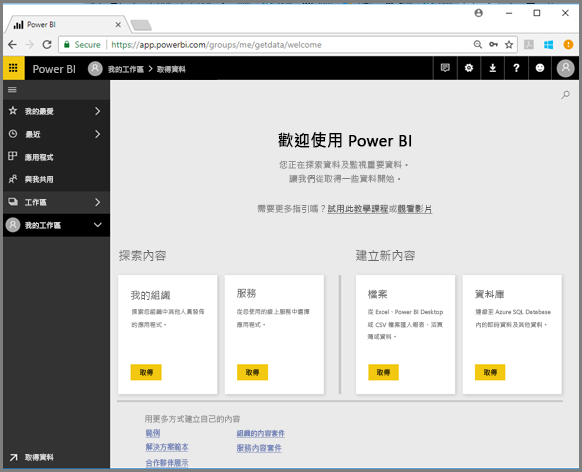
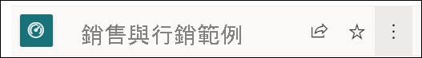
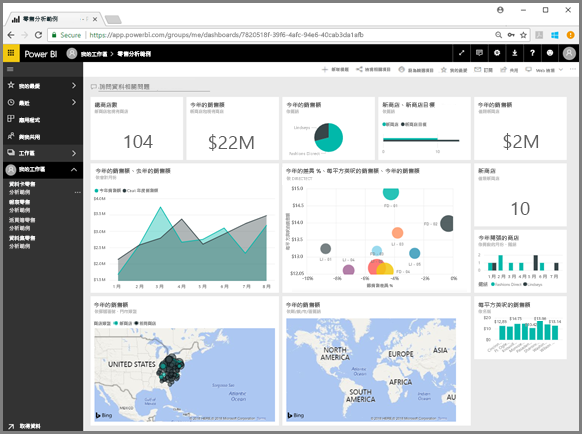
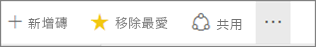
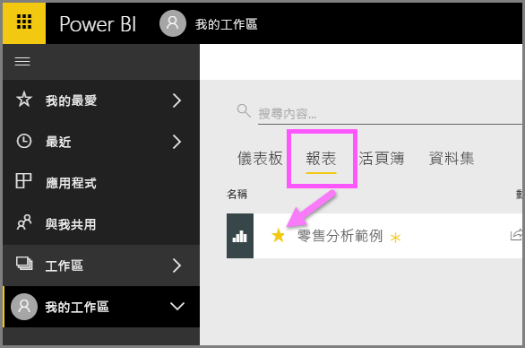
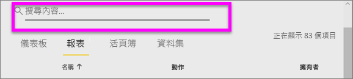
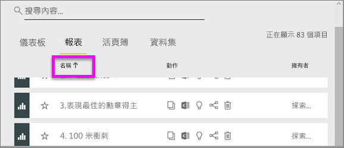
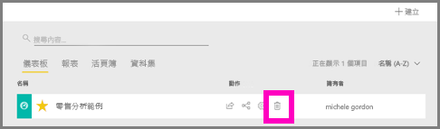

# 快速入門 - 瀏覽 Power BI 服務

您現在已知道 Power BI 基本概念，讓我們瀏覽 **Power BI 服務**。 如前所述，您小組中的某個人可能將所有時間都花在 **Power BI Desktop**、結合資料，以及為其他人建立報表。 但另一方面，您可能將所有時間都花在 Power BI 服務、檢視其他人所建立的內容並與其互動 (**取用**體驗)。 在本快速入門中，您將會匯入範例資料，並使用該資料來了解如何使用 Power BI 服務。 
 
## 先決條件

- 如果您尚未註冊 Power BI，請先進行[免費註冊](https://app.powerbi.com/signupredirect?pbi_source=web)再開始。

- 請閱讀 [Power BI 服務基本概念](end-user-basic-concepts.md)

## 開啟 Power BI 服務並取得一些資料
我們將會抓取用於瀏覽 Power BI 服務的一些範例資料。 我們提供所有類型的範例資料供您進行探索，而且這次我們將使用零售商店的相關資料。    
1. 開啟 app.powerbi.com，然後選取 [範例] 連結。 

    

2. 選取 [零售分析範例] > [連線]。

    

    Power BI 服務會匯入範例，並顯示儀表板。 「儀表板」是 Power BI 服務與 Power BI Desktop 的不同之處。 範例也包含報表和資料集，我們日後將會進行瀏覽。

    

觀看影片，讓 Amanda 帶領您瀏覽 Power BI 服務的導覽體驗。  然後遵循以下影片中的逐步指示自行探索。

<iframe width="560" height="315" src="https://www.youtube.com/embed/G26dr2PsEpk" frameborder="0" allowfullscreen></iframe>

## 檢視內容 (儀表板、報表、活頁簿、資料集、工作區、應用程式)
讓我們開始查看如何組織基本內容 (儀表板、報表、資料集、活頁簿)。 內容會顯示在工作區的內容內。 此時，您只有一個稱為 [我的工作區] 的工作區。 一般而言，取用者不需要使用任何其他工作區。 [我的工作區] 會儲存您所擁有的所有內容。 請將它視為您專屬內容的個人沙箱或工作區域。 [我的工作區] 是您剛剛下載並儲存零售分析範例的位置。 

在 [我的工作區] 內，您的內容組織為 4 個索引標籤︰[儀表板]、[報表]、[活頁簿] 和 [資料集]。

![[我的工作區] 畫面](./media/end-user-experience/power-bi-my-workspace.png)

從左側瀏覽窗格 (左側瀏覽窗格) 選取工作區，相關內容 (儀表板、報表、活頁簿、資料集) 的索引標籤便會填入右側的 Power BI 畫布。

如果您是新使用者，則只會看到一個工作區：[我的工作區]。

在這些索引標籤 (也稱為「內容檢視」) 內，您會看到內容的相關資訊，以及您可使用該內容採取的動作。  例如，您可以從 [儀表板] 索引標籤開啟儀表板、搜尋、排序等。

![[儀表板] 索引標籤](./media/end-user-experience/power-bi-dashboard-tab.png)

選取儀表板名稱，以開啟儀表板。

## 將儀表板和報表設為我的最愛
[我的最愛] 可讓您快速存取對您而言最重要的內容。  

1. 在儀表板開啟的情況下，從右上角選取 [我的最愛]。
   
   
   
   [我的最愛] 會變成 [移除最愛]，且星狀圖示會變成黃色。
   
   

2. 若要顯示您已新增為我的最愛之所有內容清單，請在左側瀏覽窗格中選取 [我的最愛] 右邊的箭號。 由於左側瀏覽窗格是 Power BI 服務的永久功能，因此您可以從 Power BI 服務的任何位置存取此清單。
   
    ![[我的最愛] 飛出視窗](./media/end-user-experience/power-bi-favorite.png)
   
    到目前為止，我們只有一個我的最愛。 我的最愛可以是儀表板、報表或應用程式。  

1. 另一種方式是從 [儀表板] 或 [報表] 內容檢視索引標籤將儀表板或報表標示為我的最愛。開啟 [報表] 索引標籤，然後選取報表名稱左側的星星圖示。
   
   

3. 從左側瀏覽窗格中選取 [我的最愛]，或選取星星圖示 ，以開啟 [我的最愛] 窗格。
   
   ![開啟 [我的最愛] 畫面](./media/end-user-experience/power-bi-favorite-pane.png)
   
   您現在有兩個我的最愛：一個是儀表板，一個是報表。 您可以在這裡開啟、搜尋、移除最愛，或與同事共用內容。

4. 選取報表名稱，以在報表編輯器中進行開啟。

    

若要深入了解，請參閱[我的最愛](end-user-favorite.md)

## 找到最新內容

1. 與 [我的最愛] 類似，選取左側瀏覽窗格中 [最近項目] 旁的箭號，即可從 Power BI 服務的任何位置快速查看最近項目。

   ![[最近項目] 飛出視窗](./media/end-user-experience/power-bi-recent-flyout.png)

    從飛出視窗中，選取內容予以開啟。

2. 有時，您不想要開啟最近內容，但想要檢視資訊或採取其他動作，例如檢視深入解析或匯出 Excel。 在這些類似的情況下，從左側瀏覽窗格中選取 [最近項目] 或其圖示，以開啟 [最近項目] 窗格。 如果您有多個工作區，則這份清單會包含所有工作區中的內容。

   ![[最近項目] 窗格](./media/end-user-experience/power-bi-recent.png)

若要深入了解，請參閱 [Power BI 中的最近項目](end-user-recent.md)。

### 搜尋和排序內容
內容檢視可讓您更輕鬆地搜尋、篩選及排序您的內容。 若要搜尋儀表板、報表或活頁簿，請在搜尋區域中鍵入。 Power BI 只會篩選出名稱中包含搜尋字串的內容。

因為您只有一個範例，所以不需要搜尋和排序。  但當您擁有詳細的儀表板、報表、活頁簿和資料集清單時，會發現搜尋和排序十分有幫助。

您也可以依名稱或擁有者排序內容。 請注意 [名稱] 右邊的向上箭號。 我們目前正在依名稱字母順序遞增排序 83 個項目。 若要變更排序順序為遞減，請選取 [名稱]。 向上箭號會變更為向下箭號。

並非所有資料行都可以進行排序。 將滑鼠游標暫留在資料行標題，以探索哪些項目無法進行排序。

若要深入了解，請參閱 [Power BI 導覽：搜尋和排序](end-user-search-sort.md)

## 清除資源
完成此快速入門後，您可以根據需求，刪除零售分析範例儀表板、報表和資料集。

1. 開啟 Power BI 服務 (app.powerbi.com) 並登入。    
2. 在左側瀏覽窗格中，選取 [工作區] > [我的工作區]。  
    有注意到表示我的最愛的黃色星號嗎？    
3. 在 [儀表板] 索引標籤上，選取零售分析儀表板旁邊的垃圾桶**刪除**圖示。    

    

4. 選取 [報表] 索引標籤，然後對零售分析報表執行相同的動作。
1. 選擇 [資料集] 索引標籤，然後對零售分析資料集執行相同的動作。

## 後續步驟

> [!div class="nextstepaction"]
> [Power BI 服務中的閱讀檢視](end-user-reading-view.md)