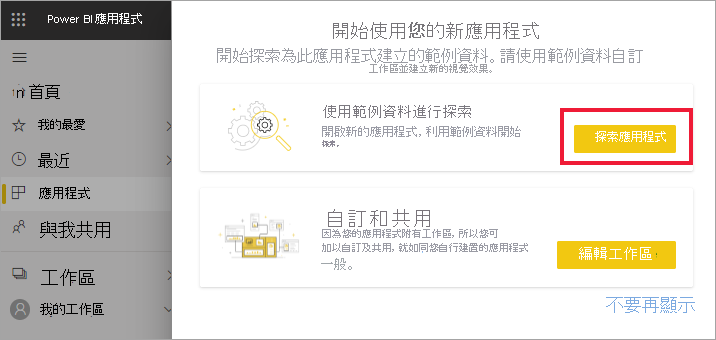
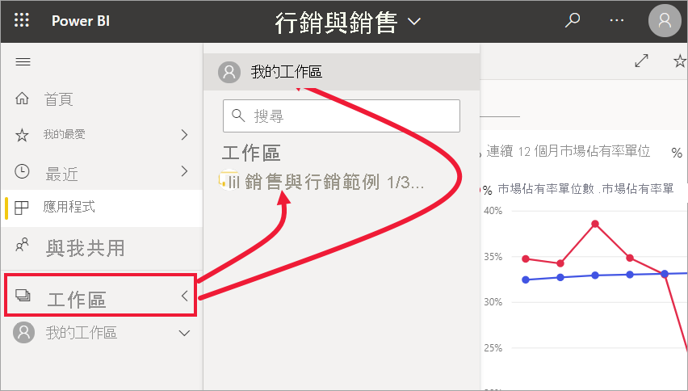
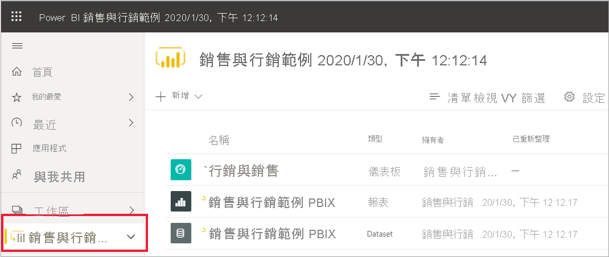
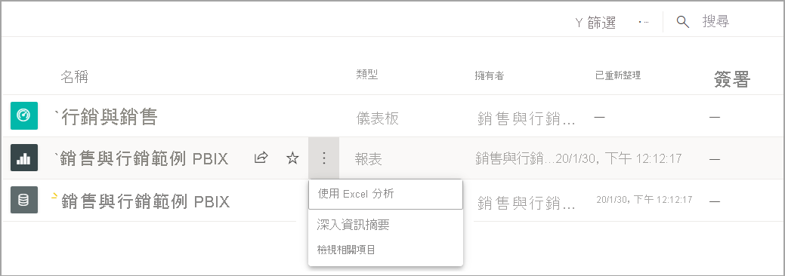
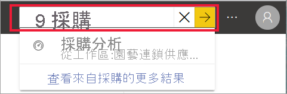
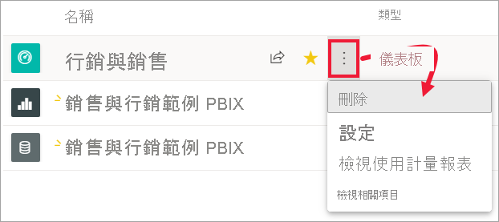

# 快速入門 - 瀏覽 Power BI 服務

[!INCLUDE [power-bi-service-new-look-include](../includes/power-bi-service-new-look-include.md)]

您現在已知道 Power BI 基本概念，讓我們瀏覽 **Power BI 服務**。 如先前所述，您小組中的某個人可能將所有時間都花在 **Power BI Desktop**、結合資料，以及為其他人建立報表。 但另一方面，您可能將所有時間都花在 Power BI 服務、檢視其他人所建立的內容並與其互動 (**取用**體驗)。 在本快速入門中，您將會匯入範例資料，並使用該資料來了解如何使用 Power BI 服務。 
 
## 必要條件

- 如果您尚未註冊 Power BI，請先進行[免費註冊](https://app.powerbi.com/signupredirect?pbi_source=web)再開始。

- 請閱讀 [Power BI 服務基本概念](end-user-basic-concepts.md)

## 開啟 Power BI 服務

若要開始，請開啟 Power BI 服務 (app.powerbi.com) 並巡覽至 [首頁]  。 
1. 如果左瀏覽窗格已摺疊，請選取瀏覽窗格圖示  加以展開。 

1. 如果其尚未開啟，請選取 [首頁]  。 

1. 取得範例資料。 我們將會抓取用於瀏覽 Power BI 服務的一些範例資料。 我們提供所有類型的範例資料供您進行探索，且這次我們將使用行銷與銷售的相關資料。 

    若要跟著做，請使用這些指示來安裝[銷售與行銷範例應用程式](end-user-app-marketing.md)。

1. 安裝應用程式之後，從瀏覽窗格選取 [應用程式]  。 

   ![螢幕擷取畫面顯示 Power BI [首頁] 畫面，其中包含歡迎訊息。](./media/end-user-experience/power-bi-home-steps.png)

2. 在 [應用程式]  畫面上，選取 [銷售與行銷範例]  應用程式。

    ![螢幕擷取畫面顯示 Power BI [應用程式] 畫面，其中包含名為「銷售與行銷範例」的應用程式。](./media/end-user-experience/power-bi-sample-app.png)

2. 選取 [探索應用程式]  。

    

3. Power BI 服務會開啟應用程式的儀表板。 儀表板是 Power BI 服務與 Power BI Desktop 的不同之處。 範例也會包含報表和資料集。 

    

    身為「取用者」  ，您所收到大部分應用程式都不會包含基礎資料集的直接存取權。 由於 Power BI 範例是針對所有的 Power BI 客戶建立，因此會包含資料集。 您的「設計師」  同事可以使用資料集，以了解如何建立新的儀表板和報表。 

## 檢視內容 (儀表板和報表)
讓我們開始查看如何組織基本內容 (儀表板、報表、應用程式)。 內容會顯示在工作區的內容內。 每個取用者都至少有一個工作區，且其稱為 [我的工作區]  。 每當您安裝應用程式時，就會為該應用程式建立工作區。  由於已安裝銷售與行銷範例應用程式，因此我們現在有兩個工作區。 

從左瀏覽窗格選取 [工作區]  以自行查看。 

[我的工作區]  會儲存您擁有並建立的所有內容。 請將它視為您專屬內容的個人沙箱或工作區域。 對於許多 Power BI「取用者」  ，[我的工作區]  會保持空白，因為您的工作不會牽涉到建立新內容。  根據定義，「取用者」  會取用其他人所建立的資料，並使用該資料來制定商務決策。 如果您發現正在建立內容，請考慮改為閱讀[適用於「報表建立者」  的 Power BI 文章](../index.yml)。

[應用程式工作區]  包含特定應用程式的所有內容。  當「設計師」  建立應用程式時，會將該應用程式所需的所有內容組合在一起，以供使用。  選取銷售與行銷工作區，以查看「設計師」  包含在應用程式中的內容。 

銷售與行銷應用程式工作區包含一個儀表板、一個報表和一個資料集。 並非所有應用程式都會包含這三種內容。 一個應用程式可以只包含一個儀表板、包含這三種內容類型，或甚至包含二十個報表。 這全都取決於「設計師」  包含在應用程式中的內容。 由於銷售與行銷資料是範例，因此會包含資料集。 但更常見的情況是，適用於「取用者」  的應用程式工作區不會包含任何資料集。 

工作區不僅是簡單的內容清單。 在此頁面上，您可以深入了解工作區的儀表板和報表。 請花幾分鐘的時間來識別內容擁有者、上次重新整理的日期、相關內容和簽署。 如果工作區具有描述，則該描述可協助您進一步了解工作區的目標，以及如何將其用於您的商務用途。 此外，如果工作區有許多內容，則請使用搜尋和排序選項快速找出您所需的功能。

工作區也是您資料的其中一個路徑。 從清單選取儀表板或報表加以開啟。  將游標暫留在星號圖示上並選取該圖示，以將儀表板或報表設為我的最愛。 如果「設計師」  提供您[共用權限](end-user-shared-with-me.md)，則暫留時也會顯示該動作。 

選取儀表板名稱，以開啟儀表板。

## 將儀表板和報表設為我的最愛
[我的最愛]  可讓您快速存取對您而言最重要的內容。 您剛了解如何從工作區將儀表板設為我的最愛。 您也可以直接從儀表板或報表建立我的最愛。

1. 在儀表板開啟的情況下，從功能表列選取 [我的最愛]  。
   
   
   
   [我的最愛]  會變成 [移除最愛]  ，且星狀圖示會變成黃色。
   
   

2. 若要顯示所有內容清單 (您已將其新增為我的最愛)，請從瀏覽窗格選取 [我的最愛]  右邊的箭號。 由於瀏覽窗格是 Power BI 服務的永久功能，因此您可以從 Power BI 服務的任何地方存取此清單。
   
    ![[我的最愛] 飛出視窗](./media/end-user-experience/power-bi-favorites-flyout.png)
   
    這個 Power BI 使用者到目前為止有四個我的最愛。 我的最愛可以是儀表板、報表或應用程式。  

若要深入了解，請參閱[我的最愛](end-user-favorite.md)

## 找到最新內容

1. 與 [我的最愛] 類似，選取瀏覽窗格中 [最近]  旁的箭號，即可從 Power BI 服務的任何位置快速查看最近所存取內容。

   ![[最近項目] 飛出視窗](./media/end-user-experience/power-bi-flyout-recent.png)

    從飛出視窗中，選取內容予以開啟。

2. 有時，您不僅想要開啟最近使用的內容，還想要檢視資訊或採取其他動作，例如檢視見解或匯出到 Excel。 在這些類似的情況下，從導覽窗格中選取 [最近項目] 或其圖示，以開啟 [最近項目] 窗格。 在此範例中，Power BI 使用者有多個工作區，因此這份清單可能會包含其所有工作區中的內容。

   ![[最近項目] 窗格](./media/end-user-experience/power-bi-recent-action.png)

若要深入了解，請參閱 [Power BI 中的最近項目](end-user-recent.md)。

### 搜尋和排序內容
開始使用 Power BI 服務時，您只會有一些內容。 但當同事開始與您共用內容，而您開始下載應用程式時，您可能就會有多內容。 這就是您發現搜尋和排序非常有幫助的時候了。

Power BI 服務的幾乎每個部分都可以使用搜尋。 只要尋找搜尋方塊或搜尋放大鏡圖示即可。    

在 [搜尋] 欄位中，輸入儀表板、報表、活頁簿、應用程式或擁有者的全部或部分名稱。 Power BI 會搜尋您的所有內容。

也有許多排序內容的方式。 將游標暫留在資料行標頭上，並尋找指出資料行可以進行排序的箭號。 並非所有資料行都可以進行排序。 

![[類型] 資料行標頭旁的箭號](./media/end-user-experience/power-bi-sort-icon.png)

或者，尋找畫布右上角附近的排序控制項。 選擇要依日期、名稱或擁有者進行遞增或遞減排序。  

若要深入了解，請參閱 [Power BI 導覽：搜尋和排序](end-user-search-sort.md)

## Power BI 首頁
本快速入門將以一開始的 Power BI [首頁]  做總結。 

![[首頁] 畫布](./media/end-user-experience/power-bi-home-oldest.png)

[首頁] 結合搜尋和排序工具、瀏覽窗格，以及具有「卡片」  的畫布，讓您可以選擇用來開啟儀表板、報表和應用程式。 一開始，您在 [首頁] 畫布上可能沒有太多的卡片，但當開始與同事使用 Power BI 時，此情況就會改變。 您的 [首頁] 畫布也會以建議的內容和學習資源進行更新。

如需詳細資訊，請參閱 [Power BI 首頁](end-user-home.md)

## 清除資源
完成此快速入門後，您可視需要刪除範例儀表板、報表和資料集。

1. 開啟 Power BI 服務 (app.powerbi.com) 並登入。    
2. 開啟 Power BI [首頁]，向下捲動至 [工作區]  ，然後選取 [銷售與行銷]  。      

3. 將游標暫留在儀表板、報表或資料集上，然後選取 [更多選項 (...)]   > [刪除]  。 重複執行，直到移除所有三項。

    

## 後續步驟

> [!div class="nextstepaction"]
> [Power BI 服務中的閱讀檢視](end-user-reading-view.md)
