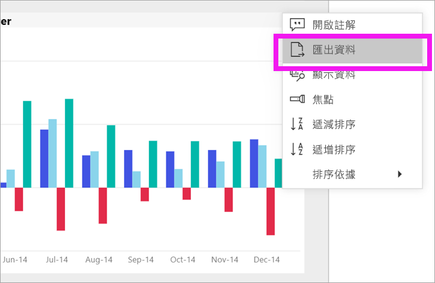

# 從 visual 匯出資料
如果您想要查看的資料，用來建立視覺[您可以在 Power BI 中顯示該資料](end-user-show-data.md)或將資料匯出至 Excel。 將資料匯出選項需要特定型別或授權，並編輯內容的權限。 如果您無法匯出，請洽詢您的 Power BI 系統管理員。 

## 從 Power BI 儀表板上的視覺效果

1. 開始在 Power BI 儀表板。 這裡我們使用的儀表板***行銷和銷售範例***應用程式。 您可以[下載此應用程式從 AppSource.com](https://appsource.microsoft.com/en-us/product/power-bi/microsoft-retail-analysis-sample.salesandmarketingsample-preview?flightCodes=e2b06c7a-a438-4d99-9eb6-4324ce87f282)。

    

2. 暫留在視覺效果，以顯示省略符號 （...），然後按一下以顯示 [動作] 功能表。

    

3. 選取 **匯出至 Excel**。

4. 接下來的情況，取決於您所使用的瀏覽器。 您可能會提示您儲存檔案或您可能看到匯出的檔案，在瀏覽器底部的連結。 

    

5. 在 Excel 中開啟檔案。  

    

## 從 視覺效果的報表
您可以從報表中視覺效果匯出資料，為.csv 或.xlsx (Excel) 格式。 

1. 在儀表板中，選取圖格開啟基礎報表。  在此範例中，我們要選取與上述相同的視覺效果*總單位 YTD Var %* 。 

    

    從建立此圖格以來*銷售與行銷範例*報表，所開啟的報表。 它會開啟包含所選的圖格視覺效果的頁面。 

2. 在報表中，選取圖格。 請注意**篩選器**右邊的窗格。 此視覺效果已套用的篩選器。 若要深入了解篩選器，請參閱[在報表中使用篩選](end-user-report-filter.md)。

    

3. 選取視覺效果右上角的省略符號。 選擇**匯出資料**。

    

4. 您會看到 匯出摘要資料或基礎資料的選項。 如果您使用*銷售與行銷範例*應用程式**基礎資料**將會停用。 但是，您可能會遇到的報表啟用這兩個選項的位置。 以下是差異的說明。

    **彙總資料**： 選取此選項，如果您想要匯出資料以供您在視覺效果中所看到的內容。  這種類型的匯出會顯示用來建立視覺效果的資料。 如果視覺效果已套用的篩選器，您將匯出的資料會也篩選。 比方說，此視覺效果，您的匯出將只包含 2014 資料和中部地區和只有四個製造商提供的資料：VanArsdel、 Natura、 Aliqui 和 Prirum。
  

    **基礎資料**： 選取此選項，如果您想要匯出資料以供您在視覺效果中所看到的內容**加上**從基礎資料集的其他資料。  這可能包括資料集內包含但不是會用於視覺效果的資料。 

    

5. 接下來的情況，取決於您所使用的瀏覽器。 您可能會提示您儲存檔案或您可能看到匯出的檔案，在瀏覽器底部的連結。 

    

7. 在 Excel 中開啟檔案。 比較資料匯出至我們從相同的視覺效果的儀表板上匯出的資料的量。 這個匯出中所包含的差別**基礎資料**。 

    

