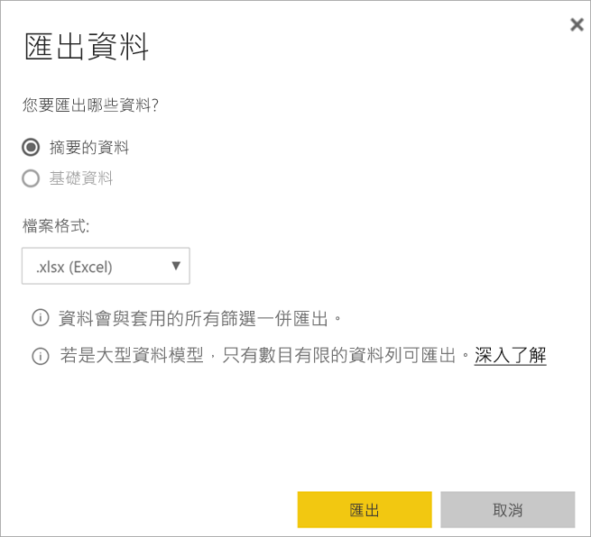

# 匯出視覺效果的資料

[!INCLUDE [power-bi-service-new-look-include](../includes/power-bi-service-new-look-include.md)]

如果您想要查看用來建立視覺效果的資料，可以[在 Power BI 中顯示該資料](end-user-show-data.md)或將資料匯出至 Excel。 匯出資料的選項需要特定類型或授權，以及內容的編輯權限。 如果無法匯出，請連絡您的 Power BI 系統管理員。 

## 從 Power BI 儀表板上的視覺效果

1. 從 Power BI 儀表板上開始。 在這裡，我們使用來自「行銷與銷售範例」應用程式的儀表板。 您可以[從 AppSource.com 下載此應用程式](https://appsource.microsoft.com/en-us/product/power-bi/microsoft-retail-analysis-sample.salesandmarketingsample-preview?flightCodes=e2b06c7a-a438-4d99-9eb6-4324ce87f282)。

    

2. 將滑鼠暫留在視覺效果上方以顯示 [更多選項]  (...)，然後按一下以顯示動作功能表。

    

3. 選取 [匯出至 Excel]  。

4. 後續步驟取決於您使用的瀏覽器。 系統可能會提示您儲存檔案，或者您可能會在瀏覽器底部看到所匯出檔案的連結。 

    

5. 以 Excel 開啟檔案。  

    

## 從報表中的視覺效果
您可以從報表中的視覺效果將資料匯出為 .csv 或 .xlsx (Excel) 格式。 

1. 在儀表板上，選取圖格來開啟基礎報表。  在此範例中，我們選取與上方相同的視覺效果的「年初迄今單位總量差異 %」  。 

    

    因為此圖格是從「銷售與行銷範例」  報表建立的，所以會開啟該報表。 而且，報表會開啟到包含所選圖格視覺效果的頁面。 

2. 選取報表中的圖格。 請注意右邊的 [篩選]  窗格。 此視覺效果已套用篩選。 若要深入了解篩選，請參閱[在報表中使用篩選](end-user-report-filter.md)。

    

3. 選取視覺效果右上角的省略符號。 選擇 [匯出資料]  。

    ![下拉式清單中已選取的 [匯出資料]](media/end-user-export/power-bi-export-report.png)

4. 您會看到要匯出 [摘要的資料] 或 [基礎資料] 的選項。 如果您使用的是「銷售與行銷範例」  應用程式，將會停用 [基礎資料]  。 但是，您可能會遇到兩個選項都已啟用的報表。 以下是差異的說明。

    **摘要的資料**：如果您想要匯出在該視覺效果中所看到內容的資料，請選取此選項。  此類型的匯出只會顯示用來建立視覺效果的資料。 如果視覺效果已套用篩選，則您匯出的資料也會經過篩選。 例如，針對此視覺效果，您的匯出只會包含 2014 年和中部區域的資料，且只有四個製造商的資料：VanArsdel、Natura、Aliqui 和 Pirum。
  

    **基礎資料**：如果您想要匯出視覺效果中所見的資料**和**來自基礎資料集的其他資料，請選取此選項。  這可能包括資料集所包含但未在視覺效果中使用的資料。 

    

5. 後續步驟取決於您使用的瀏覽器。 系統可能會提示您儲存檔案，或者您可能會在瀏覽器底部看到所匯出檔案的連結。 

    

6. 以 Excel 開啟檔案。 將資料數量與在儀表板上從相同視覺效果匯出的資料比較。 差別在於此匯出包含**基礎資料**。 

    

## 後續步驟

[顯示用來建立視覺效果的資料](end-user-show-data.md)