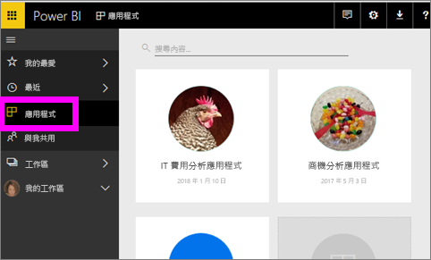
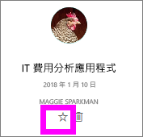
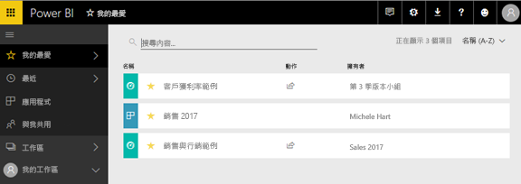

# Power BI 服務中的常用儀表板、報告和應用程式
當您將內容*我的最愛*，您將能夠存取它快速地從**我的最愛**內容清單中以及從**首頁 Power BI**  >  **我的最愛和常用項目**。  我的最愛是您最常瀏覽，並識別具有黃色星星的一般內容。

   ![[我的最愛] 圖示](./media/end-user-favorite/power-bi-favorite-nav.png)

   ![[我的最愛] 圖示](./media/end-user-favorite/power-bi-home.png)

您也可以選取單一儀表板，作為[精選儀表板](end-user-featured.md)Power BI 服務中。

## 將儀表板或報表新增為「我的最愛」 

1. 開啟您常用的儀表板或報表。 即使是別人與您共用的內容，也可以設為「我的最愛」  。

2. 從 Power BI 服務 [上方] 功能區中，選取**我的最愛**或星號圖示。
   
   ![[我的最愛] 圖示](./media/end-user-favorite/powerbi-dashboard-favorite.png)
   
   您可以也最愛的儀表板或報表從任何地方您看到與我的星狀圖示，例如首頁、 最近、 應用程式，以及共用。 
   
   ![具有黃色星號的 [儀表板] 索引標籤](./media/end-user-favorite/power-bi-recent.png)

## 將應用程式新增為「我的最愛」 

1. 從 [導覽] 窗格中，選取**應用程式**。

   

2. 停留在應用程式上以顯示更多詳細資料。  選取星號   圖示以設為我的最愛。
   
   

## 使用「我的最愛」 
1. 若要存取 我的最愛，選取 右邊的彈出式箭號**我的最愛**。  您可以在這裡選取我的最愛並加以開啟。 只會列出五個我的最愛 (依字母順序)。 如果您有超過五個，請選取**查看所有**開啟內容的 [我的最愛] 清單 （請參閱下方的 #2）。 
   
   ![[我的最愛] 飛出視窗](./media/end-user-favorite/power-bi-favorite-flyout.png)
2. 若要查看**所有**的內容，您已新增為我的最愛，在導覽窗格中，選取**我的最愛**或我的最愛圖示。  
   
    
   
   您可以在這裡執行下列動作：開啟、識別擁有者，甚至與同事共用。

## 移除最愛的內容
某份報表的使用頻率不再如往常頻繁嗎？  您可以將其移除最愛。 移除最愛的內容時，其會從 [我的最愛] 清單中移除，但不會從 Power BI 中移除。

1. 在左側功能窗格中，選取 [我的最愛]  以開啟 [我的最愛]  畫面。
   
   ![[我的最愛] 畫面](./media/end-user-favorite/power-bi-unfavorites-screen.png)
2. 選取內容旁的黃色星星即可移除最愛。

> [!NOTE]
> 您也可以將儀表板、報表或應用程式本身移除最愛。 只要開啟並取消選取黃色圖示就可以了。   
> 
> 
## 限制與考量
在目前的時間，您可以最愛的應用程式和此自動我的最愛的所有報表和儀表板，該應用程式。 您不可能最愛的個別應用程式的報表或儀表板。 

## 後續步驟
[Power BI - 基本概念](end-user-basic-concepts.md)

有其他問題嗎？ [試試 Power BI 社群](http://community.powerbi.com/)

