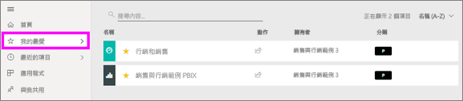
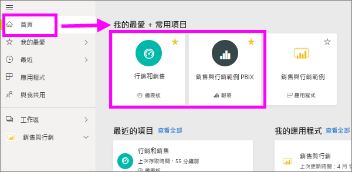
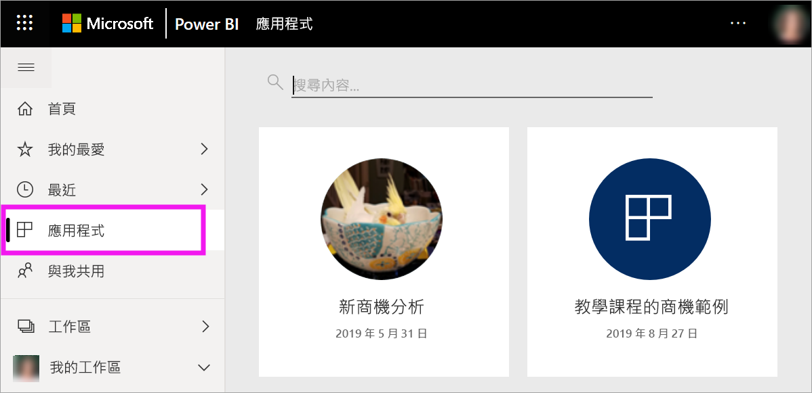

# Power BI 服務中的常用儀表板、報告和應用程式

[!INCLUDE[consumer-appliesto-yyny](../includes/consumer-appliesto-yyny.md)]

當您將內容設為 [我的最愛]  時，您可以從 [我的最愛]  內容清單，並從 [Power BI 首頁]   > [我的最愛和常用項目]  快速存取該內容。 [我的最愛] 通常是您經常瀏覽的內容，並以黃色星號識別。

   

   

## 將儀表板或報表新增為我的最愛

1. 開啟您常用的儀表板或報表。 即使是別人與您共用的內容，也可以設為我的最愛。

2. 從 Power BI 服務的上方功能表列中，選取 [我的最愛]  或星號  圖示。
   
   ![[我的最愛] 圖示](./media/end-user-favorite/power-bi-favorite.png)
   
   您也可以從看到星號圖示之任何位置將儀表板或報表加入我的最愛，例如 [首頁]、[最近]、[應用程式] 及 [與我共用]。 
   
   ![具有黃色星號的 [儀表板] 索引標籤](./media/end-user-favorite/power-bi-recent.png)

## 將應用程式新增為我的最愛

1. 從導覽窗格中選取 [應用程式]  。

   

2. 停留在應用程式上以顯示更多詳細資料。 選取星號  圖示以設為我的最愛。
   
   

## 使用我的最愛
1. 若要存取我的最愛，請選取 [我的最愛]  右邊的飛出箭號。 您可以在這裡選取我的最愛並加以開啟。 最多依字母順序列出五個我的最愛。 如果超過五個，請選取 [查看全部]  來開啟 [我的最愛] 內容清單。 
   
   ![[我的最愛] 飛出視窗](./media/end-user-favorite/power-bi-favorite-flyout.png)
2. 若要查看您已新增為我的最愛的所有內容，請在導覽窗格中選取 [我的最愛]  或我的最愛 圖示。 
   
    ![[我的最愛] 視窗](./media/end-user-favorite/power-bi-fav-screen.png)
   
   您可以從這裡採取動作。 您可以開啟 [我的最愛]、識別擁有者，甚至與同事共用我的最愛。

## 移除最愛的內容
如果您不再像之前那樣經常使用報表，則可以從我的最愛中移除。 移除最愛的內容時，其會從 [我的最愛] 清單中移除，但不會從 Power BI 中移除。

1. 在導覽窗格中，選取 [我的最愛]  以開啟 [我的最愛]  畫面。
   
   ![[我的最愛] 畫面](./media/end-user-favorite/power-bi-un-favorite.png)
2. 選取您要移除最愛的內容旁黃色星號。

> [!NOTE]
> 您也可以從我的最愛中移除儀表板、報表或應用程式。 只要開啟並選取黃色星號，將其重新轉換回白色星號。 
> 
> 
## 限制與考量
目前，您可以將應用程式加入我的最愛，這會自動將該應用程式所有報表和儀表板加入我的最愛。 您無法將個別應用程式報表或儀表板加入我的最愛。 

## 後續步驟
- [Power BI：基本概念](end-user-basic-concepts.md)
- 有其他問題嗎？ 試試 [Power BI 社群](https://community.powerbi.com/)。

