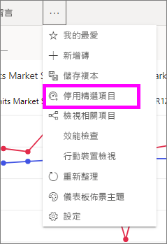

# Power BI 服務中的精選儀表板
## 建立精選儀表板
許多使用者會有一個比其他任何儀表板更常瀏覽的儀表板。  這可能是用來執行業務的儀表板，或可能是包含來自許多不同儀表板和報告之圖格彙總的儀表板。

當您選取做為儀表板*精選*，每次開啟 Power BI 服務時，它會開啟顯示該儀表板。  

您也可以選取幾個儀表板，並將其設定為「我的最愛」  。 請參閱[我的最愛儀表板](end-user-favorite.md)。

如果您尚未設定精選儀表板，Power BI 會開啟至您所使用的最後一個儀表板或 Power BI 的首頁。  

### 將儀表板設定為**精選**
觀賞 Amanda 如何建立精選儀表板，然後遵循影片下方的指示親自試試看。

<iframe width="560" height="315" src="https://www.youtube.com/embed/G26dr2PsEpk" frameborder="0" allowfullscreen></iframe>

1. 開啟您想要設為 [精選]  的儀表板。 
2. 在頂端功能表列中，選取省略符號 （...） 並選擇**設為精選**。  
   
    
3. 確認您的選擇。
   
    

## 變更精選儀表板
當然，如果您稍後改變心意，可以將新的儀表板設為精選儀表板。

1. 遵循上述步驟 1 和 2。
   
    
2. 選取 [設為精選儀表板]  。 將儀表板移除精選並不會將其從您的工作區中移除。  
   
    

## 移除精選儀表板
如果您決定不想要將任何儀表板指定為精選，以下是取消精選儀表板的方式。

1. 開啟目前的精選儀表板。
2. 在頂端功能表列中，選取省略符號 （...） 並選擇**停用精選**。

    
   
## 後續步驟
[將儀表板設為最愛](end-user-favorite.md)

有其他問題嗎？ [試試 Power BI 社群](http://community.powerbi.com/)

